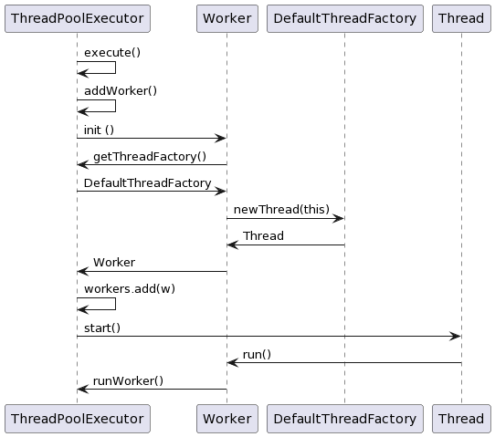
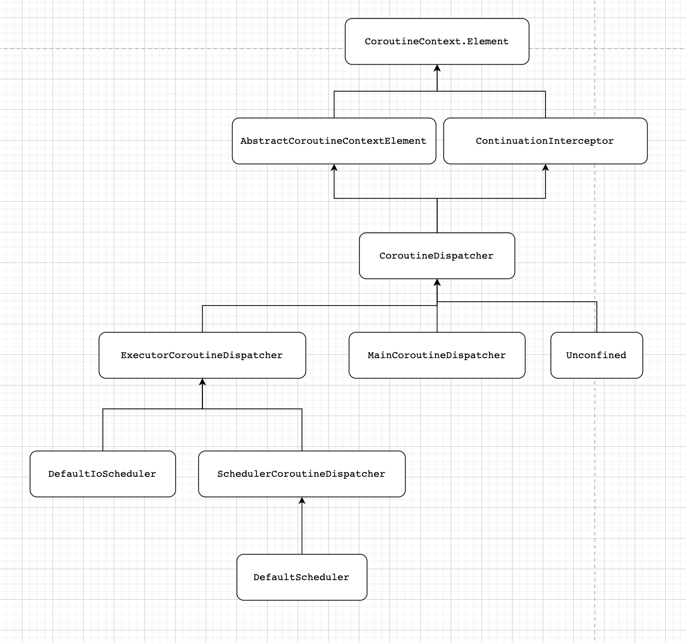
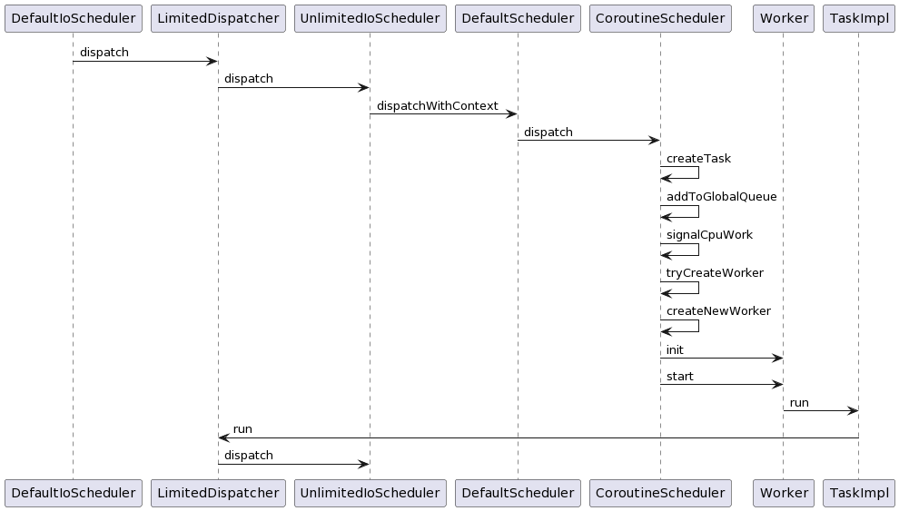

# 序文
當 Application 被啟動時，系統都會生成固定的空間來讓應用程式使用。而這個空間除了存放著 **code**、 **data** 與 **file** 外，它也用於執行緒的調動。

Thread (線程/執行緒) 代表著 CPU 的最小操作單位。 CPU 最主要的執行緒被稱為 **Main Thread** ( 主執行緒 )，而其他的則被稱為 **Worker Thread** 或 **Background Thread**。

對於擁有顯示器的電腦而言，**Main Thread** 就是負責接收使用者互動與顯示畫面的執行緒。 而它之所以可以成為 **Main Thread** 其實就是靠它的重要性 或 `priority` 來決定的。

當我們需要執行重量級的運算時，為了避免卡頓我們會用到 **Worker Thread** 來執行這些耗時工作。

在系統中，每一個執行緒都會有自己的 **stack**、 **register**、 **counter** 等等的資訊。 這些資訊都會佔有一定的空間，所以在創造、執行與結束執行緒時也會有相對的成本，我們稱之為 **overhead**。

其中一個需要這些資訊的原因，是因為一般程式都會使用多個不同的執行緒 ( **Multitasking** )，但因為核心數量的限制，他們並無法全部都同時進行。所以系統就會進行記憶體的優化以及執行緒的合理安排。因此，何時該調用哪個執行緒，這就由系統與 CPU 自行決定了。 而從 `thread A` 轉換到 `thread B` 的過程我們稱之為 **Context Switching** ( 上下文切換 )。 當系統需要再次調用 `thread A` 時，它便可以從 stack 中得知 `thread A` 最後調用的位置。

由於應用程式所擁有的空間是有限的， 所以過多的執行緒會導致 stackoverflow 的發生。為了避免 stackoverflow，我們應當控制執行緒的數量。

> 提醒：系統中的執行緒除了我們所熟悉的 Thread 之外還包括了 Application。 可以把 Thread 想像成更小的 Application。

想要優化多工處理，除了控制執行緒的數量外，我們還有另一個方法，那就是控制上下文切換的方式。

上下文切換可以分成 [兩種](https://pediaa.com/what-is-the-difference-between-preemptive-and-cooperative-multitasking/)：
- **Preemptive Multitasking** ( **先佔式** 多工 )
- **Cooperative Multitasking** ( **協作式** 多工 )

這兩者的主要差異在於上下文切換的主動權：
- 擁有先佔式的系統，會由系統決定何時執行上下文切換，所以有時候未必會在最適當的時候執行。
- 相反的，擁有協作式的系統則會由執行緒自行禮讓 ( **yield** ) 出主動權。因此，我們可以在執行緒在等待的期間通知其他執行緒開始或繼續執行。 如此一來，多工作業上也就能更有效地完成。

當然，以上的方法只能由系統或硬體來實現。但如果我們在調用方法時也能擁有協作的能力呢？

# 何謂 Coroutine ?

在程式中，我們可以把任何一個方法稱為一個 `routine`。 不管他是進行簡單的運算、資料的讀取抑或是耗時的運算，這都會被稱為 `routine`。

而 **Coroutine**、**Cooperative-Routine** 、 **共常式**  或 **協程** 則是指可以協同運作的方法們 \[[What is a Coroutine?](https://www.educative.io/answers/what-is-a-coroutine)\]。

一般我們在方法 `A()` 中調用方法 `B()` 時， 我們都需要等待 `B()` 完成才會繼續 `A()` 的後面。 此時我們會說控制權會從 `A()` 轉到 `B()` 直到 `B()` 結束才會回到 `A()`。這個範例中， `B()` 就是所謂的 **blocking call**，因為它阻擋到 `A()` 的執行。


```kotlin
fun A() {                 fun A                   fun B
    println(1)      +--------------+        +--------------+
    B()             |              |        |              |
    println(2)      |      A()     |        |              |
}                   |       |      |        |              |
                    |       v      |        |              |
fun B() {           |      B()     |  --->  |      B()     |
    println(3)      |              |        |      |       |
}                   |              |        |      v       |
                    |      A()     |  <---  |    return    |
A()                 |      |       |        |              |
                    |      v       |        |              |
                    |     END      |        |              |
                    +--------------+        +--------------+
/* 結果
    1
    3
    2
*/
```

但如果這些方法都是 Coroutine 的話，那我們就可以如此調動了：

```kotlin
     fun A                   fun B
+--------------+        +--------------+
|              |        |              |
|      A()     |        |              |
|       |      |        |              |
|       v      |        |              |
|      B()     |  --->  |      B()     |
|              |        |      |       |
|              |        |      v       |
|   cont A()   |  <---  |  resume A()  | ........ yield 讓出控制權
|       |      |        |              |
|       v      |        |              |
|  resume B()  |  --->  |    cont B()  |
|              |        |      |       |
|              |        |      v       |
|   cont A()   |  <---  |  resume A()  |
|       |      |        |              |
|       v      |        |              |
|  resume B()  |  --->  |    cont B()  |
|              |        |      |       |
|              |        |      v       |
|     A()      |  <---  |    return    |
|      |       |        |              |
|      v       |        |              |
|     END      |        |              |
+--------------+        +--------------+
```

當然這只是簡單的講解 Coroutine 的基本運作，接下來我們會從 Thread 的運用慢慢地深研 Coroutine 的設計與運作。

# Thread 的基本操作

**Thread** 的創建極為簡單，我們只需要將一個 **Runnable** 給 Thread 並調用 `Thread.start()` 即可：

```kotlin
val random = Random(0)

val thread = Thread {
    sleep(random.nextInt(1000).toLong());
    println("Complete")
}
thread.start()
```

有趣的是， **Thread** 本身也是一個 **Runnable**：

```java
public class Thread implements Runnable

@FunctionalInterface
public interface Runnable {
    public abstract void run();
}
```

當我們創建 Thread 時，傳入的 Runnable 會被設為 `target`：

```java
private Thread(ThreadGroup g, Runnable target, String name,
       long stackSize, AccessControlContext acc,
       boolean inheritThreadLocals) {
    // ...
    this.target = target;
    this.stackSize = stackSize; // 預設為 0
    this.tid = nextThreadID();
}
```

而在調用 `Thread.start()` 時，則會通過 `nativeCreate()` 來通知系統創建執行緒：

```java
public synchronized void start() {
    // ...
    try {
        // Android-changed: Use Android specific nativeCreate() method to create/start thread.
        // start0();
        nativeCreate(this, stackSize, daemon);
        started = true;
    } finally {
        try {
            if (!started) {
                group.threadStartFailed(this);
            }
        } catch (Throwable ignore) {
            /* do nothing. If start0 threw a Throwable then
              it will be passed up the call stack */
        }
    }
}
```

在執行緒被創建後就會執行 `Thread.run()` 進而調用 `target.run()`：
```java
@Override
public void run() {
    if (target != null) {
        target.run();
    }
}
```

這裡 `target.run()` 就會調用一開始的：
```kotlin
sleep(random.nextInt(1000).toLong());
println("Complete")
```

總結如下：

```
+-------------------+       +-----------------+     +-----------------+     +---------------+
|   Thread.start()  |  -->  |   nativeCreate  | --> |   Thread.run()  | --> |  target.run() |
+-------------------+       +-----------------+     +-----------------+     +---------------+
```

雖然執行緒的創建與運用很簡單，但為了避免 stackoverflow 的發生我們應該減少執行緒的創建。

為此，我們可以通過設計一個 **ThreadPool** 來存放固定數量的執行緒並讓他們可以不斷地重複使用。

## ThreadPool 的設計

**ThreadPool** 可以通過 **List** 存放 **Thread** 並用 **Queue** 來存放 **Runnable**。 另外，我們也按 Thread 的設計方法將 ThreadPool 也設為 Runnable：

```java
// [源碼來源: https://popcornylu.gitbooks.io/java_multithread/content/threadpool/threadpool.html]
public class ThreadPool implements Runnable {
    private final LinkedBlockingQueue<Runnable> queue;
    private final List<Thread> threads;
    private boolean shutdown;

    public ThreadPool(int numberOfThreads) {
        queue = new LinkedBlockingQueue<>();
        threads = new ArrayList<>();

        for (int i=0; i<numberOfThreads; i++) {
            // 讓 thread 知道 run() 是由誰實作
            Thread thread = new Thread(this);
            thread.start();
            threads.add(thread);
        }
    }

    public void execute(Runnable task) throws InterruptedException {
        queue.put(task);
    }

    private Runnable consume() throws InterruptedException {
        return queue.take();
    }

    // run 會在 thread.start 不斷被調用
    public void run()  {
        try {
            while (!shutdown) {
                Runnable task = this.consume();
                task.run();
            }
        } catch(InterruptedException e) { }

        System.out.println(Thread.currentThread().getName() + " shutdown");
    }

    public void shutdown() {
        shutdown = true;

        threads.forEach((thread) -> {
            thread.interrupt();
        });
}
```

這裡的重點在 `Thread thread = new Thread(this)`。 由於 `this` 也是 **Runnable**，所以當調用 `thread.start()` 後，這個執行緒就會調用 `run()`。

使用 **ThreadPool** 的時候也只需要在 `execute` 時指定 **Runnable** 行為即可。 但為了要確保在方法結束後，被創出的執行緒也需要被移除，所以最後需要調用 `ThreadPool.shutdown()`：

```kotlin
public static void main(String[] args) throws InterruptedException {
    ThreadPool threadPool = new ThreadPool(5);
    Random random = new Random();

    for (int i=0; i<10; i++) {
        int fi = i;
        threadPool.execute(() -> {
            try {
                Thread.sleep(random.nextInt(1000));
                System.out.printf("task %d complete\n", fi);
            } catch (InterruptedException e) {
                e.printStackTrace();
            }
        });
    }

    Thread.sleep(3000);
    threadPool.shutdown();
}
```

但是與其自己設計 threadpool， Java 提供了幾個 **Executors** 供我們使用，包括 **ThreadPoolExecutor**、 **ForkJoinPool**、 **ScheduledThreadPoolExecutor** 等等。

## Executor 的運用

通過 **Executors**，上方的範例可以改為以下：

```java
public static void main(String[] args) throws InterruptedException {
    ExecutorService executor = Executors.newFixedThreadPool(5);
    Random random = new Random();

    for (int i=0; i<10; i++) {
        int fi = i;
        executor.execute(() -> {
            try {
                Thread.sleep(random.nextInt(1000));
                System.out.printf("task %d complete\n", fi);
            } catch (InterruptedException e) {
                e.printStackTrace();
            }
        });
    }

    Thread.sleep(3000);
    executor.shutdown();
}
```

雖然 **ThreadPool** 與 **ThreadPoolExecutor** 的使用極為相似，但內部實作卻截然不同。

主要差異在於 **ThreadPoolExecutor** 並非 **Runnable** 而是 **AbstractExecutorService**：

```kotlin
public class ThreadPoolExecutor extends AbstractExecutorService

// 從 Executors 創建 ThreadPoolExecutor
public static ExecutorService newFixedThreadPool(int nThreads) {
    return new ThreadPoolExecutor(nThreads, nThreads,
                                  0L, TimeUnit.MILLISECONDS,
                                  new LinkedBlockingQueue<Runnable>());
}

public abstract class AbstractExecutorService implements ExecutorService

public interface ExecutorService extends Executor {
    void shutdown();
    List<Runnable> shutdownNow();

    boolean isShutdown();
    boolean isTerminated();
    boolean awaitTermination(long timeout, TimeUnit unit)
        throws InterruptedException;

    <T> Future<T> submit(Callable<T> task);
    <T> Future<T> submit(Runnable task, T result);
    Future<?> submit(Runnable task);

    <T> List<Future<T>> invokeAll(Collection<? extends Callable<T>> tasks)
        throws InterruptedException;
    <T> T invokeAny(Collection<? extends Callable<T>> tasks)
        throws InterruptedException, ExecutionException;
    <T> T invokeAny(Collection<? extends Callable<T>> tasks, long timeout, TimeUnit unit)
        throws InterruptedException, ExecutionException, TimeoutException;
}

public interface Executor {
    void execute(Runnable command);
}

// 這會晚點談
public interface Future<V> {
    boolean cancel(boolean mayInterruptIfRunning);
    boolean isCancelled();
    boolean isDone();

    V get() throws InterruptedException, ExecutionException;
    V get(long timeout, TimeUnit unit)
        throws InterruptedException, ExecutionException, TimeoutException;
}
```

<u><b>那 ThreadPoolExecutor 是如何啟動執行緒的呢？</b></u>

這就要看它是如何實作 `execute` 了。

```java
public void execute(Runnable command) {
    if (command == null)
        throw new NullPointerException();
    // 1. 取得當下的 state。可能為 RUNNING, SHUTDOWN, STOP, TIDYING 或 TERMINATED
    //    但通過 COUNT_MASK 還可以得到當下執行緒的數量
    int c = ctl.get();

    // 2. 查看當下執行緒數量與 corePoolSize 相比
    if (workerCountOf(c) < corePoolSize) {

        // 3. 若執行緒數量 < corePoolSize， 便通過 addWorker
        //    - 增加 ctl
        //    - 並創建 Worker: AbstractQueuedSynchronizer, Runnable
        //    - 每一個 Worker 只有一個 Thread 與 一個 Runnable， 而且 Thread 會通過
        //      this.thread = getThreadFactory().newThread(this); 來創建。
        //      預設為 DefaultThreadFactory，它會不斷地創建新的 Thread，
        //      並將他們的 isDaemon 設為 false，且 priority = NORM_PRIORITY。
        //    - 最後會將 worker 放入 workers : HashSet<Worker> 並調用 RUnnable 的 start()。
        if (addWorker(command, true))

            // 4. 若成功加入 Worker 且啟動 command 就 return
            return;
        c = ctl.get();
    }

    // 5. 當 workerCountOf > corePoolSize 時，就檢查 c 是否 Running，並嘗試將 command 被放入 workQueue
    if (isRunning(c) && workQueue.offer(command)) {
        int recheck = ctl.get();

        // 6. 若 c 已結束，就嘗試移除 command
        if (! isRunning(recheck) && remove(command))
            reject(command);
        else if (workerCountOf(recheck) == 0)
            addWorker(null, false);
    }
    else if (!addWorker(command, false))
        reject(command);
}
```


<u><b>那放在 `workQueue` 的 `command` 又會如何被調用呢？</b></u>

我們可以通過方法調用的流程畫出以下 uml ：

<center>

</center>

<br>

從 UML 我們可以知道，每個 **Worker** 只會有一個 Thread，自己也是個 Runnable。 而在通過 **DefaultThreadFactory** 創建 **Thread** 時， Worker 也是將自己放入 Thread 中成為其 `target`。 所以當 Thread 被執行時，它會不斷地調用 Worker 的 `run`。 以下就是 `Worker.run()` 被調用時的流程：

```java
// ThreadPoolExecutor.Worker
public void run() {
    runWorker(this);
}

// ThreadPoolExecutor
final void runWorker(Worker w) {
    // 1. 取得當下 Thread
    Thread wt = Thread.currentThread();

    // 2. 取得 firstTask
    Runnable task = w.firstTask;

    // 3. 移除 worker 的 firstTask
    w.firstTask = null;

    // 4. 允許被阻止
    w.unlock(); // allow interrupts
    boolean completedAbruptly = true;


    try {
        while (task != null || (task = getTask()) != null) {
            w.lock();
            // If pool is stopping, ensure thread is interrupted;
            // if not, ensure thread is not interrupted.  This
            // requires a recheck in second case to deal with
            // shutdownNow race while clearing interrupt

            // 5. 檢查當下 ThreadPoolExecutor 的狀態
            if ((runStateAtLeast(ctl.get(), STOP) ||
                 (Thread.interrupted() &&
                  runStateAtLeast(ctl.get(), STOP))) &&
                !wt.isInterrupted())

                // 6. 若 ThreadPoolExecutor 已經暫停或結束了就打斷此 Thread
                wt.interrupt();

            try {
                // 7. 預設沒行為
                beforeExecute(wt, task);
                try {
                    // 8. 啟動 task
                    task.run();

                    // 9. 預設沒有行為
                    afterExecute(task, null);
                } catch (Throwable ex) {
                    afterExecute(task, ex);
                    throw ex;
                }
            } finally {
                task = null;
                w.completedTasks++;

                // 10. 將 Worker 解鎖
                w.unlock();
            }
        }
        completedAbruptly = false;
    } finally {
        processWorkerExit(w, completedAbruptly);
    }
}
```

所以 **Worker** 與 **ThreadPool** 有以下不同：
1. Worker 只會擁有一個 Thread 。
2. Worker 在新增 Thread 時會通過 `lock` 與 `unlock` 防止 race condition 發生。

但本質上 Executor 其實就是包裹著 ThreadPool 的類別。其主要目的就是對 ThreadPool 進行封裝。

當然，上面所描述的只針對 **ThreadPoolExecutor**。 如果有興趣也可以看看其他的 executors ：
- [**ForkJoinPool**](https://www.infoworld.com/article/3693752/how-to-use-forkjoinpool-in-java.html)
  一個將 task 分成數個 subtask 並通過 Divide and Conquer 的方式平行完成這些 subtask。
  最後再通過 join 將這些 subtask 的結果集合並得到 task 得最終結果。
- **ScheduledThreadPoolExecutor**

<u><b>那 **kotlinx.coroutines** 又是如何實作 Executor 呢？</b></u>

這就要看 **Dispatchers** 了。

## Dispatchers 的探索

Coroutine 中的 Dispatchers 總共有四種：

```kotlin
public actual object Dispatchers {

    /*
        當 builders，像是 launch, async ...，中沒有使用 ContinuationInterceptor 時，這就是預設的 Dispatcher
        他會使用 JVM shared pool of thread

        CPU 核心數量 >= 執行緒數量 >= 2
    */
    @JvmStatic
    public actual val Default: CoroutineDispatcher = DefaultScheduler

    /*
        這是主執行緒。

        - 在 JS 這與 Default 一樣
        - 在 JVM 就是 Main Thread 或 JavaFx / Swing EDT dispatcher，這是由 ServiceLoader 決定
    */
    @JvmStatic
    public actual val Main: MainCoroutineDispatcher get() = MainDispatcherLoader.dispatcher

    /*
        這並沒有指定任何的執行緒
    */
    @JvmStatic
    public actual val Unconfined: CoroutineDispatcher = kotlinx.coroutines.Unconfined

    /*
        這是一個擁有共享 Thread Pool 的 dispatcher。
        我們會使用這個 dispatcher 來進行耗時作業。

        若同時建立多個 Dispatchers.IO 時，他們會共用執行緒：

        val myMysqlDbDispatcher = Dispatchers.IO.limitedParallelism(100)
        val myMongoDbDispatcher = Dispatchers.IO.limitedParallelism(60)

        此時系統會有 {core number} + 100 + 60 執行緒
    */
    @JvmStatic
    public val IO: CoroutineDispatcher = DefaultIoScheduler

    @DelicateCoroutinesApi
    public fun shutdown() {
        DefaultExecutor.shutdown()
        // Also shuts down Dispatchers.IO
        DefaultScheduler.shutdown()
    }
}
```

從他們的階層關係發現他們都是所謂的 **CoroutineDispatcher**：

<center>

</center>

<br>

```kotlin
public abstract class CoroutineDispatcher :
    AbstractCoroutineContextElement(ContinuationInterceptor), ContinuationInterceptor {

    /** @suppress */
    @ExperimentalStdlibApi
    public companion object Key : AbstractCoroutineContextKey<ContinuationInterceptor, CoroutineDispatcher>(
        ContinuationInterceptor,
        { it as? CoroutineDispatcher })

    public open fun isDispatchNeeded(context: CoroutineContext): Boolean = true

    @ExperimentalCoroutinesApi
    public open fun limitedParallelism(parallelism: Int): CoroutineDispatcher {
        parallelism.checkParallelism()
        return LimitedDispatcher(this, parallelism)
    }

    public abstract fun dispatch(context: CoroutineContext, block: Runnable)

    @InternalCoroutinesApi
    public open fun dispatchYield(context: CoroutineContext, block: Runnable): Unit = dispatch(context, block)

    public final override fun <T> interceptContinuation(continuation: Continuation<T>): Continuation<T> =
        DispatchedContinuation(this, continuation)

    public final override fun releaseInterceptedContinuation(continuation: Continuation<*>) {
        val dispatched = continuation as DispatchedContinuation<*>
        dispatched.release()
    }

    @Suppress("DeprecatedCallableAddReplaceWith")
    @Deprecated(
        message = "Operator '+' on two CoroutineDispatcher objects is meaningless. " +
            "CoroutineDispatcher is a coroutine context element and `+` is a set-sum operator for coroutine contexts. " +
            "The dispatcher to the right of `+` just replaces the dispatcher to the left.",
        level = DeprecationLevel.ERROR
    )
    public operator fun plus(other: CoroutineDispatcher): CoroutineDispatcher = other

    /** @suppress for nicer debugging */
    override fun toString(): String = "$classSimpleName@$hexAddress"
}
```

<u><b>那是誰負責調用執行緒呢？</b></u>

首先，我們可以在 **ExecutorCoroutineDispatcher** 中找到 **Executor**。

```kotlin
public abstract class ExecutorCoroutineDispatcher: CoroutineDispatcher(), Closeable {
    /** @suppress */
    @ExperimentalStdlibApi
    public companion object Key : AbstractCoroutineContextKey<CoroutineDispatcher, ExecutorCoroutineDispatcher>(
        CoroutineDispatcher,
        { it as? ExecutorCoroutineDispatcher })

    public abstract val executor: Executor
    public abstract override fun close()
}
```

通過源碼，我們知道 **ExecutorCoroutineDispatcher** 中的 `executor` 會在以下類別中通過不同的方法進行實作：

|類別|實作 `executor` 的方法|
|:--|:--|
| **DefaultIoScheduler**  | 繼承 **Executor**  |
|**LimitedDispatcher**   | 繼承 **Executor**  |
|**ExecutorCoroutineDispatcherImpl**   |  通過建構子傳入 |
| **SchedulerCoroutineDispatcher**  | 由 **CoroutineScheduler** 實作  |


接下來，我們需要研究這幾件事：
1. `executor` 是如何被實作以及執行緒又是誰來調用的呢？
2. 從階層關係，我們知道只有 **DefaultIoScheduler** 與 **SchedulerCoroutineDispatcher** 繼承了它。那 **Dispatchers.Unconfined** 與 **Dispatchers.Main** 又是如何實作的呢？
3. 執行緒又是由誰創建與保存的呢？


### DefaultIoScheduler


在源碼中，我們發現 `executor` 會被指向 `this` ：

```kotlin
override val executor: Executor
    get() = this
```

而他的 `execute(Runnable)` 的實作則會通過 `dispatch(CoroutineContext, Runnable)` 來執行：

```kotlin
override fun execute(command: java.lang.Runnable) = dispatch(EmptyCoroutineContext, command)

override fun dispatch(context: CoroutineContext, block: Runnable) {
    default.dispatch(context, block)
}

@InternalCoroutinesApi
override fun dispatchYield(context: CoroutineContext, block: Runnable) {
    default.dispatchYield(context, block)
}
```

這裡我們發現原來實作 `dispatch` 與 `dispatchYield` 的都是由 `default`，也就是 **UnlimitedIoScheduler**， 實作：

```kotlin
// 這裡會限制執行緒至少有 64 條
private val default = UnlimitedIoScheduler.limitedParallelism(
    systemProp(
        IO_PARALLELISM_PROPERTY_NAME,
        64.coerceAtLeast(AVAILABLE_PROCESSORS)
    )
)
```

通過 `UnlimitedIoScheduler.limitedParallelism(Int)` 的調用，**LimitedDispatcher** 會被創建出來並將 UnlimitedIoScheduler 包裹其中：

```kotlin
@ExperimentalCoroutinesApi
public open fun limitedParallelism(parallelism: Int): CoroutineDispatcher {
    // 確保 parallelism >= 2
    parallelism.checkParallelism()
    // 這裡的 this 是 UnlimitedIoScheduler 而 parallelism 則是用來控制 runningWorkers 的數量 (當下執行的數量)
    return LimitedDispatcher(this, parallelism)
}
```

### LimitedDispatcher

**LimitedDispatcher** 除了是一個 **CoroutineDispatcher** 也是一個 **Runnable**：

```kotlin
internal class LimitedDispatcher(
    private val dispatcher: CoroutineDispatcher,
    private val parallelism: Int
) : CoroutineDispatcher(), Runnable, Delay by (dispatcher as? Delay ?: DefaultDelay) {
    private val queue = LockFreeTaskQueue<Runnable>(singleConsumer = false)
}
```

我們可以從 **LimitedDispatcher** 的 `run()` 知道它會做出以下事件：
1. 進行無限 loop 並通過 `queue` 取得下一個 Runnable 再調用 `task.run()`
2. 若 `task.run()` 被拋出 Throwable，就會調用 `handleCoroutineException(CoroutineContext, Throwable)`：
   <br>
   ```kotlin
   @InternalCoroutinesApi
   public fun handleCoroutineException(context: CoroutineContext, exception: Throwable) {
       // Invoke an exception handler from the context if present
       try {
           context[CoroutineExceptionHandler]?.let {
               it.handleException(context, exception)
               return
           }
       } catch (t: Throwable) {
           handleCoroutineExceptionImpl(context, handlerException(exception, t))
           return
       }
       // If a handler is not present in the context or an exception was thrown, fallback to the global handler
       handleCoroutineExceptionImpl(context, exception)
   }
   ```
   <br>
   並嘗試讓 **CoroutineContext** 中的 **CoroutineExceptionHandler** 處理此錯誤訊息
   <br>
3. 當 loop 跑過 16 次之後，且 `dispatcher.isDispatchNeeded(CoroutineContext) == true` 時，就會調用 `dispatcher.dispatch(CoroutineContext, Runnable)` 並結束這個 loop。
4. 但如果還不需要 dispatch，就會重新設定 `fairnessCounter` 與 `runningWorkers`。 而且如果 `queue.size == 0` 也會離開這個 loop。

```kotlin
override fun run() {
    var fairnessCounter = 0
    while (true) {
        val task = queue.removeFirstOrNull()
        if (task != null) {
            try {
                task.run()
            } catch (e: Throwable) {
                handleCoroutineException(EmptyCoroutineContext, e)
            }
            // 16 is our out-of-thin-air constant to emulate fairness. Used in JS dispatchers as well
            if (++fairnessCounter >= 16 && dispatcher.isDispatchNeeded(this)) {
                // Do "yield" to let other views to execute their runnable as well
                // Note that we do not decrement 'runningWorkers' as we still committed to do our part of work
                dispatcher.dispatch(this, this)
                return
            }
            continue
        }

        synchronized(workerAllocationLock) {
            --runningWorkers
            if (queue.size == 0) return
            ++runningWorkers
            fairnessCounter = 0
        }
    }
}
```

所以從 `run()` 中我們知道它的功能只是進行 `task.run()` 並在需要的時候調用 `dispatcher.dispatch(CoroutineContext, Runnable)`。

<u><b>那 Runnable 又是如何加入 `queue` 的呢？</b></u>

原來這是通過 **LimitedDispatcher** 的 `addAndTryDispatching` ：

```kotlin
private fun addAndTryDispatching(block: Runnable): Boolean {
    queue.addLast(block)
    return runningWorkers >= parallelism
}
```

從源碼中可以看到 `addAndTryDispatching(Runnable)` 會由 `dispatch` 與 `dispatchYield` 調用：

```kotlin
private inline fun dispatchInternal(block: Runnable, dispatch: () -> Unit) {
    if (addAndTryDispatching(block)) return

    if (!tryAllocateWorker()) return
    dispatch() // 若 runningWorkers < parallelism，便調用 dispatcher.dispatch() 或 dispatcher.dispatchYield
}

override fun dispatch(context: CoroutineContext, block: Runnable) {
    // 1. 將 Runnable 放入 queue 中
    dispatchInternal(block) {
        // 2. 調用 dispatch 並將自己傳入
        dispatcher.dispatch(this, this)
    }
}

@InternalCoroutinesApi
override fun dispatchYield(context: CoroutineContext, block: Runnable) {
    // 1. 將 Runnable 放入 queue 中
    dispatchInternal(block) {
        // 2. 調用 dispatchYield 並將自己傳入
        dispatcher.dispatchYield(this, this)
    }
}
```

但到目前為止我們都沒看到執行緒是由誰創建並存放。


<u><b>所以執行緒是由誰創建與存放的呢？</b></u>

細節就在 **UnlimitedIoScheduler** 中了。

### UnlimitedIoScheduler
由於在創建 LimitedDispatcher 時，他會將 UnlimitedIoScheduler 設為 `dispatcher`。 所以當 `LimitedDispatcher.dispatch(Runnable)` 被調用時，它除了會將 Runnable 存放入 `queue` 中，也會在執行緒有空的時候調用 `dispatcher.dispatch(Runnable)` 或 `dispatcher.dispatchYield(Runnable)`。

而這個時候便是調用 `UnlimitedIoScheduler.dispatch(Runnable)` 或 `UnlimitedIoScheduler.dispatchYield(Runnable)`：

```kotlin
private object UnlimitedIoScheduler : CoroutineDispatcher() {

    @InternalCoroutinesApi
    override fun dispatchYield(context: CoroutineContext, block: Runnable) {
        DefaultScheduler.dispatchWithContext(block, BlockingContext, true)
    }

    override fun dispatch(context: CoroutineContext, block: Runnable) {
        DefaultScheduler.dispatchWithContext(block, BlockingContext, false)
    }
}
```

接下來我們看看 **DefaultScheduler** 又是什麼吧。


### DefaultScheduler
```kotlin
internal object DefaultScheduler : SchedulerCoroutineDispatcher(
    CORE_POOL_SIZE, MAX_POOL_SIZE,
    IDLE_WORKER_KEEP_ALIVE_NS, DEFAULT_SCHEDULER_NAME
)

internal open class SchedulerCoroutineDispatcher(
    private val corePoolSize: Int = CORE_POOL_SIZE,
    private val maxPoolSize: Int = MAX_POOL_SIZE,
    private val idleWorkerKeepAliveNs: Long = IDLE_WORKER_KEEP_ALIVE_NS,
    private val schedulerName: String = "CoroutineScheduler",
) : ExecutorCoroutineDispatcher()
```

DefaultScheduler 是一個 **SchedulerCoroutineDispatcher** 的單一通道。 它內部的實作都是由 SchedulerCoroutineDispatcher 間接或直接完成：

```kotlin
internal object DefaultScheduler : SchedulerCoroutineDispatcher(
    CORE_POOL_SIZE, MAX_POOL_SIZE,
    IDLE_WORKER_KEEP_ALIVE_NS, DEFAULT_SCHEDULER_NAME
) {
    // Shuts down the dispatcher, used only by Dispatchers.shutdown()
    internal fun shutdown() {
        super.close()
    }

    // Overridden in case anyone writes (Dispatchers.Default as ExecutorCoroutineDispatcher).close()
    override fun close() {
        throw UnsupportedOperationException("Dispatchers.Default cannot be closed")
    }

    override fun toString(): String = "Dispatchers.Default"
}
```

而 SchedulerCoroutineDispatcher 則是一個 ExecutorCoroutineDispatcher。 它內部的實作則會導向 `coroutineScheduler: CoroutineScheduler` 來完成。 另外，建構子中用來限制執行緒數量的也是供 `coroutineScheduler` 使用：

```kotlin
internal open class SchedulerCoroutineDispatcher(
    private val corePoolSize: Int = CORE_POOL_SIZE,
    private val maxPoolSize: Int = MAX_POOL_SIZE,
    private val idleWorkerKeepAliveNs: Long = IDLE_WORKER_KEEP_ALIVE_NS,
    private val schedulerName: String = "CoroutineScheduler",
) : ExecutorCoroutineDispatcher() {

    override val executor: Executor
        get() = coroutineScheduler

    // This is variable for test purposes, so that we can reinitialize from clean state
    private var coroutineScheduler = createScheduler()

    private fun createScheduler() =
        CoroutineScheduler(corePoolSize, maxPoolSize, idleWorkerKeepAliveNs, schedulerName)

    override fun dispatch(context: CoroutineContext, block: Runnable): Unit = coroutineScheduler.dispatch(block)

    override fun dispatchYield(context: CoroutineContext, block: Runnable): Unit =
        coroutineScheduler.dispatch(block, tailDispatch = true)

    internal fun dispatchWithContext(block: Runnable, context: TaskContext, tailDispatch: Boolean) {
        coroutineScheduler.dispatch(block, context, tailDispatch)
    }

    override fun close() {
        coroutineScheduler.close()
    }

    // fot tests only
    @Synchronized
    internal fun usePrivateScheduler() {
        coroutineScheduler.shutdown(1_000L)
        coroutineScheduler = createScheduler()
    }

    // for tests only
    @Synchronized
    internal fun shutdown(timeout: Long) {
        coroutineScheduler.shutdown(timeout)
    }

    // for tests only
    internal fun restore() = usePrivateScheduler() // recreate scheduler
}
```

所以接下來我們會將重點放在 **CoroutineScheduler** 上。


### CoroutineScheduler

```kotlin
@Suppress("NOTHING_TO_INLINE")
internal class CoroutineScheduler(
    @JvmField val corePoolSize: Int,
    @JvmField val maxPoolSize: Int,
    @JvmField val idleWorkerKeepAliveNs: Long = IDLE_WORKER_KEEP_ALIVE_NS,
    @JvmField val schedulerName: String = DEFAULT_SCHEDULER_NAME
) : Executor, Closeable
```

**CoroutineScheduler** 是一個 Closeable 的 Executor。以下是它內部所需要的參數與類別：

|名稱|型別|作用|
|:--|:--|:--|
|Worker   | Thread  |負責執行 localQueue: WorkQueue 中的 Runnable 並更新不同的 WorkerState。<br>另外， Worker 還可以在 `localQueue` 與 `globalBlockingQueue` 中找不到 Task 時偷其他 Worker 的 `buffer` 中的 Task |
|WorkQueue   | WorkQueue  |用來存放 Task :> Runnable 的類別  |
|WorkerState   | enum  | 定義 Worker 有哪些狀態，包括： `CPU_ACQUIRED`, `BLOCKING`, `PARKING`, `DORMANT` 與 `TERMINATED`  |
|`globalCpuQueue`   |  LockFreeTaskQueue<Task>(singleConsumer = false) |  存放 `task.isBlocking == true` 的 Task |
|`globalBlockingQueue`   | LockFreeTaskQueue<Task>(singleConsumer = false)  | 存放 `task.isBlocking == false` 的 Task。 <br>Worker 除了 `localQueue` 外，如果有空也可以從這裡找尋下一個 Task。  |


接下來我們專心看 **Worker** 是何時，且如何被創建的吧。


由於 CoroutineScheduler 是一個 Executor，所以答案應該就在 `execute` 裡面：

```kotlin
override fun execute(command: Runnable) = dispatch(command)

fun dispatch(block: Runnable, taskContext: TaskContext = NonBlockingContext, tailDispatch: Boolean = false) {
    trackTask() // this is needed for virtual time support

    // 1. 若 block != Task， 便創建 TaskImpl
    //    TaskImpl 是一個 Runnable Wrapper，同時還通過 TaskContext 記錄 afterTask() 的實作
    //    它會通過 run() 調用 block() 並在 finally 調用 taskContext.afterTask()
    val task = createTask(block, taskContext)

    // try to submit the task to the local queue and act depending on the result
    // 2. 若 currentThread 是 Worker，那就會有 Worker 否則為 null
    //    private fun currentWorker(): Worker? = (Thread.currentThread() as? Worker)?.takeIf { it.scheduler == this }
    val currentWorker = currentWorker()

    // 3. 嘗試將 task 放入 worker 的 localQueue 中。 這方法會在以下狀況下失敗：
    //    - 若 currentWorker == null
    //    - 若 currentWorker.state == TERMINATED
    //    - 若 task.mode != BLOCKING 且 currentWorker.state == BLOCKING (無法立可處理此 Task)
    //    另外， 若 tailDispatch == true， task 會被放置在 localQueue 的最後面
    val notAdded = currentWorker.submitToLocalQueue(task, tailDispatch)

    // 4. 若失敗 notAdded == task
    if (notAdded != null) {
        // 5. 嘗試將 task 放入 GlobalQueue 中
        if (!addToGlobalQueue(notAdded)) {
            // Global queue is closed in the last step of close/shutdown -- no more tasks should be accepted
            throw RejectedExecutionException("$schedulerName was terminated")
        }
    }

    // 6. skipUnpark == task 可以被放在最後面 且 目前 Worker 沒空
    val skipUnpark = tailDispatch && currentWorker != null
    // Checking 'task' instead of 'notAdded' is completely okay

    // 7. 若 task 需要馬上完成，但沒有人有空，那就當沒有一回事吧 :p
    if (task.mode == TASK_NON_BLOCKING) {
        if (skipUnpark) return

        // 8. 若有人有空或 task 並非要放在最後面時，它會嘗試 Unpark Worker (回收) 並嘗試創建 Worker。
        signalCpuWork()
    } else {

        // 9. Increment blocking tasks anyway
        signalBlockingWork(skipUnpark = skipUnpark)
    }

    // 10. 由於 Task 已放入 globalCpuQueue / globalBlockingQueue 中，所以創建的 Worker 都可以從他們這取得 Task。
}
```

以下便是 **TaskImpl** 的創建方式：

```kotlin
internal class TaskImpl(
    @JvmField val block: Runnable,
    submissionTime: Long,
    taskContext: TaskContext
) : Task(submissionTime, taskContext) {
    override fun run() {
        try {
            block.run()
        } finally {
            taskContext.afterTask()
        }
    }

    override fun toString(): String =
        "Task[${block.classSimpleName}@${block.hexAddress}, $submissionTime, $taskContext]"
}

internal abstract class Task(
    @JvmField var submissionTime: Long,
    @JvmField var taskContext: TaskContext
) : Runnable {
    constructor() : this(0, NonBlockingContext)
    inline val mode: Int get() = taskContext.taskMode // TASK_XXX
}

@JvmField
internal val NonBlockingContext: TaskContext = TaskContextImpl(TASK_NON_BLOCKING)

@JvmField
internal val BlockingContext: TaskContext = TaskContextImpl(TASK_PROBABLY_BLOCKING)
```


至於 Worker，就比較特別了。

我們知道當我們在創建 Thread 時，我們會需要跟他說 `target` 是誰，這樣就可以在 `run()` 時直接調用 `target.run()`。 但是 Worker 選擇覆寫 `run()` 並直接調用 `runWorker()` ：

```kotlin
override fun run() = runWorker()

private fun runWorker() {
    var rescanned = false
    while (!isTerminated && state != WorkerState.TERMINATED) {
        val task = findTask(mayHaveLocalTasks)
        // Task found. Execute and repeat
        if (task != null) {
            rescanned = false
            minDelayUntilStealableTaskNs = 0L
            executeTask(task)
            continue
        } else {
            mayHaveLocalTasks = false
        }
        /*
         * No tasks were found:
         * 1) Either at least one of the workers has stealable task in its FIFO-buffer with a stealing deadline.
         *    Then its deadline is stored in [minDelayUntilStealableTask]
         * // '2)' can be found below
         *
         * Then just park for that duration (ditto re-scanning).
         * While it could potentially lead to short (up to WORK_STEALING_TIME_RESOLUTION_NS ns) starvations,
         * excess unparks and managing "one unpark per signalling" invariant become unfeasible, instead we are going to resolve
         * it with "spinning via scans" mechanism.
         * NB: this short potential parking does not interfere with `tryUnpark`
         */
        if (minDelayUntilStealableTaskNs != 0L) {
            if (!rescanned) {
                rescanned = true
            } else {
                rescanned = false
                tryReleaseCpu(WorkerState.PARKING)
                interrupted()
                LockSupport.parkNanos(minDelayUntilStealableTaskNs)
                minDelayUntilStealableTaskNs = 0L
            }
            continue
        }
        /*
         * 2) Or no tasks available, time to park and, potentially, shut down the thread.
         * Add itself to the stack of parked workers, re-scans all the queues
         * to avoid missing wake-up (requestCpuWorker) and either starts executing discovered tasks or parks itself awaiting for new tasks.
         */
        tryPark()
    }
    tryReleaseCpu(WorkerState.TERMINATED)
}
```

之所以 Worker 可以這麼做是因為它是 CoroutineScheduler 的 inner class。

從 **LimitedDispatcher** 到現在的 **CoroutineScheduler**，你應該會發現原來之前的 `limitedParallelism(Int)` 所傳入的值並非用於 **CoroutineScheduler** 中。

<u><b>所以 `limitedParallelism(Int)` 到底做了什麼？</b></u>

#### limitedParallelism 的職責

想要暸解 `limitedParallelism(Int)` 的作用就要談談如何使用 **Dispatchers.IO** 了。

從源碼得知， Dispatches.IO 有兩種用法：

```kotlin
val defaultIOScheduler = Dispatchers.IO

val threadNumber = 4
val limitedDispatcher = Dispatchers.IO.limitedDispatcher(threadNumber)
```

雖然 DefaultIoScheduler 是個 Executor，但重點並非 `execute` 而是 `dispatch` 與 `dispatchYield` ，因為這是 **CoroutineDispatcher** 的職責。另外，無論我們是否通過 `limitedDispatcher` 取得 CoroutineDispatcher，他們最後都會委派 LimitedDispatcher 來應對。

所以只要我們跟著 `LimitedDispatcher.dispatch` 的流程就會發現整個流程是如此：

<center>

</center>

由於 `LimitedDispatcher.run()` 會做兩件事：
1. 從 `queue` 中取得 `task` 並調用 `task.run()`
2. 若 `fairnessCounter >= 16` 且 `dispatcher.isDispatchNeeded == true` 時，就會再次調用 `dispatcher.dispatch()`

所以 LimitedDispatcher 的 `run()` 其實會進行一個無限循環，直到 LimitedDispatcher 的 `queue` 都沒有為止。


>
>
> 總結來說， **Dispatchers.IO** 最後是通過 **LimitedDispatcher** 的 `dispatchInternal` 進行實質限制執行緒的數量。
>
> 但是要切記， **CoroutineScheduler** 中的參數是共用的。所以每次調用 `limitedParallelism(Int)` 時，我們的總執行緒都是累加起來的。
> <br>


### Dispatchers.Default

```kotlin
@JvmStatic
public actual val Default: CoroutineDispatcher = DefaultScheduler
```

**Dispatchers.Default** 與 **Dispatchers.IO** 其實差不多。 只是缺少了 **LimitedDispatcher** 來協助執行緒數量的限制。所以盡量少用。


### Dispatchers.Unconfined

```kotlin
@JvmStatic
public actual val Unconfined: CoroutineDispatcher = kotlinx.coroutines.Unconfined
```

原來 **Unconfined** 也是一個 Singleton ：

```kotlin
internal object Unconfined : CoroutineDispatcher() {

    @ExperimentalCoroutinesApi
    override fun limitedParallelism(parallelism: Int): CoroutineDispatcher {
        throw UnsupportedOperationException("limitedParallelism is not supported for Dispatchers.Unconfined")
    }

    override fun isDispatchNeeded(context: CoroutineContext): Boolean = false

    override fun dispatch(context: CoroutineContext, block: Runnable) {
        /** It can only be called by the [yield] function. See also code of [yield] function. */
        val yieldContext = context[YieldContext]
        if (yieldContext != null) {
            // report to "yield" that it is an unconfined dispatcher and don't call "block.run()"
            yieldContext.dispatcherWasUnconfined = true
            return
        }
        throw UnsupportedOperationException("Dispatchers.Unconfined.dispatch function can only be used by the yield function. " +
            "If you wrap Unconfined dispatcher in your code, make sure you properly delegate " +
            "isDispatchNeeded and dispatch calls.")
    }

    override fun toString(): String = "Dispatchers.Unconfined"
}

@PublishedApi
internal class YieldContext : AbstractCoroutineContextElement(Key) {
    companion object Key : CoroutineContext.Key<YieldContext>

    @JvmField
    var dispatcherWasUnconfined = false
}
```

我們從源碼可以看出 **Unconfined** 有以下特點：
- 無法限制執行緒的，如同 **Default**。
- `isDispatchNeeded == false`
- `dispatch` 只會設定 **YieldContext** 的 `dispatcherWasUnconfined == true`


而 `YieldContext.dispatcherWasUnconfined` 除了在 Unconfined 會使用外，就是 Yield.kt 中的 `yield()` 方法了：

```kotlin
public suspend fun yield(): Unit = suspendCoroutineUninterceptedOrReturn sc@ { uCont ->
    val context = uCont.context
    context.ensureActive()
    val cont = uCont.intercepted() as? DispatchedContinuation<Unit> ?: return@sc Unit
    if (cont.dispatcher.isDispatchNeeded(context)) {
        // this is a regular dispatcher -- do simple dispatchYield
        cont.dispatchYield(context, Unit)
    } else {
        // This is either an "immediate" dispatcher or the Unconfined dispatcher
        // This code detects the Unconfined dispatcher even if it was wrapped into another dispatcher
        val yieldContext = YieldContext()
        cont.dispatchYield(context + yieldContext, Unit)
        // Special case for the unconfined dispatcher that can yield only in existing unconfined loop
        if (yieldContext.dispatcherWasUnconfined) {
            // Means that the Unconfined dispatcher got the call, but did not do anything.
            // See also code of "Unconfined.dispatch" function.
            return@sc if (cont.yieldUndispatched()) COROUTINE_SUSPENDED else Unit
        }
        // Otherwise, it was some other dispatcher that successfully dispatched the coroutine
    }
    COROUTINE_SUSPENDED
}

// suspendCoroutineUninterceptedOrReturn 只是用來傳遞 Continuation<T> 的
fun <T> suspendCoroutineUninterceptedOrReturn(crossinline block: (Continuation<T>) -> Any?): T
```

從上面可見，`cont` 可以是 Unconfined 也可以是 Main.immediate。 `yield()` 會通過 `dispatchYield` 傳入 YieldContext。之後，若 `yieldContext.dispatcherWasUnconfined == true`，那就會將 DispatchedContinuation 以 DispatchedTask 的名義放入 `EventLoop.unconfinedQueue` 中，等待被執行。


其中的流程我們晚點再說吧。


### Dispatchers.Main
```kotlin
@JvmStatic
public actual val Main: MainCoroutineDispatcher get() = MainDispatcherLoader.dispatcher
```

**Dispatchers.Main** 其實會通過 **ServiceLoader** 與 **MainDispatcherFactory** 來創建 **MainCoroutineDispatcher**：

```kotlin
// Lazy loader for the main dispatcher
internal object MainDispatcherLoader {

    private val FAST_SERVICE_LOADER_ENABLED = systemProp(FAST_SERVICE_LOADER_PROPERTY_NAME, true)

    @JvmField
    val dispatcher: MainCoroutineDispatcher = loadMainDispatcher()

    private fun loadMainDispatcher(): MainCoroutineDispatcher {
        return try {
            val factories = if (FAST_SERVICE_LOADER_ENABLED) {
                FastServiceLoader.loadMainDispatcherFactory()
            } else {
                // We are explicitly using the
                // `ServiceLoader.load(MyClass::class.java, MyClass::class.java.classLoader).iterator()`
                // form of the ServiceLoader call to enable R8 optimization when compiled on Android.
                ServiceLoader.load(
                        MainDispatcherFactory::class.java,
                        MainDispatcherFactory::class.java.classLoader
                ).iterator().asSequence().toList()
            }
            @Suppress("ConstantConditionIf")
            factories.maxByOrNull { it.loadPriority }?.tryCreateDispatcher(factories)
                ?: createMissingDispatcher()
        } catch (e: Throwable) {
            // Service loader can throw an exception as well
            createMissingDispatcher(e)
        }
    }
}

@InternalCoroutinesApi // Emulating DI for Kotlin object's
public interface MainDispatcherFactory {
    public val loadPriority: Int
    public fun createDispatcher(allFactories: List<MainDispatcherFactory>): MainCoroutineDispatcher
    public fun hintOnError(): String? = null
}
```

Android 中繼承 MainDispatcherFactory 除了 **MissingMainCoroutineDispatcher** 外，就是 **AndroidDispatcherFactory** 了：

```kotlin
internal class AndroidDispatcherFactory : MainDispatcherFactory {

    override fun createDispatcher(allFactories: List<MainDispatcherFactory>): MainCoroutineDispatcher {
        val mainLooper = Looper.getMainLooper() ?: throw IllegalStateException("The main looper is not available")
        return HandlerContext(mainLooper.asHandler(async = true))
    }

    override fun hintOnError(): String = "For tests Dispatchers.setMain from kotlinx-coroutines-test module can be used"

    override val loadPriority: Int
        get() = Int.MAX_VALUE / 2
}
```

這裡就出現三個新的類別了：
- **Looper**
  這是一個用來為某執行緒存放 messages 的類別
- **Handler**
  這是用來為某執行緒撈取 Looper 中的 message 的類別
- **HandlerContext**

想要暸解 Dispatchers.Main 想必還是需要先暸解 Looper 與 Handler 了。

#### Looper

Looper 是用來為某執行緒存放 messages 的類別。 所以它內部會保存 **MessageQueue** 與 **Thread**，而且每個 Thread 都只能有一個 Looper：

```java
public final class Looper {

    private Looper(boolean quitAllowed) {
        mQueue = new MessageQueue(quitAllowed);
        mThread = Thread.currentThread();
    }

    // ...
    @UnsupportedAppUsage
    final MessageQueue mQueue;
    final Thread mThread;
    private boolean mInLoop;
    // ...
}
```

我們目前不需要暸解 **MessageQueue** 內部的資訊，因為他是由 native 的方式讀取與存放。 另外， Message 並非直接放入 MessageQueue 中，而是需要通過 **Handler**。

Looper 除了用來存放 MessageQueue 外，還可以通過不同的方法取得不同執行緒的 Looper ：

```java
// 這是取得 Main Thread 的 Looper
public static Looper getMainLooper() {
    synchronized (Looper.class) {
        return sMainLooper;
    }
}

// 這是用來取得當下的 current thread 的 Looper
public static @Nullable Looper myLooper() {
    return sThreadLocal.get();
}
```

如果我們想要綁定 Looper 與 Handler，我們可以模仿以下範例：

```java
class LooperThread extends Thread {
   public Handler mHandler;

   // 1. 啟動 Thread
   public void run() {
       // 2. 為 Thread 創建 Looper
       Looper.prepare();

       // 3. 創建 Handler 並與 myLooper() 綁定
       //    這裡的 myLooper() 會是這個 Thread 的 Looper
       mHandler = new Handler(Looper.myLooper()) {

           // 4. 通過 handleMessage 處理 Looper 中的 Message
           public void handleMessage(Message msg) {
               // process incoming messages here
           }
       };

       // 5. 啟動 Looper
       Looper.loop();
   }
}
```

這裡 `prepare()` 是為了確保 thread 只能有單一 Looper。 另外在 Application 啟動時，**ActivityThread** 會在 `main` 中調用 `prepareMainLooper` 來綁定 Main Thread 與 Looper：

```java
public static void prepare() {
    prepare(true);
}

private static void prepare(boolean quitAllowed) {
    if (sThreadLocal.get() != null) {
        throw new RuntimeException("Only one Looper may be created per thread");
    }
    sThreadLocal.set(new Looper(quitAllowed));
}

@Deprecated
public static void prepareMainLooper() {
    prepare(false);
    synchronized (Looper.class) {
        if (sMainLooper != null) {
            throw new IllegalStateException("The main Looper has already been prepared.");
        }
        sMainLooper = myLooper();
    }
}
```

由於 `Looper.prepare()` 是在 `Thread.run()` 中調用，所以這個 Looper 會綁定當下的 Thread。

之後就會創建 **Handler** 並將它與 Looper 綁在一起。

最後再調用 `Looper.loop()` 並不斷調用 `msg.target.dispatchMessage(Message)` 傳給 Handler：

```java
public static void loop() {

    // 1. 確保 Looper.prepare() 已經準備好
    final Looper me = myLooper();
    if (me == null) {
        throw new RuntimeException("No Looper; Looper.prepare() wasn't called on this thread.");
    }
    if (me.mInLoop) {
        Slog.w(TAG, "Loop again would have the queued messages be executed"
                + " before this one completed.");
    }

    me.mInLoop = true;

    // Make sure the identity of this thread is that of the local process,
    // and keep track of what that identity token actually is.
    Binder.clearCallingIdentity();
    final long ident = Binder.clearCallingIdentity();

    // Allow overriding a threshold with a system prop. e.g.
    // adb shell 'setprop log.looper.1000.main.slow 1 && stop && start'
    final int thresholdOverride =
            SystemProperties.getInt("log.looper."
                    + Process.myUid() + "."
                    + Thread.currentThread().getName()
                    + ".slow", -1);

    me.mSlowDeliveryDetected = false;

    // 2. 進行無限循環並進行 poll + deliver single message
    for (;;) {
        if (!loopOnce(me, ident, thresholdOverride)) {
            return;
        }
    }
}

private static boolean loopOnce(final Looper me,
        final long ident, final int thresholdOverride) {

    // 1. 取得下一個 Message
    Message msg = me.mQueue.next(); // might block
    if (msg == null) {
        // No message indicates that the message queue is quitting.
        return false;
    }

    // ... 進行一堆設定與記錄

    try {
        // 2. 通過 Handler 的 dispatchMessage(Message)
        msg.target.dispatchMessage(msg);
        if (observer != null) {
            observer.messageDispatched(token, msg);
        }
        dispatchEnd = needEndTime ? SystemClock.uptimeMillis() : 0;
    } catch (Exception exception) {
        if (observer != null) {
            observer.dispatchingThrewException(token, msg, exception);
        }
        throw exception;
    } finally {
        ThreadLocalWorkSource.restore(origWorkSource);
        if (traceTag != 0) {
            Trace.traceEnd(traceTag);
        }
    }

    // ... 進行 Logging

    // 3. 回收 Message
    msg.recycleUnchecked();

    return true;
}

```

現在知道 Looper 的行為，我們要看看 Handler 的設計。

#### Handler

**Handler** 當中擁有了 Looper, MessageQueue, Callback 與 IMessenger：

```java
public class Handler {

    @UnsupportedAppUsage
    final Looper mLooper;
    final MessageQueue mQueue;  // MessageQueue 會是從 Looper 取得
    @UnsupportedAppUsage
    final Callback mCallback;
    final boolean mAsynchronous;
    @UnsupportedAppUsage
    IMessenger mMessenger;       // 這是由 getIMessenger() 取得

    public Handler(@NonNull Looper looper) {
        this(looper, null, false);
    }

    public Handler(@NonNull Looper looper, @Nullable Callback callback) {
        this(looper, callback, false);
    }

    @UnsupportedAppUsage
    public Handler(@NonNull Looper looper, @Nullable Callback callback, boolean async) {
        this(looper, callback, async, /* shared= */ false);
    }

    public Handler(@NonNull Looper looper, @Nullable Callback callback, boolean async,
            boolean shared) {
        mLooper = looper;
        mQueue = looper.mQueue;
        mCallback = callback;
        mAsynchronous = async;
        mIsShared = shared;
    }

    public Handler(@Nullable Callback callback, boolean async) {
        if (FIND_POTENTIAL_LEAKS) {
            final Class<? extends Handler> klass = getClass();
            if ((klass.isAnonymousClass() || klass.isMemberClass() || klass.isLocalClass()) &&
                    (klass.getModifiers() & Modifier.STATIC) == 0) {
                Log.w(TAG, "The following Handler class should be static or leaks might occur: " +
                    klass.getCanonicalName());
            }
        }

        mLooper = Looper.myLooper();
        if (mLooper == null) {
            throw new RuntimeException(
                "Can't create handler inside thread " + Thread.currentThread()
                        + " that has not called Looper.prepare()");
        }
        mQueue = mLooper.mQueue;
        mCallback = callback;
        mAsynchronous = async;
        mIsShared = false;
    }

    public interface Callback {
        boolean handleMessage(@NonNull Message msg);
    }
}
```

而且當調用 `Looper.loop()` 時，它會調用 `msg.target.dispatchMessage(Message)`，這個方法其實會調用 **Callback** 的 `handleMessage(Message)` ：

```java
public void dispatchMessage(@NonNull Message msg) {
    if (msg.callback != null) {
        handleCallback(msg);
    } else {
        if (mCallback != null) {
            if (mCallback.handleMessage(msg)) {
                return;
            }
        }
        handleMessage(msg);
    }
}

public void handleMessage(@NonNull Message msg) {}
```

現在知道 Handler 的架構與 Callback 的調用，接下來就要看看 Handler 是如何更新 MessageQueue 的。

原來 Handler 中有以下的方法：

|方法|Description|
|:--|:--|
|`post(Runnable)`   | 直接調用 `sendMessageDelayed`  |
|`sendEmptyMessage(Int)`   | 直接調用 `sendMessageDelayed`  |
|`sendMessage(Message)`  | 直接調用 `sendEmptyMessageDelayed`  |
|`postDelayed(...)`   | 直接調用 `sendMessageDelayed`  |
|`sendEmptyMessageDelayed(Int, Long)`  | 直接調用 `sendEmptyMessageAtTime`  |
|`sendMessageDelayed(Message, Long)`   | 直接調用 `sendMessageAtTime`  |
|`postAtTime(...)`   | 直接調用 `sendMessageAtTime`  |
|`sendEmptyMessageAtTime(Int, Long)`   | 直接調用 `sendMessageAtTime`  |
|`sendMessageAtTime(Message, Long)`   | 確保 queue != null 並調用 `enqueueMessage`  |
|`postAtFrontOfQueue(Runnable)`   | 直接調用 `sendMessageAtFrontOfQueue`  |
|  `sendMessageAtFrontOfQueue(Message)` | 直接調用 `enqueueMessage`   |
|`enqueueMessage(MessageQueue, Message, Long)`   | 將 Message 通過 `queue.enqueueMessage` 放入 MessageQueue  |

<br>

```java

public final boolean post(@NonNull Runnable r) {
   return  sendMessageDelayed(getPostMessage(r), 0);
}
public final boolean sendEmptyMessage(int what){
    return sendEmptyMessageDelayed(what, 0);
}
public final boolean sendMessage(@NonNull Message msg) {
    return sendMessageDelayed(msg, 0);
}

public final boolean postDelayed(
        @NonNull Runnable r, @Nullable Object token, long delayMillis) {
    return sendMessageDelayed(getPostMessage(r, token), delayMillis);
}
public final boolean postDelayed(Runnable r, int what, long delayMillis) {
    return sendMessageDelayed(getPostMessage(r).setWhat(what), delayMillis);
}
public final boolean postDelayed(@NonNull Runnable r, long delayMillis) {
    return sendMessageDelayed(getPostMessage(r), delayMillis);
}
public final boolean sendEmptyMessageDelayed(int what, long delayMillis) {
    Message msg = Message.obtain();
    msg.what = what;
    return sendMessageDelayed(msg, delayMillis);
}
public final boolean sendMessageDelayed(@NonNull Message msg, long delayMillis) {
    if (delayMillis < 0) {
        delayMillis = 0;
    }
    return sendMessageAtTime(msg, SystemClock.uptimeMillis() + delayMillis);
}

public final boolean postAtTime(@NonNull Runnable r, long uptimeMillis) {
    return sendMessageAtTime(getPostMessage(r), uptimeMillis);
}
public final boolean postAtTime(
        @NonNull Runnable r, @Nullable Object token, long uptimeMillis) {
    return sendMessageAtTime(getPostMessage(r, token), uptimeMillis);
}
public final boolean sendEmptyMessageAtTime(int what, long uptimeMillis) {
    Message msg = Message.obtain();
    msg.what = what;
    return sendMessageAtTime(msg, uptimeMillis);
}
public boolean sendMessageAtTime(@NonNull Message msg, long uptimeMillis) {
    MessageQueue queue = mQueue;
    if (queue == null) {
        RuntimeException e = new RuntimeException(
                this + " sendMessageAtTime() called with no mQueue");
        Log.w("Looper", e.getMessage(), e);
        return false;
    }
    return enqueueMessage(queue, msg, uptimeMillis);
}
public final boolean postAtFrontOfQueue(@NonNull Runnable r) {
    return sendMessageAtFrontOfQueue(getPostMessage(r));
}
public final boolean sendMessageAtFrontOfQueue(@NonNull Message msg) {
    MessageQueue queue = mQueue;
    if (queue == null) {
        RuntimeException e = new RuntimeException(
            this + " sendMessageAtTime() called with no mQueue");
        Log.w("Looper", e.getMessage(), e);
        return false;
    }
    return enqueueMessage(queue, msg, 0);
}

private boolean enqueueMessage(@NonNull MessageQueue queue, @NonNull Message msg,
        long uptimeMillis) {
    msg.target = this;
    msg.workSourceUid = ThreadLocalWorkSource.getUid();

    if (mAsynchronous) {
        msg.setAsynchronous(true);
    }
    return queue.enqueueMessage(msg, uptimeMillis);
}
```

現在知道 Handler 與 Looper 的作用，我們繼續看看 **HandlerContext** 吧。

#### HandlerContext

我們知道 **Dispatchers.Main** 會通過 **MainDispatcherLoader** 與 **ServiceLoader** 取得 **MainCoroutineDispatcher**。

而 MainCoroutineDispatcher 其實只是一個 CoroutineDispatcher 的抽象類別：

```kotlin
public abstract class MainCoroutineDispatcher : CoroutineDispatcher() {

    public abstract val immediate: MainCoroutineDispatcher

    override fun toString(): String = toStringInternalImpl() ?: "$classSimpleName@$hexAddress"

    // 這裡確保只有一個執行緒
    override fun limitedParallelism(parallelism: Int): CoroutineDispatcher {
        parallelism.checkParallelism()
        return this
    }

    @InternalCoroutinesApi
    protected fun toStringInternalImpl(): String? {
        val main = Dispatchers.Main
        if (this === main) return "Dispatchers.Main"
        val immediate =
            try { main.immediate }
            catch (e: UnsupportedOperationException) { null }
        if (this === immediate) return "Dispatchers.Main.immediate"
        return null
    }
}
```

而繼承 MainCoroutineDispatcher 的是 **HandlerDispatcher** ：

```kotlin
public sealed class HandlerDispatcher : MainCoroutineDispatcher(), Delay {
    public abstract override val immediate: HandlerDispatcher
}
```

最後 HandlerDispatcher 便由 HandlerContext 實作，且覆寫 `immediate` 來回傳一個 `invokeImmediately == true` 的 HandlerContext：

```kotlin
internal class HandlerContext private constructor(
    private val handler: Handler,
    private val name: String?,
    private val invokeImmediately: Boolean
) : HandlerDispatcher(), Delay {

    constructor(
        handler: Handler,
        name: String? = null
    ) : this(handler, name, false)

    @Volatile
    private var _immediate: HandlerContext? = if (invokeImmediately) this else null

    override val immediate: HandlerContext = _immediate ?:
        HandlerContext(handler, name, true).also { _immediate = it }

    override fun isDispatchNeeded(context: CoroutineContext): Boolean {
        return !invokeImmediately || Looper.myLooper() != handler.looper
    }

    // ...
}
```

由於 HandlerDispatcher 實作了 CoroutineDispatcher，所以實作了 `dispatch(CoroutineContext, Runnable)` 並通過它將 Runnable 通過 `Handler.post(Runnable)` 放入 MessageQueue 中：

```kotlin
override fun dispatch(context: CoroutineContext, block: Runnable) {
    if (!handler.post(block)) {
        cancelOnRejection(context, block)
    }
}
```

另外 HandlerDispatcher 還會通過實作 **Delay** 將預設或自訂的 Runnable 通過 `Handler.postDelayed(Runnable, Long)` 傳入 MessageQueue：

```kotlin
override fun scheduleResumeAfterDelay(timeMillis: Long, continuation: CancellableContinuation<Unit>) {

    // 1. 將 CancellableContinuation 包在 Runnable 中。
    //    如此一來便可以在 run() 時調用 resumeUndispatched(Unit)
    //    這方法會通過 Continuation 的 delegate: DispatchedContinuation 來進行 resume
    val block = Runnable {
        with(continuation) { resumeUndispatched(Unit) }
    }

    // 2. 將 Runnable 傳入 MessageQueue
    if (handler.postDelayed(block, timeMillis.coerceAtMost(MAX_DELAY))) {

        // 3. 若成功，註冊 onCancellation callback
        continuation.invokeOnCancellation { handler.removeCallbacks(block) }
    } else {
        // 4. 若失敗，直接取消 continuation.context 並從 Dispatchers.IO 傳遞 context 與 block
        //    這最後就會傳入 CoroutineScheduler
        cancelOnRejection(continuation.context, block)
    }
}

// 行為如同 scheduleResumeAfterDelay 但不會創建額外的 Runnable
override fun invokeOnTimeout(timeMillis: Long, block: Runnable, context: CoroutineContext): DisposableHandle {
    if (handler.postDelayed(block, timeMillis.coerceAtMost(MAX_DELAY))) {
        return DisposableHandle { handler.removeCallbacks(block) }
    }
    cancelOnRejection(context, block)
    return NonDisposableHandle
}

private fun cancelOnRejection(context: CoroutineContext, block: Runnable) {
    context.cancel(CancellationException("The task was rejected, the handler underlying the dispatcher '${toString()}' was closed"))
    Dispatchers.IO.dispatch(context, block)
}
```

由於 **Dispatchers.Main** 會由 ServiceLoader 產生出 MainCoroutineDispatcher，所以我們需要從 MainDispatcherFactory 來尋找 Dispatchers.Main 的實作：

```kotlin
internal class AndroidDispatcherFactory : MainDispatcherFactory {

    override fun createDispatcher(allFactories: List<MainDispatcherFactory>): MainCoroutineDispatcher {
        val mainLooper = Looper.getMainLooper() ?: throw IllegalStateException("The main looper is not available")
        return HandlerContext(mainLooper.asHandler(async = true))
    }

    override fun hintOnError(): String = "For tests Dispatchers.setMain from kotlinx-coroutines-test module can be used"

    override val loadPriority: Int
        get() = Int.MAX_VALUE / 2
}
```

所以這裡看得出來 HandlerContext 會從 Looper 取出 Main Looper 並通過 `Looper.asHandler` 創建 Handler：

```kotlin
@VisibleForTesting
internal fun Looper.asHandler(async: Boolean): Handler {
    // Async support was added in API 16.
    if (!async || Build.VERSION.SDK_INT < 16) {
        return Handler(this)
    }

    if (Build.VERSION.SDK_INT >= 28) {
        // TODO compile against API 28 so this can be invoked without reflection.
        val factoryMethod = Handler::class.java.getDeclaredMethod("createAsync", Looper::class.java)
        return factoryMethod.invoke(null, this) as Handler
    }

    val constructor: Constructor<Handler>
    try {
        constructor = Handler::class.java.getDeclaredConstructor(Looper::class.java,
            Handler.Callback::class.java, Boolean::class.javaPrimitiveType)
    } catch (ignored: NoSuchMethodException) {
        // Hidden constructor absent. Fall back to non-async constructor.
        return Handler(this)
    }
    return constructor.newInstance(this, null, true)
}
```

現在我們知道 Dispatchers 與執行緒的關係，接下來我們要看看執行緒之間如何溝通了。

# Threads 的溝通

目前我們都只談到執行緒的創建、保存與重復使用。 但你有想過他們之間是如何進行溝通的嗎？

App 之間的溝通我們稱之為 **Inter-Process Communication** (IPC)。 IPC 可以通過 [兩種方法實作](https://www.geeksforgeeks.org/inter-process-communication-ipc/)：
- **Message Passing**
- **Shared Memory**

而執行緒也會通過類似的方式進行溝通。 我們可以使用 **Handler** 與 **Looper** 通過 MessageQueue 進行溝通：

```java
// 範例來源： https://androidsrc.net/android-looper-communicate-main-ui-thread-handlers/
public class MainActivity extends Activity implements OnClickListener {

    private static Handler mainUIHandler;
    private static Handler bgThreadHandler;

    @Override
    protected void onCreate(Bundle savedInstanceState) {
        super.onCreate(savedInstanceState);
        setContentView(R.layout.activity_main);
        mainUIHandler = new Handler() {

            @Override
            public void handleMessage(Message msg) {
                // TODO Auto-generated method stub
                Toast.makeText(getApplicationContext(),
                        "Random no " + (int) msg.obj + " from BGThread",
                        Toast.LENGTH_SHORT).show();
            }

        };
        new BackgroundThread().start();
    }

    class BackgroundThread extends Thread {

        @Override
        public void run() {
            // TODO Auto-generated method stub
            this.setName(BackgroundThread.class.getName());
            this.setPriority(android.os.Process.THREAD_PRIORITY_BACKGROUND);
            // Looper must be prepared before creating handler for background
            // thread
            Looper.prepare();

            bgThreadHandler = new Handler() {

                @Override
                public void handleMessage(Message msg) {
                    // TODO Auto-generated method stub
                    Bundle bundle = msg.getData();
                    Toast.makeText(getApplicationContext(),
                            bundle.getString("hello_msg"), Toast.LENGTH_SHORT)
                            .show();

                    try {
                        // Perform some task that need to be updated to UI
                        // thread after completion
                        Thread.sleep(100);
                    } catch (Exception e) {
                        e.printStackTrace();
                    }

                    if (mainUIHandler != null) {
                        Message message = mainUIHandler.obtainMessage();
                        message.obj = new Random().nextInt(100);
                        mainUIHandler.sendMessage(message);
                    }
                }

            };

            // Run the message queue in this thread call Looper.loop()
            Looper.loop();
        }

    }

    @Override
    protected void onDestroy() {
        // TODO Auto-generated method stub
        // end Looper for background thread
        if (bgThreadHandler != null)
            bgThreadHandler.getLooper().quit();
        super.onDestroy();
    }

    @Override
    public void onClick(View v) {
        // TODO Auto-generated method stub
        if (bgThreadHandler != null) {
            Message msg = bgThreadHandler.obtainMessage();
            Bundle bundle = new Bundle();
            bundle.putString("hello_msg", "from on click of button");
            msg.setData(bundle);
            bgThreadHandler.sendMessage(msg);
        }
    }
}
```

從上面的範例我們可以通過 BackgroundThread 與 `mainUIHandler` 創建 Message 並傳遞給 Main Thread。

當然，執行緒也可以通過共享資源，像是參數、 database 與資料檔案，來進行溝通。但由於多條執行緒會不斷地讀取或寫入資料，結果會很容易發生 race condition。 為此，我們會通過 volatile、 mutex、 locking 等等方式來確保資料的正確性。

<u><b>那 Coroutine 又是如何進行多執行緒的溝通呢？</b></u>

在 Coroutine 中，當我們想要轉換執行緒，我們只需要使用 `withContext`。 通過 `withCoroutineContext` 它可以改變 ThreadContext：

```kotlin
public suspend fun <T> withContext(
    context: CoroutineContext,
    block: suspend CoroutineScope.() -> T
): T {
    contract {
        callsInPlace(block, InvocationKind.EXACTLY_ONCE)
    }
    return suspendCoroutineUninterceptedOrReturn sc@ { uCont ->
        // compute new context
        // 1. 取得 uCont.context
        val oldContext = uCont.context

        // Copy CopyableThreadContextElement if necessary
        // 2. 進行 copyForChild
        //    replace this [oldContext] CopyableThreadContextElement in the child [context] coroutine's context that is under
        //    construction if the added context does not contain an element with the same key.
        val newContext = oldContext.newCoroutineContext(context)

        // always check for cancellation of new context
        newContext.ensureActive()
        // FAST PATH #1 -- new context is the same as the old one
        if (newContext === oldContext) {

            // 3. 若 context 沒變，就創建 ScopeCoroutine
            val coroutine = ScopeCoroutine(newContext, uCont)

            // 4. 進行 probe coroutine，並使用 ContinuationImpl 包起來：
            //    - 如果 coroutine 是 BaseContinuationImpl 時會將 ScopeCoroutine 與 coroutine [Receiver] 包裹在 ContinuationImpl [ 或 RestrictedContinuationImpl] 中
            //    - 但若 coroutine 是 Function 就直接 invoke 它
            //
            return@sc coroutine.startUndispatchedOrReturn(coroutine, block)
        }

        // FAST PATH #2 -- the new dispatcher is the same as the old one (something else changed)
        // `equals` is used by design (see equals implementation is wrapper context like ExecutorCoroutineDispatcher)

        // 5. 如果不同 context，但 ContinuationInterceptor 共用，那就創建 UndispatchedCoroutine
        if (newContext[ContinuationInterceptor] == oldContext[ContinuationInterceptor]) {
            val coroutine = UndispatchedCoroutine(newContext, uCont)
            // There are changes in the context, so this thread needs to be updated

            // 6. 更新 ThreadContext，在這裡轉換 Thread
            withCoroutineContext(newContext, null) {
                return@sc coroutine.startUndispatchedOrReturn(coroutine, block)
            }
        }
        // SLOW PATH -- use new dispatcher

        // 7. 如果 context 與 ContinuationInterceptor 皆不同，那就創建 DispatchedCoroutine
        val coroutine = DispatchedCoroutine(newContext, uCont)

        // 8. 進行 probe coroutine [completion]
        //    並將 receiver [coroutine] 與 probe 包裹成 ContinuationImpl 或 RestrictedContinuationImpl
        //    最後再從 context 中取得 ContinuationInterceptor 進行 resumeCancellableWith 調用。
        block.startCoroutineCancellable(coroutine, coroutine)

        // 9. 監看 DispatchedCoroutine 中的 _decision 與 state 來看看是否有結果
        //    並回傳 Any? 可能是 state as? T 也可能是 COROUTINE_SUSPENDED
        coroutine.getResult()
    }
}

@SinceKotlin("1.3")
@InlineOnly
@Suppress("UNUSED_PARAMETER", "RedundantSuspendModifier")
public suspend inline fun <T> suspendCoroutineUninterceptedOrReturn(crossinline block: (Continuation<T>) -> Any?): T {
    contract { callsInPlace(block, InvocationKind.EXACTLY_ONCE) }
    throw NotImplementedError("Implementation of suspendCoroutineUninterceptedOrReturn is intrinsic")
}
```

<u><b>現在知道 Coroutine 中執行緒的轉換，那要如何將資訊傳到另一個執行緒中呢？</b></u>

我們可以通過 nested `withContext` 來不斷轉換執行緒：

```kotlin
withContext(Dispatcher.Main) {
    val username: String

    withContext(Dispatchers.IO) {
        // 執行 IO
        username = getUserNameFromApi()
    }

    _binding.textview.text = username
}
```

但其實 suspend 方法需要通過 Builder 來建立 CoroutineScope 才可以使用。 所以我們可以使用 `runBlocking` 或 `CoroutineScope.launch`。 所以我們先暸解這些 Builder 吧。

## CoroutineScope 的 Builder

CoroutineScope 的 builder 有三種：
- `runBlocking`
- `CoroutineScope.launch`
- `CoroutineScope.async`

```kotlin
runBlocking {
    val username: String

    withContext(Dispatchers.IO) {
        // 執行 IO
        username = getUserNameFromApi()
    }

    _binding.textview.text = username
}

viewModelScope.launch {
    val username: String

    withContext(Dispatchers.IO) {
        // 執行 IO
        username = getUserNameFromApi()
    }

    _binding.textview.text = username
}
```

以上三種 Builder 的使用方法都是大同小異。 接下來我們要看看他們的內部結構了。

我們可以從 `runBlocking` 得知，他會使用當下的執行緒來作業。 並且會通過 `BlockingCoroutine.start(CoroutineContext, Continuation, Continuation)` 來啟動整個流程。 最後還會通過 `joinBlocking()` 來堵住當下的執行緒並等待結果：

```kotlin
@Throws(InterruptedException::class)
// 這裡通過 expect 方法知道 context 預設為 EmptyCoroutineContext
// https://github.com/Kotlin/kotlinx.coroutines/blob/master/kotlinx-coroutines-core/concurrent/src/Builders.concurrent.kt
public actual fun <T> runBlocking(context: CoroutineContext, block: suspend CoroutineScope.() -> T): T {
    contract {
        callsInPlace(block, InvocationKind.EXACTLY_ONCE)
    }
    // 1. 取得當下 thread
    val currentThread = Thread.currentThread()

    // 2. 從 context 取得 ContinuationInterceptor
    //    由於 context 預設為 EmptyCoroutineContext，所以他會是 null
    val contextInterceptor = context[ContinuationInterceptor]

    val eventLoop: EventLoop?
    val newContext: CoroutineContext

    if (contextInterceptor == null) {
        // create or use private event loop if no dispatcher is specified
        // 3. 如果 contextInterceptor 為 null 就取得當下 thread eventLoop
        //    但其實會創建 BlockingEventLoop(Thread.currentThread())
        eventLoop = ThreadLocalEventLoop.eventLoop

        // 4. 建構一個新的 CoroutineContext 變成 CombinedContext[content + CombinedContext[eventLoop]]
        newContext = GlobalScope.newCoroutineContext(context + eventLoop)
    } else {
        // See if context's interceptor is an event loop that we shall use (to support TestContext)
        // or take an existing thread-local event loop if present to avoid blocking it (but don't create one)

        // 5. 若有 ContinuationInterceptor，那就將 shouldBeProcessedFromContext == true 的 EventLoop 設為 eventLoop
        eventLoop = (contextInterceptor as? EventLoop)?.takeIf { it.shouldBeProcessedFromContext() }
            ?: ThreadLocalEventLoop.currentOrNull()

        // 6. 取得 CombinedContext[context]
        newContext = GlobalScope.newCoroutineContext(context)
    }

    // 7. 使用 eventLoop, newContext, currentThread 來創建 BlockingCoroutine
    val coroutine = BlockingCoroutine<T>(newContext, currentThread, eventLoop)

    // 8. 調用 AbstractCoroutine.start，這其實會執行：
    //    CoroutineStart.DEFAULT(block, receiver = coroutine, completion = coroutine)
    coroutine.start(CoroutineStart.DEFAULT, coroutine, block)

    // 9. 最後通過 AbstractCoroutine.joinBlocking() 它會調用 eventLoop.processNextEvent()
    return coroutine.joinBlocking()
}
```

相較於 `runBlocking`， `launch` 的流程就簡單很多。 主要是因為它所使用的執行緒會與調用他的 CoroutineScope 一樣：

```kotlin
public fun CoroutineScope.launch(
    context: CoroutineContext = EmptyCoroutineContext,
    start: CoroutineStart = CoroutineStart.DEFAULT,
    block: suspend CoroutineScope.() -> Unit
): Job {

    val newContext = newCoroutineContext(context)
    val coroutine = if (start.isLazy)
        LazyStandaloneCoroutine(newContext, block) else
        StandaloneCoroutine(newContext, active = true)

    // 與 runBlocking 相比， coroutine 在這會是 StandaloneCoroutine
    // 而 runBlocking 中會是 BlockingCoroutine
    coroutine.start(start, coroutine, block)
    return coroutine
}
```

`async` 就與 `launch` 一樣， 只是所創建的 coroutine 是 **DeferredCoroutine** 或 **LazyDeferredCoroutine**：

```kotlin
public fun <T> CoroutineScope.async(
    context: CoroutineContext = EmptyCoroutineContext,
    start: CoroutineStart = CoroutineStart.DEFAULT,
    block: suspend CoroutineScope.() -> T
): Deferred<T> {
    val newContext = newCoroutineContext(context)
    val coroutine = if (start.isLazy)
        LazyDeferredCoroutine(newContext, block) else
        DeferredCoroutine<T>(newContext, active = true)
    coroutine.start(start, coroutine, block)
    return coroutine
}
```

我們從這三種 builders 可以看到重點在於  `newCoroutineContext(context)` 與 `coroutine.start(start, coroutine, block)` 。 所以我們需要好好研究一番。

### newCoroutineContext

`newCoroutineContext(CoroutineContext)` 主要是將 `this.coroutineContext` 與 `context` fold 起來成為 **CombinedContext** 或 `newContext`：

```kotlin
@ExperimentalCoroutinesApi
public actual fun CoroutineScope.newCoroutineContext(context: CoroutineContext): CoroutineContext {
    val combined = foldCopies(coroutineContext, context, true)
    val debug = if (DEBUG) combined + CoroutineId(COROUTINE_ID.incrementAndGet()) else combined
    return if (combined !== Dispatchers.Default && combined[ContinuationInterceptor] == null)
        debug + Dispatchers.Default else debug
}
```

之後會通過 **AbstractCoroutine** :> **JobSupport** 的創建啟動 `newContext[Job].start()` 再將 AbstractCoroutine 通過 `attachChild(ChildJob)` 加到 `newContext[Job]` 中：

```kotlin
// AbstractCoroutine
init {
    if (initParentJob) initParentJob(parentContext[Job])
}

// JobSupport
protected fun initParentJob(parent: Job?) {
    assert { parentHandle == null }
    if (parent == null) {
        parentHandle = NonDisposableHandle
        return
    }
    parent.start() // make sure the parent is started
    @Suppress("DEPRECATION")
    val handle = parent.attachChild(this)
    parentHandle = handle
    // now check our state _after_ registering (see tryFinalizeSimpleState order of actions)
    if (isCompleted) {
        handle.dispose()
        parentHandle = NonDisposableHandle // release it just in case, to aid GC
    }
}
```
之後就會通過 `invokeOnCompletion` 創建 **JobNode** 並更新 `state`。

```kotlin
@Suppress("OverridingDeprecatedMember")
public final override fun attachChild(child: ChildJob): ChildHandle {
    return invokeOnCompletion(onCancelling = true, handler = ChildHandleNode(child).asHandler) as ChildHandle
}

public final override fun invokeOnCompletion(
    onCancelling: Boolean,
    invokeImmediately: Boolean,
    handler: CompletionHandler
): DisposableHandle {
    // Create node upfront -- for common cases it just initializes JobNode.job field,
    // for user-defined handlers it allocates a JobNode object that we might not need, but this is Ok.
    val node: JobNode = makeNode(handler, onCancelling)
    loopOnState { state ->
        when (state) {
            is Empty -> { // EMPTY_X state -- no completion handlers
                if (state.isActive) {
                    // try move to SINGLE state
                    if (_state.compareAndSet(state, node)) return node
                } else
                    promoteEmptyToNodeList(state) // that way we can add listener for non-active coroutine
            }
            is Incomplete -> {
                val list = state.list
                if (list == null) { // SINGLE/SINGLE+
                    promoteSingleToNodeList(state as JobNode)
                } else {
                    var rootCause: Throwable? = null
                    var handle: DisposableHandle = NonDisposableHandle
                    if (onCancelling && state is Finishing) {
                        synchronized(state) {
                            // check if we are installing cancellation handler on job that is being cancelled
                            rootCause = state.rootCause // != null if cancelling job
                            // We add node to the list in two cases --- either the job is not being cancelled
                            // or we are adding a child to a coroutine that is not completing yet
                            if (rootCause == null || handler.isHandlerOf<ChildHandleNode>() && !state.isCompleting) {
                                // Note: add node the list while holding lock on state (make sure it cannot change)
                                if (!addLastAtomic(state, list, node)) return@loopOnState // retry
                                // just return node if we don't have to invoke handler (not cancelling yet)
                                if (rootCause == null) return node
                                // otherwise handler is invoked immediately out of the synchronized section & handle returned
                                handle = node
                            }
                        }
                    }
                    if (rootCause != null) {
                        // Note: attachChild uses invokeImmediately, so it gets invoked when adding to cancelled job
                        if (invokeImmediately) handler.invokeIt(rootCause)
                        return handle
                    } else {
                        if (addLastAtomic(state, list, node)) return node
                    }
                }
            }
            else -> { // is complete
                // :KLUDGE: We have to invoke a handler in platform-specific way via `invokeIt` extension,
                // because we play type tricks on Kotlin/JS and handler is not necessarily a function there
                if (invokeImmediately) handler.invokeIt((state as? CompletedExceptionally)?.cause)
                return NonDisposableHandle
            }
        }
    }
}
```

### coroutine.start(start, coroutine, block)

現在 JobNode 都放好了，接下來就是啟動 coroutine 了。`coroutine.start(start, coroutine, block)` 這方法其實代表著：

```kotlin
public fun <R> start(start: CoroutineStart, receiver: R, block: suspend R.() -> T) {
    start(block, receiver, this)
}

// `block` 指的是
//    builder { /* 這段是 block */ }

// this 與 receiver 都是指 coroutine
```

所以他會先調用 **CoroutineStart** 的 `invoke` 並將 `block` 、 `receiver` 與 `this` 放入。 而 CoroutineStart 其實是一個 `enum`：

```kotlin
public enum class CoroutineStart {
    DEFAULT,
    LAZY,
    @ExperimentalCoroutinesApi // Since 1.0.0, no ETA on stability
    ATOMIC,
    UNDISPATCHED;

    @InternalCoroutinesApi
    public operator fun <T> invoke(block: suspend () -> T, completion: Continuation<T>): Unit =
        when (this) {
            DEFAULT -> block.startCoroutineCancellable(completion)
            ATOMIC -> block.startCoroutine(completion)
            UNDISPATCHED -> block.startCoroutineUndispatched(completion)
            LAZY -> Unit // will start lazily
        }


    @InternalCoroutinesApi
    public operator fun <R, T> invoke(block: suspend R.() -> T, receiver: R, completion: Continuation<T>): Unit =
        when (this) {
            DEFAULT -> block.startCoroutineCancellable(receiver, completion)
            ATOMIC -> block.startCoroutine(receiver, completion)
            UNDISPATCHED -> block.startCoroutineUndispatched(receiver, completion)
            LAZY -> Unit // will start lazily
        }

}
```

所以此時 `coroutine` 就成了 `CoroutineStart.invoke` 中的 `receiver` 與 `completion`。

通過調用 `block.startCoroutineCancellable(receiver, completion)`，它會調用以下方法：


```kotlin
internal fun <R, T> (suspend (R) -> T).startCoroutineCancellable(
    receiver: R,
    completion: Continuation<T>,
    onCancellation: ((cause: Throwable) -> Unit)? = null
) =
    runSafely(completion) {
        createCoroutineUnintercepted(receiver, completion).intercepted().resumeCancellableWith(Result.success(Unit), onCancellation)
    }
```

`runSafely(completion){ /*new block*/ }` 主要是調用 `newBlock` 的同時進行 try-catch 的行為：

```kotlin
private inline fun runSafely(completion: Continuation<*>, block: () -> Unit) {
    try {
        block()
    } catch (e: Throwable) {
        dispatcherFailure(completion, e)
    }
}

private fun dispatcherFailure(completion: Continuation<*>, e: Throwable) {
    /*
     * This method is invoked when we failed to start a coroutine due to the throwing
     * dispatcher implementation or missing Dispatchers.Main.
     * This situation is not recoverable, so we are trying to deliver the exception by all means:
     * 1) Resume the coroutine with an exception, so it won't prevent its parent from completion
     * 2) Rethrow the exception immediately, so it will crash the caller (e.g. when the coroutine had
     *    no parent or it was async/produce over MainScope).
     */
    completion.resumeWith(Result.failure(e))
    throw e
}
```

如果發生錯誤，那便會通過 `dispatcherFailure(Continuation, Throwable)` 來讓 `completion` 處理錯誤。 而 `resumeWith` 則是由 **JobSupport** 實作，並嘗試結束這個 **AbstractCoroutine**：

```kotlin
public final override fun resumeWith(result: Result<T>) {
    val state = makeCompletingOnce(result.toState())
    if (state === COMPLETING_WAITING_CHILDREN) return
    afterResume(state)
}
```

最後便會將這個 JobNode 從 `parentJob: JobSupport` 中移除。

若沒有 Throwable，那便會調用 `block()` ：

```kotlin
createCoroutineUnintercepted(receiver, completion)
    .intercepted()
    .resumeCancellableWith(Result.success(Unit), onCancellation)
```

通過 `createCoroutineUnintercepted(receiver: R, Continuation<T>)` 得到 **RestrictedContinuationImpl** 或 **ContinuationImpl** ：

```kotlin
@SinceKotlin("1.3")
public actual fun <T> (suspend () -> T).createCoroutineUnintercepted(
    completion: Continuation<T>
): Continuation<Unit> {
    val probeCompletion = probeCoroutineCreated(completion)
    return if (this is BaseContinuationImpl)
        create(probeCompletion)
    else
        createCoroutineFromSuspendFunction(probeCompletion) {
        // 這裡的 this == block ==> builder { /* block */ }
            (this as Function1<Continuation<T>, Any?>).invoke(it)
        }
}
```

之後會繼續調用 `intercepted()` 來取得 ContinuationInterceptor 並通過 `interceptContinuation(Continuation)` 取得 **DispatchedContinuation**：

```kotlin
@Transient
private var intercepted: Continuation<Any?>? = null

public fun intercepted(): Continuation<Any?> =
  intercepted
      ?: (context[ContinuationInterceptor]?.interceptContinuation(this) ?: this)
          .also { intercepted = it }

// CoroutineDispatcher
// 此時的 this == context[ContinuationInterceptor] == DispatchedContinuation.dispatcher
public final override fun <T> interceptContinuation(continuation: Continuation<T>): Continuation<T> =
      DispatchedContinuation(this, continuation)
```

最後在調用 `DispatchedContinuation.resumeCancellableWith` 調用 `dispatcher.dispatch()` 在當下的執行緒作業：

```kotlin
// We inline it to save an entry on the stack in cases where it shows (unconfined dispatcher)
// It is used only in Continuation<T>.resumeCancellableWith
@Suppress("NOTHING_TO_INLINE")
inline fun resumeCancellableWith(
    result: Result<T>,
    noinline onCancellation: ((cause: Throwable) -> Unit)?
) {
    val state = result.toState(onCancellation)
    if (dispatcher.isDispatchNeeded(context)) {
        _state = state
        resumeMode = MODE_CANCELLABLE
        dispatcher.dispatch(context, this)
    } else {
        executeUnconfined(state, MODE_CANCELLABLE) {
            if (!resumeCancelled(state)) {
                resumeUndispatchedWith(result)
            }
        }
    }
}
```

現在我們知道 Coroutine 是如何在執行緒上執行作業， 同時也知道 Coroutine 可以通過 `withContext` 進行執行緒的轉換。


目前就先談到這，有機會再談談 Flow 是時麼吧。


1. [Java Thread Tutorial](https://arashmd.blogspot.com/2013/06/java-threading.html)
2. [ThreadPool 設計與實作](https://popcornylu.gitbooks.io/java_multithread/content/threadpool/threadpool.html)
3. [Difference between Preemptive and Cooperative Multitasking](https://pediaa.com/what-is-the-difference-between-preemptive-and-cooperative-multitasking/)
4. [ForkJoinPool](https://www.infoworld.com/article/3693752/how-to-use-forkjoinpool-in-java.html)
5. [geeksforgeeks: IPC](https://www.geeksforgeeks.org/inter-process-communication-ipc/)


<br><br><br><br><br><br>
