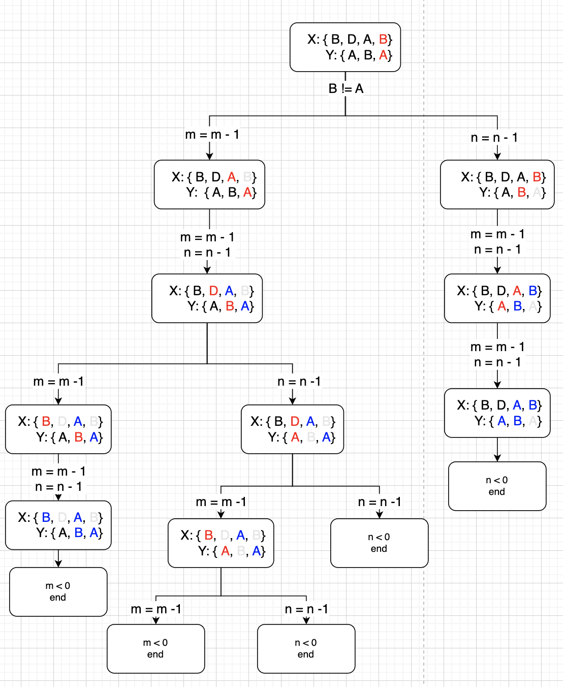
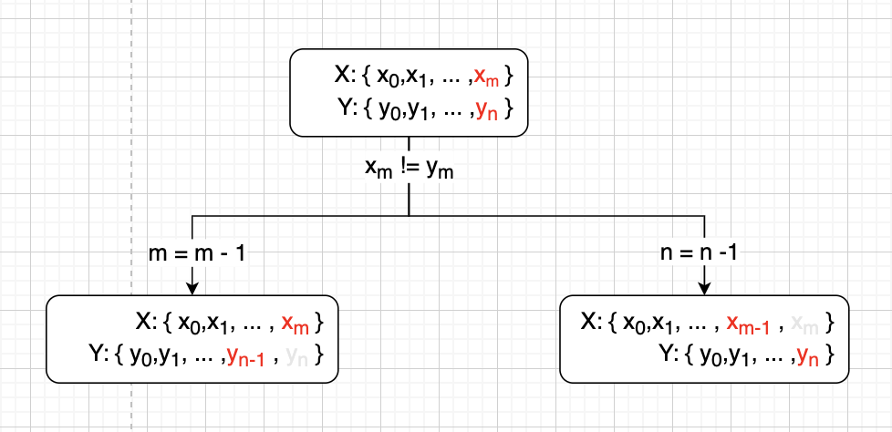

# Background

Recently, I decided to take a look at how **RecyclerView** works. Inside the **Adapter**,

Finding the **Longest Common Subsequence** ( **LCS** ) between or among strings is a well known algorithmic problem.

><br><b>Problem Description</b>
>
>Find the **longest common subsequence** between two sequences **A** and **B**.
>
> A **common subsequence** of two strings is a subsequence that is common to both strings.
><br>

Though this problem seems simple, but it can be found in various applications, including
- **DNA** sequence analysis
- **git diff**
- Update to **RecyclerView** Data

In this article, we will look at different ways to solve LCS, both from the present and the past, including :

<div style="overflow-x:auto;">
<table>
<tr>
  <th> Year </th>
  <th> Author </th>
  <th> Space Complexity </th>
  <th> Time Complexity </th>
  <th> Paper </th>
</tr>

<tr>
  <th>1974</th>

  <td>Wagner<span style="color:rgba(255,255,255,0.5)">_</span>R.A.<br>FISCHER<span style="color:rgba(255,255,255,0.5)">_</span>M.J.</td>

  <td><b>
    O ( n x m )
  </b></td>
  <td><b>
    O ( n x m )
  </b></td>
</tr>
</table>

</div>

The algorithm that we are most interested in is **Myners Diff Algorithm**, which is used in **git diff** and **RecyclerView**.


# Understand the Problem

## Substring vs Subsequence
Ref : [Subsequence vs Substring](https://www.codingninjas.com/codestudio/library/subsequence-vs-substring)

><br>A <b>substring</b> is a <u>contiguous</u> sequence of character within the string.
><br>

So if the string is **Tree**, then we get the following substrings :

```kotlin
"T", "r", "e", "e", "Tr", "re", "ee", "Tre", ...
```

Therefore, for a string with length **N** the total number of substring will be :

$$\begin{aligned}
sum = &N + (N - 1) + ... + 1
\\= &\frac{(N + 1)(N)}{2}
\end{aligned}$$


On the other hand
><br>A <b>subsequence</b> is a <u>sequence</u> that can be derived from another sequence <b>without changing the order</b> .
><br>

For the string **Tree**, subsequences include :

```kotlin
{Tree},
{Tre}, {Tre}, {ree}, {Tee},
{Tr}, {Te}, {Te}, {ee}, {re}, {re},
{T}, {r}, {e}, {e}, {}
```

So for a string with length **N**, the total subsequence will be :

$$\begin{aligned}
sum &= \sum_{k = 0}^{N}( _k^N )
\\ &= 2^N
\end{aligned}$$

Let's try to proof this.

## Proof : Total number of Subsequence

$$\begin{aligned}
sum &= \sum_{k = 0}^{N}( _k^N )
\end{aligned}$$

In this equation, $k$ represents the number of characters that can be taken out from the string with a length $N$, to make a subsequence.

and

$(_k^N)$ represents the total number of subsequences that can be created by taking out $k$ number of characters. It is also known as the **binomial coefficient**

If we expands the equation


|k|Expand|sum|sum(N = k)|
|--|:--|:--|:--:|
|0   | $\frac{N!}{N!0!} = 1$  |$1$|$1 = 2^0$|
|1   | $\frac{N!}{(N - 1)!1!} = N$  | $1 + N$|$2 = 2^1$|
|2   | $\frac{N!}{(N - 2)!2!} = \frac{N(N-1)}{2}$ | $\frac{2 + 2N + N(N - 1)}{2} = \frac{N^2 +N + 2}{2}$|$4 = 2^2$|
|3   | $\frac{N!}{(N - 3)!3!} = \frac{N(N-1)(N-2)}{6}$  | $\frac{N^3 + 5N + 6}{6}$  |$8 = 2^3$|


Through examining, we can find that :

$$\begin{aligned}
\sum_{k = 0}^{N}( _k^N ) &= 2^N
\end{aligned}$$


We can also proof this through <u>[**binomial theorem**](https://www.britannica.com/science/binomial-theorem)</u> :
><br>
>For any positive integer n, the nth power of the sum of two numbers a and b may be expressed as the sum of n + 1 terms of the form<br>
><br>

$$\begin{aligned}
(_k^n)a^{n - k}b^k
\end{aligned}$$

This might not be that obvious, but it will be clear when it is shown in this form :

$$\begin{aligned}
(a + b)^n = (_0^n)a^nb^0 + (^n_1)a^{n - 1}b^1 + ... + (_n^n)a^0b^n
\end{aligned}$$

For different $n$, we will get different coefficients:

|n|coefficients| values
|:--:|:--:|:--:|
|0   |  $(^0_0)$ | 1 |
|1   | $(^1_0), (^1_1)$  | 1 , 1|
|2   |  $(^2_0), (^2_1), (^2_2)$ |1 , 2 , 1|
|3   | $(^3_0), (^3_1), (^3_2), (^3_3)$  | 1 , 3 , 3 , 1  |

As you can see, coefficients are **Pascal's triangle**.

Now, in order to proof the sum of the coefficients, we can simply make $a = 1$ and $b = 1$. As a result, we should get :

$$\begin{aligned}
(1 + 1)^n &= (_0^n)1^n1^0 + (^n_1)1^{n - 1}1^1 + ... + (_n^n)1^01^n
\\&= 2^n
\end{aligned}$$


# Analyzing the Problem
> ref: <b>Introduction to Algorithm, 3rd, 15.4</b>

Assuming we have two strings $X$ and $Y$ :

$$\begin{aligned}
X &= \{ x_1, x_2, x_3,... , x_m\}
\\Y &= \{ y_1, y_2, y_3, ... , y_n\}
\end{aligned}$$

The $i^{th}$ prefix of the sequences can be represented as :

$$\begin{aligned}
X_i = \{ x_1, x_2, x_3, ... , x_i\}
\end{aligned}$$

if $X = \{A, B, C, D\}$, then

$$\begin{aligned}
X_2 = \{A, B\}
\end{aligned}$$

In order to find the **LCS**, we can compare all $2^m $ and  $2^n$ subsequences. But obviously that is not the best choice.

Instead, we can go through $X$ and $Y$ from one end to another, storing all the characters that matches $x_m = y_n$ inside $Z$.

So any **LCS** of the two strings is represented as $Z$ :

$$\begin{aligned}
Z &= \{ z_1, z_2, z_3, ... , z_k\}
\end{aligned}$$

Here are some rules that will be followed when generating $Z$:

><br>
>
>1. If $x_m = y_n$, then it will be appended to $Z$, making it $Z_{k + 1}$.
>2. If $x_m \neq y_n$, then we need to find LCS for both $(X_{m-1}, Y)$ and $(X, Y_{n-1})$.
><br>

Now that we understand the problem, let's try to solve it.

# Native Approach ( $2^{n + m}$ )

Let's take a look this example and try to solve it by **going through all subsequences**.

Here are the two strings of interest:

$$\begin{aligned}
X &= \{ B, D, A, B \}
\\Y &= \{ A, B, A\}
\end{aligned}$$

If we follow the process mentioned above, then we will go though a process like this :


<center>

</center>

From this, we can find all of Common Sequences between $X$ and $Y$ include :

$$\begin{aligned}
\{\{ B, A \}, \{ A \}, \{ A, B \}\}
\end{aligned}$$

and the LCS length is $2$.


This process can be represented using the following code :


```c

#include <stdio.h>
#include <string.h>

int max(int a, int b) { return (a > b) ? a : b; }

int lcs(char* X, char* Y, int m, int n)
{
    if (m == 0 || n == 0)
        return 0;
    if (X[m - 1] == Y[n - 1])
        return 1 + lcs(X, Y, m - 1, n - 1);
    else
        return max(lcs(X, Y, m, n - 1),
                   lcs(X, Y, m - 1, n));
}

int main()
{
    char X[] = "BDAB";
    char Y[] = "ABA";

    int m = strlen(X);
    int n = strlen(Y);

    int length = lcs(X, Y, m, n);
    printf("Length of LCS: %d\n", length);

    return 0;
}

```

### Complexity

||Complexity|
|:--|:--:|
| **Time**  |  $O(2^{n + m})$ |
|  **Space** |  $O(1)$ |

<br>

To find the complexity of this algorithm, we need to take a look at the worst case scenario, where <u>**there is no common subsequence at all**</u>. <br>

<center>

</center>

<br>

From the graph, we can see that whenever an unmatch occurred, `lcs(char*, char*, int, int)` will be called **twice** with the reduced `m` or `n` values.

And the process will continue until `m` or `n` become **0**.

So, the time complexity of this approach is [ref](https://www.quora.com/How-do-I-do-the-sum-of-Sigma-2-n):

$$\begin{aligned}
sum &= 2^1 + 2^2 + 2^3 + ... + 2^{n + m}
\\ &= a\frac{(r^{n + m} -1)}{r-1}
\\ &= 1\frac{(2^{n + m} -1)}{2-1}
\\ &=O(2^{n + m})
\end{aligned}$$


As for **Space Complexity**, since the only space that we are using comes from both $X$ and $Y$ strings.

Thus, the the **Space Complexity** is :

$$\begin{aligned}
O(n + m) = O(1)
\end{aligned}$$


From the result, this is obviously not the best approach. We shall start by going through papers that play a role in developing algorithms to solve LCS problem.

# String to String Problem (1974)

The first paper we will go through is <u><i>**The String-to-String Correction Problem**</u></i> by **ROBERT A. WAGNER** and **MICHAEL J. FISCHER** in **1974**.

In this paper, a **trace** is used to describe the transformation from string $A$ to string $B$ as :

$$T = A \Rightarrow B$$

In order to perform $A \Rightarrow B$, it needs to go through a set of operation sequences $S$ :

$$S = \{s_1, s_2, ... , s_m\}$$

Each sequence $s_i$ is a combination of 1 or more <i>**edit operation**</i> acting on a pair of strings $(a, b)$ of length $\leqslant 1$:

- <b>*change*</b> $a$ to $b$ : $a \rightarrow b$
- <b> *insert* </b> : $a = \Lambda$  (empty) <br>
- <b>*delete* </b> : when $b = \Lambda$

And the **cost** to perform $a \rightarrow b$ is :

$$\begin{align} \nonumber
\gamma(a \rightarrow b)
\end{align}$$

If $b = a$ then $\gamma(a \rightarrow a) = 0$ .

The total cost to tranform $A \Rightarrow B$ is written as :

$$\gamma(S) = \sum_{i = 1}^{m}\gamma(s_i) = cost(T)$$

The purpose of this paper is the find the minimum cost to perform $a \rightarrow b$ , aka **edit distance** :

$$\delta(a \rightarrow b)$$

And for every edit sequence $S$ for $A \Rightarrow B$ , there is a trace $T$ such that :

$$cost(T) \leqslant \gamma(S)$$

meaning that $\delta(A \rightarrow B)$ is also the minimum cost trace from $A$ to $B$.

Here is an example from the paper :

<center>

</center>

<br>

The lines in the diagram indicated $S$ has been applied to $A_i$ and corresponding $B_j$.

As for the letters that were untouched, the letter in $A$ will be **deleted**, while letters in $B$ will be **inserted**.

Thus the total cost for $A \Rightarrow B$ is written as :

$$ cost(T) = \sum_{(i, j) \in T}\gamma(A_i \rightarrow B_j) + \sum_{i \in I}\gamma(A_i \rightarrow \Lambda) + \sum_{j \in J}\gamma(\Lambda \rightarrow B_j)$$


From the diagram, we can see that both strings $A$ and $B$ can be represented as two substrings:

<center>

</center>

$$\begin{align}
A = A_1A_2
\nonumber
\\B = B_1B_2
\nonumber
\end{align}$$

Since $A_1$ and $A_2$, as well as $B_1$ and $B_2$ do not have any line connected, we can say that :

$$\begin{align}
cost (T) = cost(T_1) + cost (T_2)
\nonumber
\end{align}$$

and the lowest cost for each substrings is denoted as $D$ :

$$\begin{align}
D(i, j) &= \delta(A<1:i>, B<1:j>)
\nonumber
\\&= \delta(A(i), B(j))
\nonumber
\end{align}$$

which is simply the minimum cost of **edit operations** on $A_i$ and $B_j$, along with the minimum cost before these strings :

$$\begin{align}
\nonumber
\\D(i,j)= min\{ &D(i - 1, j - 1) + \gamma(A_i
\rightarrow B_j),
\nonumber
\\&D(i-1, j) + \gamma(A_i \rightarrow \Lambda)
\nonumber
\\&D(i, j - 1) + \gamma(\Lambda \rightarrow B_j)\}
\nonumber
\end{align}$$

><br>
>
>Here you can see the assembling between $D(i,j)$ and the algorithm we wrote at the beginning.
><br><br>

Based on what we've known so far, we can create a sudo-code ( **Algorithm X** ) as follows :


```c
 int D[0, 0] = 0;
 // generate the cost to delete Ai
 for i: 1 to |A| do D[i, 0] = D[i - 1, 0] + γ(A[i] -> Λ);
 // generate the cost to insert Bi
 for j: 1 to |B| do D[0, j] = D[0, j - 1] + γ(Λ -> B[j]);

```

The code above is used to find the costs for **delete** and **insert**, which will generate this table:

<div style="overflow-x:auto;">
<table style="border:3px #000;"  cellpadding="10">
<tr>
<th></th>
<th>j</th>
<th>0</th>
<th>1 ... ( n - 2 )</th>
<th>n - 1</th>
<th>n</th>
</tr>

<tr>
<th>i</th>
<th></th>
<th>y<sub>0</sub></th>
<th>y<sub>j</sub></th>
<th>y<sub>n - 1</sub></th>
<th>y<sub>n</sub></th>
</tr>

<tr>
<th><center>0</center></th>
<th>x<sub>0</sub></th>
<th style="background-color:#000;"><span style="color:#ffffff">0</span></th>

<td style="background-color:#00f"><span style="color:#fff">γ<span style="color:rgba(0,0,255,0.5)">_</span>(<span style="color:rgba(0,0,255,0.5)">_</span>Λ<span style="color:rgba(0,0,255,0.5)">_</span>→<span style="color:rgba(0,0,255,0.5)">_</span>B<sub><span style="color:rgba(0,0,255,0.5)">_</span>j&#8722;1</sub><span style="color:rgba(0,0,255,0.5)">_</span>) <br>+<span style="color:rgba(0,0,255,0.5)">_</span>γ<span style="color:rgba(0,0,255,0.5)">_</span>(<span style="color:rgba(0,0,255,0.5)">_</span>Λ<span style="color:rgba(0,0,255,0.5)">_</span>→<span style="color:rgba(0,0,255,0.5)">_</span>b<sub><span style="color:rgba(0,0,255,0.5)">_</span>j</sub><span style="color:rgba(0,0,255,0.5)">_</span>)</span></td>

<td style="background-color:#00f"><span style="color:#fff">γ<span style="color:rgba(0,0,255,0.5)">_</span>(<span style="color:rgba(0,0,255,0.5)">_</span>Λ<span style="color:rgba(0,0,255,0.5)">_</span>→<span style="color:rgba(0,0,255,0.5)">_</span>B<sub><span style="color:rgba(0,0,255,0.5)">_</span>n&#8722;2</sub><span style="color:rgba(0,0,255,0.5)">_</span>) <br>+<span style="color:rgba(0,0,255,0.5)">_</span>γ<span style="color:rgba(0,0,255,0.5)">_</span>(<span style="color:rgba(0,0,255,0.5)">_</span>Λ<span style="color:rgba(0,0,255,0.5)">_</span>→<span style="color:rgba(0,0,255,0.5)">_</span>b<sub><span style="color:rgba(0,0,255,0.5)">_</span>n&#8722;1</sub><span style="color:rgba(0,0,255,0.5)">_</span>)</span></td>

<td style="background-color:#00f"><span style="color:#fff">γ<span style="color:rgba(0,0,255,0.5)">_</span>(<span style="color:rgba(0,0,255,0.5)">_</span>Λ<span style="color:rgba(0,0,255,0.5)">_</span>→<span style="color:rgba(0,0,255,0.5)">_</span>B<sub><span style="color:rgba(0,0,255,0.5)">_</span>n&#8722;1</sub><span style="color:rgba(0,0,255,0.5)">_</span>) <br>+<span style="color:rgba(0,0,255,0.5)">_</span>γ<span style="color:rgba(0,0,255,0.5)">_</span>(<span style="color:rgba(0,0,255,0.5)">_</span>Λ<span style="color:rgba(0,0,255,0.5)">_</span>→<span style="color:rgba(0,0,255,0.5)">_</span>b<sub><span style="color:rgba(0,0,255,0.5)">_</span>n</sub><span style="color:rgba(0,0,255,0.5)">_</span>)</span></td>


</tr>

<tr>
<th>1<span style="color:rgba(255,255,255,0.5)">_</span>...<span style="color:rgba(255,255,255,0.5)">_</span>(<span style="color:rgba(255,255,255,0.5)">_</span>m<span style="color:rgba(255,255,255,0.5)">_</span>&#8722;<span style="color:rgba(255,255,255,0.5)">_</span>2<span style="color:rgba(255,255,255,0.5)">_</span>)</th>
<th>x<sub>i</sub></th>

<td style="background-color:#c00"><span style="color:#fff">γ<span style="color:rgba(204,0,0,0.5)">_</span>(<span style="color:rgba(204,0,0,0.5)">_</span>A<sub><span style="color:rgba(204,0,0,0.5)">_</span>i&#8722;1</sub><span style="color:rgba(204,0,0,0.5)">_</span>→<span style="color:rgba(204,0,0,0.5)">_</span>Λ<span style="color:rgba(204,0,0,0.5)">_</span>) <br>+<span style="color:rgba(204,0,0,0.5)">_</span>γ<span style="color:rgba(204,0,0,0.5)">_</span>(<span style="color:rgba(204,0,0,0.5)">_</span>a<sub><span style="color:rgba(204,0,0,0.5)">_</span>i</sub><span style="color:rgba(204,0,0,0.5)">_</span>→<span style="color:rgba(204,0,0,0.5)">_</span>Λ<span style="color:rgba(204,0,0,0.5)">_</span>)</span></td>

<td></td>

<td></td><td></td>

</tr>

<tr>
<th>m - 1</th>
<th>x<sub>m&#8722;1</sub></th>
<td style="background-color:#c00"><span style="color:#fff">γ<span style="color:rgba(204,0,0,0.5)">_</span>(<span style="color:rgba(204,0,0,0.5)">_</span>A<sub><span style="color:rgba(204,0,0,0.5)">_</span>m&#8722;2</sub><span style="color:rgba(204,0,0,0.5)">_</span>→<span style="color:rgba(204,0,0,0.5)">_</span>Λ<span style="color:rgba(204,0,0,0.5)">_</span>) <br>+<span style="color:rgba(204,0,0,0.5)">_</span>γ<span style="color:rgba(204,0,0,0.5)">_</span>(<span style="color:rgba(204,0,0,0.5)">_</span>a<sub><span style="color:rgba(204,0,0,0.5)">_</span>m&#8722;1</sub><span style="color:rgba(204,0,0,0.5)">_</span>→<span style="color:rgba(204,0,0,0.5)">_</span>Λ<span style="color:rgba(204,0,0,0.5)">_</span>)</span></td>
<td></td>
<td></td>
<td></td>

</tr>

<tr>
<th>m</th>
<th>x<sub>m</sub></th>
<td style="background-color:#c00"><span style="color:#fff">γ<span style="color:rgba(204,0,0,0.5)">_</span>(<span style="color:rgba(204,0,0,0.5)">_</span>A<sub><span style="color:rgba(204,0,0,0.5)">_</span>m&#8722;1</sub><span style="color:rgba(204,0,0,0.5)">_</span>→<span style="color:rgba(204,0,0,0.5)">_</span>Λ<span style="color:rgba(204,0,0,0.5)">_</span>) <br>+<span style="color:rgba(204,0,0,0.5)">_</span>γ<span style="color:rgba(204,0,0,0.5)">_</span>(<span style="color:rgba(204,0,0,0.5)">_</span>a<sub><span style="color:rgba(204,0,0,0.5)">_</span>m</sub><span style="color:rgba(204,0,0,0.5)">_</span>→<span style="color:rgba(204,0,0,0.5)">_</span>Λ<span style="color:rgba(204,0,0,0.5)">_</span>)</span></td>

<td></td><td></td>

<td></td>

</tr>

<tr>
<td></td><td></td><td></td><td></td><td></td><td></td>
</tr>

</table>
</div>

Then to find the minimum costs, we also need to calculate the costs to **change** and simply find the minimum among the three operations :

```c
// find the minimum cost for transformation to occur
 for i: 1 to |A| do
    for j: 1 to |B| do
        costChange = D[i - 1, j - 1] + γ(A[i] -> B[j]);
        costDelete = D[i - 1, j] + γ(A[i] -> Λ);
        costInsert = D[i, j - 1] + γ(Λ -> B[j]);

        D[i, j] = min (costChange, costDelete, costInsert);
```

The relationship among cost of **change**, **delete** and **insert** is shown below. From it, we can see that the cost to **change** has a diagonal relationship to the previous $D[i - 1, j - 1]$ :

<div style="overflow-x:auto;">
<table style="border:3px #000;"  cellpadding="10">
<tr>
<th></th>
<th>j</th>
<th>0</th>
<th>1</th>
<th>2 ... ( n - 2 )</th>
<th>n - 1</th>
<th>n</th>
</tr>

<tr>
<th>i</th>
<th></th>
<th>y<sub>0</sub></th>
<th>y<sub>1</sub></th>
<th>y<sub>j</sub></th>
<th>y<sub>n - 1</sub></th>
<th>y<sub>n</sub></th>
</tr>

<tr>
<th><center>0</center></th>
<th>x<sub>0</sub></th>
<th style="background-color:#000;"><span style="color:#ffffff">0</span></th>

<td style="background-color:#00f"><span style="color:#fff">0<span style="color:rgba(0,0,255,0.5)">_</span>+<span style="color:rgba(0,0,255,0.5)">_</span>γ<span style="color:rgba(0,0,255,0.5)">_</span>(<span style="color:rgba(0,0,255,0.5)">_</span>Λ<span style="color:rgba(0,0,255,0.5)">_</span>→<span style="color:rgba(0,0,255,0.5)">_</span>b<sub><span style="color:rgba(0,0,255,0.5)">_</span>j</sub><span style="color:rgba(0,0,255,0.5)">_</span>)</span></td>
<td style="background-color:#00f"><span style="color:#fff">γ<span style="color:rgba(0,0,255,0.5)">_</span>(<span style="color:rgba(0,0,255,0.5)">_</span>Λ<span style="color:rgba(0,0,255,0.5)">_</span>→<span style="color:rgba(0,0,255,0.5)">_</span>B<sub><span style="color:rgba(0,0,255,0.5)">_</span>j&#8722;1</sub><span style="color:rgba(0,0,255,0.5)">_</span>) <br>+<span style="color:rgba(0,0,255,0.5)">_</span>γ<span style="color:rgba(0,0,255,0.5)">_</span>(<span style="color:rgba(0,0,255,0.5)">_</span>Λ<span style="color:rgba(0,0,255,0.5)">_</span>→<span style="color:rgba(0,0,255,0.5)">_</span>b<sub><span style="color:rgba(0,0,255,0.5)">_</span>j</sub><span style="color:rgba(0,0,255,0.5)">_</span>)</span></td>

<td style="background-color:#00f"><span style="color:#fff">γ<span style="color:rgba(0,0,255,0.5)">_</span>(<span style="color:rgba(0,0,255,0.5)">_</span>Λ<span style="color:rgba(0,0,255,0.5)">_</span>→<span style="color:rgba(0,0,255,0.5)">_</span>B<sub><span style="color:rgba(0,0,255,0.5)">_</span>n&#8722;2</sub><span style="color:rgba(0,0,255,0.5)">_</span>) <br>+<span style="color:rgba(0,0,255,0.5)">_</span>γ<span style="color:rgba(0,0,255,0.5)">_</span>(<span style="color:rgba(0,0,255,0.5)">_</span>Λ<span style="color:rgba(0,0,255,0.5)">_</span>→<span style="color:rgba(0,0,255,0.5)">_</span>b<sub><span style="color:rgba(0,0,255,0.5)">_</span>n&#8722;1</sub><span style="color:rgba(0,0,255,0.5)">_</span>)</span></td>

<td style="background-color:#00f"><span style="color:#fff">γ<span style="color:rgba(0,0,255,0.5)">_</span>(<span style="color:rgba(0,0,255,0.5)">_</span>Λ<span style="color:rgba(0,0,255,0.5)">_</span>→<span style="color:rgba(0,0,255,0.5)">_</span>B<sub><span style="color:rgba(0,0,255,0.5)">_</span>n&#8722;1</sub><span style="color:rgba(0,0,255,0.5)">_</span>) <br>+<span style="color:rgba(0,0,255,0.5)">_</span>γ<span style="color:rgba(0,0,255,0.5)">_</span>(<span style="color:rgba(0,0,255,0.5)">_</span>Λ<span style="color:rgba(0,0,255,0.5)">_</span>→<span style="color:rgba(0,0,255,0.5)">_</span>b<sub><span style="color:rgba(0,0,255,0.5)">_</span>n</sub><span style="color:rgba(0,0,255,0.5)">_</span>)</span></td>

</tr>

<tr>
<th>1</th>

<th>x<sub>1</sub></th>

<td style="background-color:#c00"><span style="color:#fff">0<span style="color:rgba(204,0,0,0.5)">_</span>+<span style="color:rgba(204,0,0,0.5)">_</span>γ<span style="color:rgba(204,0,0,0.5)">_</span>(<span style="color:rgba(204,0,0,0.5)">_</span>a<sub><span style="color:rgba(204,0,0,0.5)">_</span>1</sub><span style="color:rgba(204,0,0,0.5)">_</span>→<span style="color:rgba(204,0,0,0.5)">_</span>Λ<span style="color:rgba(204,0,0,0.5)">_</span>)</span></td>

<td style="background-color:#090"><span style="color:#fff">0<span style="color:rgba(0,153,0,0.5)">_</span>+<span style="color:rgba(0,153,0,0.5)">_</span>γ<span style="color:rgba(0,153,0,0.5)">_</span>(<span style="color:rgba(0,153,0,0.5)">_</span>a<sub><span style="color:rgba(0,153,0,0.5)">_</span>1</sub><span style="color:rgba(0,153,0,0.5)">_</span>→<span style="color:rgba(0,153,0,0.5)">_</span>b<sub><span style="color:rgba(0,153,0,0.5)">_</span>1</sub><span style="color:rgba(0,153,0,0.5)">_</span>)</span></td>

<td style="background-color:#0b0"><span style="color:#fff">γ<span style="color:rgba(0,204,0,0.5)">_</span>(<span style="color:rgba(0,204,0,0.5)">_</span>A<sub><span style="color:rgba(0,204,0,0.5)">_</span>0</sub><span style="color:rgba(0,204,0,0.5)">_</span>→<span style="color:rgba(0,204,0,0.5)">_</span>B<sub><span style="color:rgba(0,204,0,0.5)">_</span>j&#8722;1</sub><span style="color:rgba(0,204,0,0.5)">_</span>) <br>+<span style="color:rgba(0,204,0,0.5)">_</span>γ<span style="color:rgba(0,204,0,0.5)">_</span>(<span style="color:rgba(0,204,0,0.5)">_</span>a<sub><span style="color:rgba(0,204,0,0.5)">_</span>1</sub><span style="color:rgba(0,204,0,0.5)">_</span>→<span style="color:rgba(0,204,0,0.5)">_</span>b<sub><span style="color:rgba(0,204,0,0.5)">_</span>j</sub><span style="color:rgba(0,204,0,0.5)">_</span>)</span></td>

<td style="background-color:#0d0"><span style="color:#000">γ<span style="color:rgba(0,204,0,0.5)">_</span>(<span style="color:rgba(0,204,0,0.5)">_</span>A<sub><span style="color:rgba(0,204,0,0.5)">_</span>0</sub><span style="color:rgba(0,204,0,0.5)">_</span>→<span style="color:rgba(0,204,0,0.5)">_</span>B<sub><span style="color:rgba(0,204,0,0.5)">_</span>n&#8722;2</sub><span style="color:rgba(0,204,0,0.5)">_</span>) <br>+<span style="color:rgba(0,204,0,0.5)">_</span>γ<span style="color:rgba(0,204,0,0.5)">_</span>(<span style="color:rgba(0,204,0,0.5)">_</span>a<sub><span style="color:rgba(0,204,0,0.5)">_</span>1</sub><span style="color:rgba(0,204,0,0.5)">_</span>→<span style="color:rgba(0,204,0,0.5)">_</span>b<sub><span style="color:rgba(0,204,0,0.5)">_</span>n&#8722;1</sub><span style="color:rgba(0,204,0,0.5)">_</span>)</span></td>

<td style="background-color:#0f0"><span style="color:#000">γ<span style="color:rgba(0,204,0,0.5)">_</span>(<span style="color:rgba(0,204,0,0.5)">_</span>A<sub><span style="color:rgba(0,204,0,0.5)">_</span>0</sub><span style="color:rgba(0,204,0,0.5)">_</span>→<span style="color:rgba(0,204,0,0.5)">_</span>B<sub><span style="color:rgba(0,204,0,0.5)">_</span>n&#8722;1</sub><span style="color:rgba(0,204,0,0.5)">_</span>) <br>+<span style="color:rgba(0,204,0,0.5)">_</span>γ<span style="color:rgba(0,204,0,0.5)">_</span>(<span style="color:rgba(0,204,0,0.5)">_</span>a<sub><span style="color:rgba(0,204,0,0.5)">_</span>1</sub><span style="color:rgba(0,204,0,0.5)">_</span>→<span style="color:rgba(0,204,0,0.5)">_</span>b<sub><span style="color:rgba(0,204,0,0.5)">_</span>n</sub><span style="color:rgba(0,204,0,0.5)">_</span>)</span></td>

</tr>

<tr>
<th>1<span style="color:rgba(255,255,255,0.5)">_</span>...<span style="color:rgba(255,255,255,0.5)">_</span>(<span style="color:rgba(255,255,255,0.5)">_</span>m<span style="color:rgba(255,255,255,0.5)">_</span>&#8722;<span style="color:rgba(255,255,255,0.5)">_</span>2<span style="color:rgba(255,255,255,0.5)">_</span>)</th>

<th>x<sub>i</sub></th>

<td style="background-color:#c00"><span style="color:#fff">γ<span style="color:rgba(204,0,0,0.5)">_</span>(<span style="color:rgba(204,0,0,0.5)">_</span>A<sub><span style="color:rgba(204,0,0,0.5)">_</span>i&#8722;1</sub><span style="color:rgba(204,0,0,0.5)">_</span>→<span style="color:rgba(204,0,0,0.5)">_</span>Λ<span style="color:rgba(204,0,0,0.5)">_</span>) <br>+<span style="color:rgba(204,0,0,0.5)">_</span>γ<span style="color:rgba(204,0,0,0.5)">_</span>(<span style="color:rgba(204,0,0,0.5)">_</span>a<sub><span style="color:rgba(204,0,0,0.5)">_</span>i</sub><span style="color:rgba(204,0,0,0.5)">_</span>→<span style="color:rgba(204,0,0,0.5)">_</span>Λ<span style="color:rgba(204,0,0,0.5)">_</span>)</span></td>

<td style="background-color:#070"><span style="color:#fff">γ<span style="color:rgba(0,119,0,0.5)">_</span>(<span style="color:rgba(0,119,0,0.5)">_</span>A<sub><span style="color:rgba(0,119,0,0.5)">_</span>i&#8722;1</sub><span style="color:rgba(0,119,0,0.5)">_</span>→<span style="color:rgba(0,119,0,0.5)">_</span>B<sub><span style="color:rgba(0,119,0,0.5)">_</span>0</sub><span style="color:rgba(0,119,0,0.5)">_</span>) <br>+<span style="color:rgba(0,119,0,0.5)">_</span>γ<span style="color:rgba(0,119,0,0.5)">_</span>(<span style="color:rgba(0,119,0,0.5)">_</span>a<sub><span style="color:rgba(0,119,0,0.5)">_</span>i</sub><span style="color:rgba(0,119,0,0.5)">_</span>→<span style="color:rgba(0,119,0,0.5)">_</span>b<sub><span style="color:rgba(0,119,0,0.5)">_</span>1</sub><span style="color:rgba(0,119,0,0.5)">_</span>)</span></td>

<td style="background-color:#090"><span style="color:#fff">γ<span style="color:rgba(0,153,0,0.5)">_</span>(<span style="color:rgba(0,153,0,0.5)">_</span>A<sub><span style="color:rgba(0,153,0,0.5)">_</span>i&#8722;1</sub><span style="color:rgba(0,153,0,0.5)">_</span>→<span style="color:rgba(0,153,0,0.5)">_</span>B<sub><span style="color:rgba(0,153,0,0.5)">_</span>j&#8722;1</sub><span style="color:rgba(0,153,0,0.5)">_</span>) <br>+<span style="color:rgba(0,153,0,0.5)">_</span>γ<span style="color:rgba(0,153,0,0.5)">_</span>(<span style="color:rgba(0,153,0,0.5)">_</span>a<sub><span style="color:rgba(0,153,0,0.5)">_</span>i</sub><span style="color:rgba(0,153,0,0.5)">_</span>→<span style="color:rgba(0,153,0,0.5)">_</span>b<sub><span style="color:rgba(0,153,0,0.5)">_</span>j</sub><span style="color:rgba(0,153,0,0.5)">_</span>)</span></td>

<td style="background-color:#0b0"><span style="color:#fff">γ<span style="color:rgba(0,187,0,0.5)">_</span>(<span style="color:rgba(0,187,0,0.5)">_</span>A<sub><span style="color:rgba(0,187,0,0.5)">_</span>i&#8722;1</sub><span style="color:rgba(0,187,0,0.5)">_</span>→<span style="color:rgba(0,187,0,0.5)">_</span>B<sub><span style="color:rgba(0,187,0,0.5)">_</span>n&#8722;2</sub><span style="color:rgba(0,187,0,0.5)">_</span>) <br>+<span style="color:rgba(0,187,0,0.5)">_</span>γ<span style="color:rgba(0,187,0,0.5)">_</span>(<span style="color:rgba(0,187,0,0.5)">_</span>a<sub><span style="color:rgba(0,187,0,0.5)">_</span>i</sub><span style="color:rgba(0,187,0,0.5)">_</span>→<span style="color:rgba(0,187,0,0.5)">_</span>b<sub><span style="color:rgba(0,187,0,0.5)">_</span>n&#8722;1</sub><span style="color:rgba(0,187,0,0.5)">_</span>)</span></td>

<td style="background-color:#0d0"><span style="color:#000">γ<span style="color:rgba(0,221,0,0.5)">_</span>(<span style="color:rgba(0,221,0,0.5)">_</span>A<sub><span style="color:rgba(0,221,0,0.5)">_</span>i&#8722;1</sub><span style="color:rgba(0,221,0,0.5)">_</span>→<span style="color:rgba(0,221,0,0.5)">_</span>B<sub><span style="color:rgba(0,221,0,0.5)">_</span>n&#8722;1</sub><span style="color:rgba(0,221,0,0.5)">_</span>) <br>+<span style="color:rgba(0,221,0,0.5)">_</span>γ<span style="color:rgba(0,221,0,0.5)">_</span>(<span style="color:rgba(0,221,0,0.5)">_</span>a<sub><span style="color:rgba(0,221,0,0.5)">_</span>i</sub><span style="color:rgba(0,221,0,0.5)">_</span>→<span style="color:rgba(0,221,0,0.5)">_</span>b<sub><span style="color:rgba(0,221,0,0.5)">_</span>n</sub><span style="color:rgba(0,221,0,0.5)">_</span>)</span></td>

</tr>

<tr>
<th>m - 1</th>
<th>x<sub>m&#8722;1</sub></th>
<td style="background-color:#c00"><span style="color:#fff">γ<span style="color:rgba(204,0,0,0.5)">_</span>(<span style="color:rgba(204,0,0,0.5)">_</span>A<sub><span style="color:rgba(204,0,0,0.5)">_</span>m&#8722;2</sub><span style="color:rgba(204,0,0,0.5)">_</span>→<span style="color:rgba(204,0,0,0.5)">_</span>Λ<span style="color:rgba(204,0,0,0.5)">_</span>) <br>+<span style="color:rgba(204,0,0,0.5)">_</span>γ<span style="color:rgba(204,0,0,0.5)">_</span>(<span style="color:rgba(204,0,0,0.5)">_</span>a<sub><span style="color:rgba(204,0,0,0.5)">_</span>m&#8722;1</sub><span style="color:rgba(204,0,0,0.5)">_</span>→<span style="color:rgba(204,0,0,0.5)">_</span>Λ<span style="color:rgba(204,0,0,0.5)">_</span>)</span></td>

<td style="background-color:#050"><span style="color:#fff">γ<span style="color:rgba(0,85,0,0.5)">_</span>(<span style="color:rgba(0,85,0,0.5)">_</span>A<sub><span style="color:rgba(0,85,0,0.5)">_</span>m&#8722;2</sub><span style="color:rgba(0,85,0,0.5)">_</span>→<span style="color:rgba(0,85,0,0.5)">_</span>B<sub><span style="color:rgba(0,85,0,0.5)">_</span>0</sub><span style="color:rgba(0,85,0,0.5)">_</span>) <br>+<span style="color:rgba(0,85,0,0.5)">_</span>γ<span style="color:rgba(0,85,0,0.5)">_</span>(<span style="color:rgba(0,85,0,0.5)">_</span>a<sub><span style="color:rgba(0,85,0,0.5)">_</span>m&#8722;1</sub><span style="color:rgba(0,85,0,0.5)">_</span>→<span style="color:rgba(0,85,0,0.5)">_</span>b<sub><span style="color:rgba(0,85,0,0.5)">_</span>1</sub><span style="color:rgba(0,85,0,0.5)">_</span>)</span></td>

<td style="background-color:#070"><span style="color:#fff">γ<span style="color:rgba(0,119,0,0.5)">_</span>(<span style="color:rgba(0,119,0,0.5)">_</span>A<sub><span style="color:rgba(0,119,0,0.5)">_</span>m&#8722;2</sub><span style="color:rgba(0,119,0,0.5)">_</span>→<span style="color:rgba(0,119,0,0.5)">_</span>B<sub><span style="color:rgba(0,119,0,0.5)">_</span>j&#8722;2</sub><span style="color:rgba(0,119,0,0.5)">_</span>) <br>+<span style="color:rgba(0,119,0,0.5)">_</span>γ<span style="color:rgba(0,119,0,0.5)">_</span>(<span style="color:rgba(0,119,0,0.5)">_</span>a<sub><span style="color:rgba(0,119,0,0.5)">_</span>m&#8722;1</sub><span style="color:rgba(0,119,0,0.5)">_</span>→<span style="color:rgba(0,119,0,0.5)">_</span>b<sub><span style="color:rgba(0,119,0,0.5)">_</span>j&#8722;1</sub><span style="color:rgba(0,119,0,0.5)">_</span>)</span></td>

<td style="background-color:#090"><span style="color:#fff">γ<span style="color:rgba(0,153,0,0.5)">_</span>(<span style="color:rgba(0,153,0,0.5)">_</span>A<sub><span style="color:rgba(0,153,0,0.5)">_</span>m&#8722;2</sub><span style="color:rgba(0,153,0,0.5)">_</span>→<span style="color:rgba(0,153,0,0.5)">_</span>B<sub><span style="color:rgba(0,153,0,0.5)">_</span>n&#8722;2</sub><span style="color:rgba(0,153,0,0.5)">_</span>) <br>+<span style="color:rgba(0,153,0,0.5)">_</span>γ<span style="color:rgba(0,153,0,0.5)">_</span>(<span style="color:rgba(0,153,0,0.5)">_</span>a<sub><span style="color:rgba(0,153,0,0.5)">_</span>m&#8722;1</sub><span style="color:rgba(0,153,0,0.5)">_</span>→<span style="color:rgba(0,153,0,0.5)">_</span>b<sub><span style="color:rgba(0,153,0,0.5)">_</span>n&#8722;1</sub><span style="color:rgba(0,153,0,0.5)">_</span>)</span></td>

<td style="background-color:#0b0"><span style="color:#fff">γ<span style="color:rgba(0,187,0,0.5)">_</span>(<span style="color:rgba(0,187,0,0.5)">_</span>A<sub><span style="color:rgba(0,187,0,0.5)">_</span>m&#8722;2</sub><span style="color:rgba(0,187,0,0.5)">_</span>→<span style="color:rgba(0,187,0,0.5)">_</span>B<sub><span style="color:rgba(0,187,0,0.5)">_</span>n&#8722;1</sub><span style="color:rgba(0,187,0,0.5)">_</span>) <br>+<span style="color:rgba(0,187,0,0.5)">_</span>γ<span style="color:rgba(0,187,0,0.5)">_</span>(<span style="color:rgba(0,187,0,0.5)">_</span>a<sub><span style="color:rgba(0,187,0,0.5)">_</span>m&#8722;1</sub><span style="color:rgba(0,187,0,0.5)">_</span>→<span style="color:rgba(0,187,0,0.5)">_</span>b<sub><span style="color:rgba(0,187,0,0.5)">_</span>n</sub><span style="color:rgba(0,187,0,0.5)">_</span>)</span></td>

</tr>

<tr>
<th>m</th>
<th>x<sub>i</sub></th>
<td style="background-color:#c00"><span style="color:#fff">γ<span style="color:rgba(204,0,0,0.5)">_</span>(<span style="color:rgba(204,0,0,0.5)">_</span>A<sub><span style="color:rgba(204,0,0,0.5)">_</span>m&#8722;1</sub><span style="color:rgba(204,0,0,0.5)">_</span>→<span style="color:rgba(204,0,0,0.5)">_</span>Λ<span style="color:rgba(204,0,0,0.5)">_</span>) <br>+<span style="color:rgba(204,0,0,0.5)">_</span>γ<span style="color:rgba(204,0,0,0.5)">_</span>(<span style="color:rgba(204,0,0,0.5)">_</span>a<sub><span style="color:rgba(204,0,0,0.5)">_</span>m</sub><span style="color:rgba(204,0,0,0.5)">_</span>→<span style="color:rgba(204,0,0,0.5)">_</span>Λ<span style="color:rgba(204,0,0,0.5)">_</span>)</span></td>

<td style="background-color:#030"><span style="color:#fff">γ<span style="color:rgba(0,51,0,0.5)">_</span>(<span style="color:rgba(0,51,0,0.5)">_</span>A<sub><span style="color:rgba(0,51,0,0.5)">_</span>m&#8722;1</sub><span style="color:rgba(0,51,0,0.5)">_</span>→<span style="color:rgba(0,51,0,0.5)">_</span>B<sub><span style="color:rgba(0,51,0,0.5)">_</span>0</sub><span style="color:rgba(0,51,0,0.5)">_</span>) <br>+<span style="color:rgba(0,51,0,0.5)">_</span>γ<span style="color:rgba(0,51,0,0.5)">_</span>(<span style="color:rgba(0,51,0,0.5)">_</span>a<sub><span style="color:rgba(0,51,0,0.5)">_</span>m</sub><span style="color:rgba(0,51,0,0.5)">_</span>→<span style="color:rgba(0,51,0,0.5)">_</span>b<sub><span style="color:rgba(0,51,0,0.5)">_</span>1</sub><span style="color:rgba(0,51,0,0.5)">_</span>)</span></td>


<td style="background-color:#050"><span style="color:#fff">γ<span style="color:rgba(0,85,0,0.5)">_</span>(<span style="color:rgba(0,85,0,0.5)">_</span>A<sub><span style="color:rgba(0,85,0,0.5)">_</span>m&#8722;1</sub><span style="color:rgba(0,85,0,0.5)">_</span>→<span style="color:rgba(0,85,0,0.5)">_</span>B<sub><span style="color:rgba(0,85,0,0.5)">_</span>j&#8722;2</sub><span style="color:rgba(0,85,0,0.5)">_</span>) <br>+<span style="color:rgba(0,85,0,0.5)">_</span>γ<span style="color:rgba(0,85,0,0.5)">_</span>(<span style="color:rgba(0,85,0,0.5)">_</span>a<sub><span style="color:rgba(0,85,0,0.5)">_</span>m</sub><span style="color:rgba(0,85,0,0.5)">_</span>→<span style="color:rgba(0,85,0,0.5)">_</span>b<sub><span style="color:rgba(0,85,0,0.5)">_</span>j&#8722;1</sub><span style="color:rgba(0,85,0,0.5)">_</span>)</span></td>

<td style="background-color:#070"><span style="color:#fff">γ<span style="color:rgba(0,119,0,0.5)">_</span>(<span style="color:rgba(0,119,0,0.5)">_</span>A<sub><span style="color:rgba(0,119,0,0.5)">_</span>m&#8722;1</sub><span style="color:rgba(0,119,0,0.5)">_</span>→<span style="color:rgba(0,119,0,0.5)">_</span>B<sub><span style="color:rgba(0,119,0,0.5)">_</span>n&#8722;2</sub><span style="color:rgba(0,119,0,0.5)">_</span>) <br>+<span style="color:rgba(0,119,0,0.5)">_</span>γ<span style="color:rgba(0,119,0,0.5)">_</span>(<span style="color:rgba(0,119,0,0.5)">_</span>a<sub><span style="color:rgba(0,119,0,0.5)">_</span>m</sub><span style="color:rgba(0,119,0,0.5)">_</span>→<span style="color:rgba(0,119,0,0.5)">_</span>b<sub><span style="color:rgba(0,119,0,0.5)">_</span>n&#8722;1</sub><span style="color:rgba(0,119,0,0.5)">_</span>)</span></td>

<td style="background-color:#090"><span style="color:#fff">γ<span style="color:rgba(0,153,0,0.5)">_</span>(<span style="color:rgba(0,153,0,0.5)">_</span>A<sub><span style="color:rgba(0,153,0,0.5)">_</span>m&#8722;1</sub><span style="color:rgba(0,153,0,0.5)">_</span>→<span style="color:rgba(0,153,0,0.5)">_</span>B<sub><span style="color:rgba(0,153,0,0.5)">_</span>n&#8722;1</sub><span style="color:rgba(0,119,0,0.5)">_</span>) <br>+<span style="color:rgba(0,153,0,0.5)">_</span>γ<span style="color:rgba(0,153,0,0.5)">_</span>(<span style="color:rgba(0,153,0,0.5)">_</span>a<sub><span style="color:rgba(0,153,0,0.5)">_</span>m</sub><span style="color:rgba(0,153,0,0.5)">_</span>→<span style="color:rgba(0,153,0,0.5)">_</span>b<sub><span style="color:rgba(0,153,0,0.5)">_</span>n</sub><span style="color:rgba(0,153,0,0.5)">_</span>)</span></td>

</tr>

<tr>
<td></td><td></td><td></td><td></td><td></td><td></td>
</tr>

</table>
</div>

And the minimum cost at $i$ and $j$ is found by comparing costs of **change**, **delete** and **insert**.

<div style="overflow-x:auto;">
<table style="border:3px #000;"  cellpadding="10">


<tr>
<th></th>
<th>y<sub>j&#8722;1</sub></th>
<th>y<sub>j</sub></th>
</tr>

<tr>
<th>x<sub>i&#8722;1</sub></th>
<th style="background-color:#000;"><span style="color:#ffffff">0</span></th>

<td style="background-color:#00f"><span style="color:#fff"><center>Cost to Insert</center></span></td>


</tr>

<tr>

<th>x<sub>i</sub></th>

<td style="background-color:#c00"><span style="color:#fff"><center>Cost to Delete</center></span></td>

<td style="background-color:#090"><span style="color:#fff"><center>Cost to Change</center></span></td>
</tr>

<tr>
<td></td><td></td><td></td>
</tr>

</table>
</div>

Now, this allows us to find the $cost(T)$.

If we want to get all the position when **trace** ( $T_i$ ) occurred, we can simply loop through $D$ and print whenver **change** occurs ( **Algorithm Y** ):

```c
int i = |A|;
int j = |B|;

while(i != 0 && j != 0) {
  // reduce i by 1 when delete occurs
  if D[i, j] == D[i - 1, j] + γ(A[i] -> Λ) then i --;
  // reduce j by 1 when insert occurs
  else if D[i, j] == D[i, j - 1] + γ(Λ -> B[j]) then j --;

  else
    // trace occurred (a line will connect to A[i] and B[j])
    print((i,j));
    i --;
    j --;
}

```

### Complexity
|Algorithm|Time $O$| Space $O$|
|:--|:--:|:--:|
|**Algorithm X**   | $O(n \times m)$   |  $O(n \times m)$ |
|**Algorithm Y**   |  $O(n + m)$ | $O(n \times m)$  |
<br>

### Finding LCS

So far we've seen how the algorithm helps us find the minimum cost to tranform $A$ to $B$, but have mention how to decide the costs of different **edit operations**.

The cost is really up to you. It could be the effort for user's finger to reach the right character, or simply because you prefer changes compared to insert or delete.

In the case of finding **LCS**, we will make the cost to **change** equals to the sum of **insert** and **delete**  :

|Operations|Cost|
|:--|:--|
|**Insert**   | 1  |
|**Delete**   |  1 |
|**Change**   |  $$\begin{cases}0 &a = b\\2 &a\ne b\end{cases}$$ |

Then we will define $\rho(A, B)$ as the **length** of LCS between $A$ and $B$, which is also the **maximum number of pairs $(i, j)$** in any trace where $A_i = B_j$.

With these, we can calculate $cost(T)$ as follows :
<br>

$$\begin{align}
cost(T) &= \sum_{(i, j) \in T}\gamma(A_i \rightarrow B_j) + \sum_{i \in I}\gamma(A_i \rightarrow \Lambda) + \sum_{j \in J}\gamma(\Lambda \rightarrow B_j)
\nonumber
\\
\nonumber
\\&= A_{delete\ all} + B_{insert\ all} - Changes_{a = b}
\nonumber
\\
\nonumber
\\&= |A| + |B| -2\rho(A, B)
\nonumber
\end{align}$$

<br>

Since the cost to change is $2$, thus we simply subtract the cost to change $\rho(A, B)$. That's why we have $-2$ in the equation.

Also, because the lowest cost equals to $\delta(A, B)$, therefore, we can represent $\rho(A,B)$ as :

<br>

$$\begin{align}
\delta(A, B) &= -2\rho(A, B) + |A| + |B|
\nonumber
\\ \rho(A, B)&=  \frac{(|A| + |B| - \delta(A,B))}{2}
\nonumber
\end{align}$$


With this formula, we can use **Algorithm X** to find the **length** of LCS :

```c
int D[0, 0] = 0;
// generate the cost to delete Ai
// γ(A[i] -> Λ) is replaced by 1
for i: 1 to |A| do D[i, 0] = D[i - 1, 0] + 1;
// generate the cost to insert Bj
// γ(Λ -> B[j]) is replaced by 1
for j: 1 to |B| do D[0, j] = D[0, j - 1] + 1;

// find the minimum cost for transformation to occur
 for i: 1 to |A| do
    for j: 1 to |B| do
        // γ(A[i] -> B[j]) is replaced by 2 or 0
        costChange = D[i - 1, j - 1] + 0;

        if (A[i] != B[j]) {
          costChange += 2;
        }

        costDelete = D[i - 1, j] + 1;
        costInsert = D[i, j - 1] + 1;

        D[i, j] = min (costChange, costDelete, costInsert);

// calculated the length of LCS
int rho = (|A| + |B| - D[|A|, |B|]) / 2

```

Similarly, we can also print LCS using **Algorithm Y** :

```c
int i = |A|;
int j = |B|;

while(i != 0 && j != 0) {
  // reduce i by 1 when delete occurs
  if D[i, j] == D[i - 1, j] + 1 then i --;
  // reduce j by 1 when insert occurs
  else if D[i, j] == D[i, j - 1] + 1 then j --;

  else
    // trace occurred (a line will connect to A[i] and B[j])
    print((i,j));
    i --;
    j --;
}

```


Of course, this algorithm is not perfect.

To see how we can improve this algorithm, we will take a look at the paper : **A Linear Space Algorithm for Computing Maximal Common Sequence** by **D.S. Hirshberg** in 1975.

# Linear Space Algorithm (1975)

Assuming we are performing **Wagner & Fischer**'s algorithm on strings with length of $1,000$ and the computer is running on a speed of **1 byte per ms**. It will take **1 second** and **1MB** just to tranform $A$ to $B$. The situation will become worst as the length of string increased.

In order to reduce space complexity, **Hirshberg** came up with an algorithm that has time complexity of $O(n\times m)$ and space complexity of $O(n + m)$.

In order to understand this algorithm, Hirshberg used **three algorithms** to explain how the final algorithm was developed.

|Algorithm|Space Complexity| Time Complexity|
|:--:|:--:|:--:|
|**A**   |$O(n \times m)$   |  $O(n \times m)$ |
|**B**   |$O(n \times m)$   |  $O(n + m)$ |
|**C**   |$O(n \times m)$   |  $O(n + m)$ |

## Algorithm A

Unlike the algorithm developed by **Wagner & Fischer**, which tries to find the *lowest cost*, **Algorithm A** tries to find the *maximum length* of the LCS between strings $A$ and $B$, let's denoted it as $\rho(A, B)$ just like before.

This really makes things straight forward and really close to what we had in our **native approach**.

Assuming we have two strings $A$ and $B$ :


$$\begin{align}
A_{1,m} &= a_1a_2a_3...a_m
\nonumber
\\ B_{1, n} &=b_1b_2b_3...b_n
\nonumber
\end{align}$$

which can also be seen as a combination of multiple subsequences :

$$\begin{align}
A_{1,n} &= A_{1,i} + A_{i+1, m}
\nonumber
\\ B_{1, m} &=B_{1,j} + B_{j+1, n}
\nonumber
\end{align}$$


To find $\rho(A,B)$ we need go through both strings by comparing $a_i$ with $b_j$. While doing so, we will face 2 situations :

1. $a_i = b_j$
   In this case, the current LCS will increase by $1$ and both $i$ and $j$ will also increase by $1$ to skip $a_i$ and $b_j$.
<br>
2. $a_i \neq b_j$
   When this happens, we need to keep comparing the strings by increasing either $i$ or $j$ by $1$. Then find the maximum LCS between these situations.

Thus, we can write a sudo code as follows :

```c
ALG A(m, n, A, B, L) {
  // If |B| has 0 length, then LCS = 0
  for i in 1...m L(i, 0) = 0;
  // If |A| has 0 length, then LCS = 0
  for j in 1...n L(0, j) = 0;

  for i in 1 ... m do
    begin
    for j in 1 ... n do
      if (A[i] == B[j]) L[i,j] = L[i - 1, j - 1] + 1;
      else L[i,j] = max(L[i - 1,j], L[i, j - 1]);
}
```

In the algorithm, the **space complexity** is simply the size of $L$ ( $n \times m$ ), which is the same as previous algorithms.

On the other hand, the **time complexity** has quite a improvement from *native approach*.

In *native approach*, we went through the strings from the last character and moved towards the first character. And without the help from memorization, there are overlapping going on, which resulted in a time complexity of $O(2^{n + m})$ .

Now with this **memorization approach**, we only need to go through all the characters once, thus making the time complexity $O(n + m)$ .

## Algorithm B

From *Algorithm A*, we can see that to find values in $L$ of row $i$, we only need to look at values from rows $i$ and $i - 1$.

```c
for j in 1 ... n do
  if (A[i] == B[j]) L[i,j] = L[i - 1, j - 1] + 1;
  else L[i,j] = max(L[i - 1,j], L[i, j - 1]);
```

<table>
<tr>
<th></th>
<th>i - 1</th>
<th>i</th>
</tr>

<tr>
<th>j - 1</th>
<th>L [ i - 1 , j - 1 ] <br>↘</th>
<th>L [ i , j - 1 ] <br>↓ </th>
</tr>

<tr>
<th>j</th>
<th>L [ i - 1 , j ] <br>→</th>
<th>L [ i , j ]</th>
</tr>
</table>

<br>

With this concept, we can simply use an array of size $m \times 2$ to store the $L$ values for $A_{i - 1, i}$ and $B_{j - 1, j}$ . Also, the final result can be stored in an array of size $m \times 1$, $LL$.

Thus we can write :

```c
ALG B (m, n, A, B, LL) {
  // initialization
  for j in 0 ... n do K[1, j] = 0;

  for i in 1 ... m do
    // update K row 0 values from row 1
    for j in 1 ... n do K[0, j] = K[1, j];

    begin
    for j in 1 ... n do
      if A[i] == B[j] : K[1, j] = K[0, j - 1] + 1;
      else :            K[1, j] = max ( K[1, j - 1], K[0, j] );

      // stores the LCS between A[0...i] and B[0..j]
      LL[j] = K[1, j];
}
```

Finally, we can get LCS from $LL[n]$.

Through this implementation, the space complexity is now : $O(m + n + (n + 1) \times 2) \approx O(m + n)$ and time complexity stays the same $O(m \times n)$.

## Algorithm C

Though it seems *Algorithm B* is good enough, but we can still improve it through **divide and conquer**.

From *Wagner & Fischer*, we know that the two strings can be divided into 2 substrings such that :

$$\begin{align}
A &= A_{1,i}\ A_{i + 1, m}
\nonumber
\\B &= B_{1,j}\ B_{j+1, n}
\nonumber
\end{align}$$

and

$$\begin{align}
\delta(A,B) &= \delta(A_{1,i},B_{1,j}) + \delta(A_{i + 1, m}, B_{j+1, n})
\nonumber
\end{align}$$

which can also be presented as :

$$\begin{align}
L(m, n) &= L(i, j) + L^*(i,j)
\nonumber
\end{align}$$


In order to find the proper value for $i$ and $j$, we will keep $A$ steady, while shifting $B$. This is done by setting $i = \frac{m}{2}$ and loop through $j = 0 ... n$ .

While looping through $j$, we can use $Algorithm B$ to find $LL$ or $L$ in our case. We can even get the LCS of $A$ and $B$ at the end.

```c
ALG C (m, n, A, B, C) {
  // simple filter
  if (n == 0) C = empty_string;
  else if (m == 1) {
    for j in 0...n do
      if (B[j] == A[1]) C = B[j];
      else C = empty_string;
  }

  else {
    // split A
    i = m/2;
    M = 0; // stores maximum L
    k = 0; // stores location when maximum L was found

    for j in 0 ... n do
      begin
      ALG_B(i, n, A[1, i], B, L1);
      ALG_B(m - i, n, A[i + 1, m], B, L2);

      // store the L1 + L2 from j [0...n]
      if (L1[j] + L2[n - j] > M) {
        M = L1[j] + L2[n - j];
        k = j;
      }

    ALG_C(i, k, A[1, i], B[1, k], C1);
    ALG_C(m - i, n - k, A[i + 1, m], B[k + 1, n], C2);

    return C1 + C2; // LCS
  }

}
```

<br>

In the case of **Algorithm C**, the time and space complexity is the same as **Algorithm B**. However, with the help of divide and conquer, the $m$ and $n$ values will not be the full length of $A$ and $B$. Thus, **Algorithm C** requires less time and space than a simple *Algorithm B* .


# Fast Algorithm (1977)

|Space Complexity| Time Complexity|
|:--:|:--:|
|  $O(r + n)$ |  $O((r + n)\ log(n))$ |

In this [paper](https://dl.acm.org/doi/10.1145/359581.359603), it assumed $A$ and $B$ are strings with the same length ( $n$ ).

The key data structure in the algorithm is an array of *threshhold values*  $T_{i, k}$, where

$$T_{i, k} = j$$

It represents the length of $B_j$ when it is compared with $A_i$


# Faster Algorithm (1980)


# Myners Diff Algorithm (1986)


## Impl : RecyclerView


<br><br><br><br>
