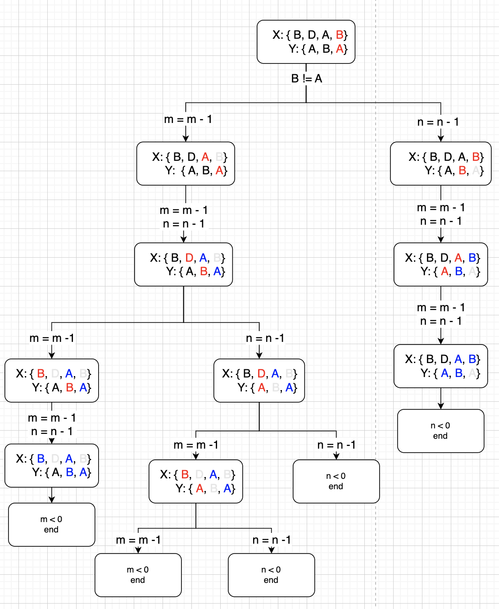
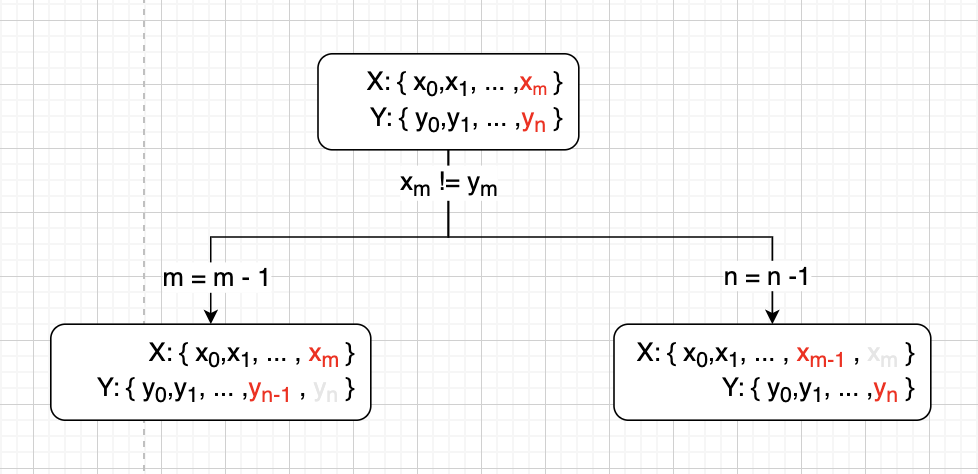
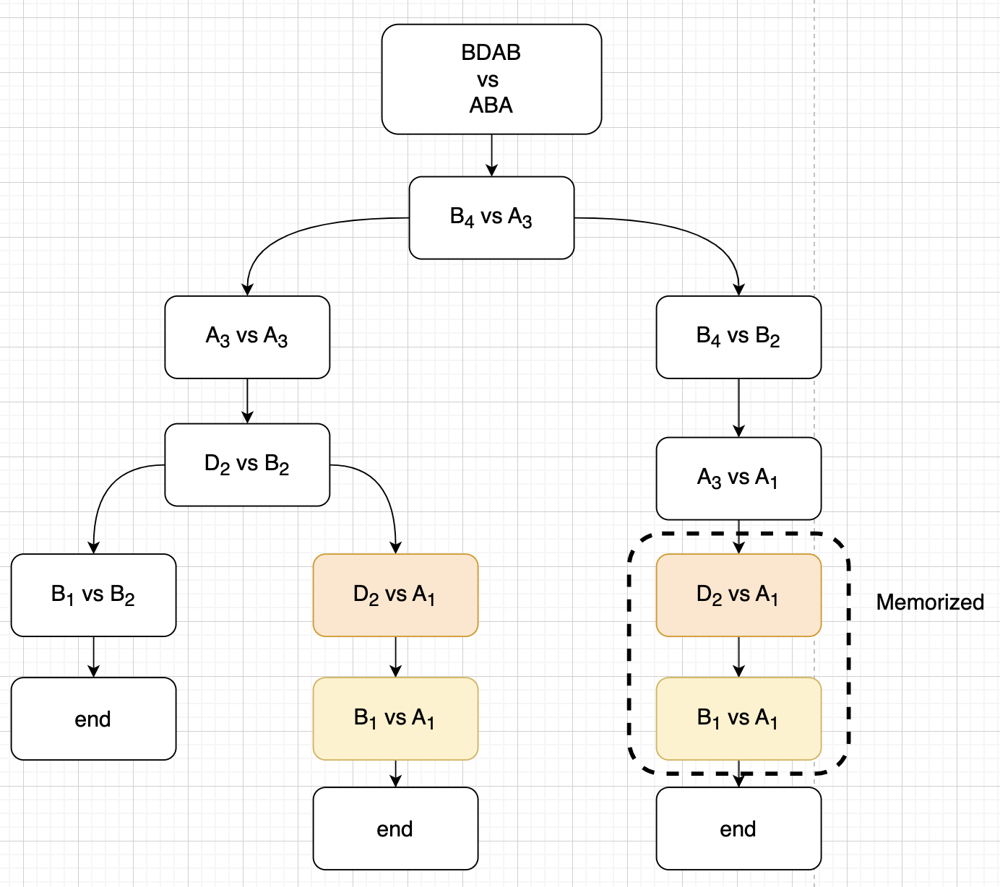
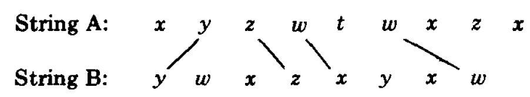
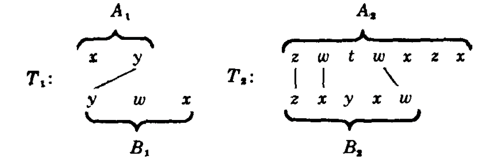

# Background
The problem **Longest Common Subsequence** ( **LCS** ) is a well known algorithm problem.

><br><b>Problem Description</b>
>
>Find the **longest common subsequence** between two sequences **A** and **B**.
>
> A **common subsequence** of two strings is a subsequence that is common to both strings.
><br>

Though this problem seems simple, but it can be found in various applications, including
- **DNA** sequence analysis
- **git diff**
- Update to **RecyclerView** Data


In this article, we will look at different ways to solve LCS, both from the present and the past.


including :

|Algorithm| Time Complexity|Space Complexity|
|:--|:--:|:--:|
|Brutal Force   |  $O(2^{n + m})$ |$O(n + m)$|
| Memorization Approach  | $O(n \times m)$  |$O(n \times m)$|

# Understand the Problem

## Substring vs Subsequence
Ref : [Subsequence vs Substring](https://www.codingninjas.com/codestudio/library/subsequence-vs-substring)

><br>A <b>substring</b> is a <u>contiguous</u> sequence of character within the string.
><br>

So if the string is **Tree**, then we get the following substrings :

```kotlin
"T", "r", "e", "e", "Tr", "re", "ee", "Tre", ...
```

Therefore, for a string with length **N** the total number of substring will be :

$$\begin{aligned}
sum = &N + (N - 1) + ... + 1
\\= &\frac{(N + 1)(N)}{2}
\end{aligned}$$


On the other hand
><br>A <b>subsequence</b> is a <u>sequence</u> that can be derived from another sequence <b>without changing the order</b> .
><br>

For the string **Tree**, subsequences include :

```kotlin
{Tree},
{Tre}, {Tre}, {ree}, {Tee},
{Tr}, {Te}, {Te}, {ee}, {re}, {re},
{T}, {r}, {e}, {e}, {}
```

So for a string with length **N**, the total subsequence will be :

$$\begin{aligned}
sum &= \sum_{k = 0}^{N}( _k^N )
\\ &= 2^N
\end{aligned}$$

Let's try to proof this.

## Proof : Total number of Subsequence

$$\begin{aligned}
sum &= \sum_{k = 0}^{N}( _k^N )
\end{aligned}$$

In this equation, $k$ represents the number of characters that can be taken out from the string with a length $N$, to make a subsequence.

and

$(_k^N)$ represents the total number of subsequences that can be created by taking out $k$ number of characters. It is also known as the **binomial coefficient**

If we expands the equation


|k|Expand|sum|sum(N = k)|
|--|:--|:--|:--:|
|0   | $\frac{N!}{N!0!} = 1$  |$1$|$1 = 2^0$|
|1   | $\frac{N!}{(N - 1)!1!} = N$  | $1 + N$|$2 = 2^1$|
|2   | $\frac{N!}{(N - 2)!2!} = \frac{N(N-1)}{2}$ | $\frac{2 + 2N + N(N - 1)}{2} = \frac{N^2 +N + 2}{2}$|$4 = 2^2$|
|3   | $\frac{N!}{(N - 3)!3!} = \frac{N(N-1)(N-2)}{6}$  | $\frac{N^3 + 5N + 6}{6}$  |$8 = 2^3$|


Through examining, we can find that :

$$\begin{aligned}
\sum_{k = 0}^{N}( _k^N ) &= 2^N
\end{aligned}$$


We can also proof this through <u>[**binomial theorem**](https://www.britannica.com/science/binomial-theorem)</u> :
><br>
>For any positive integer n, the nth power of the sum of two numbers a and b may be expressed as the sum of n + 1 terms of the form<br>
><br>

$$\begin{aligned}
(_k^n)a^{n - k}b^k
\end{aligned}$$

This might not be that obvious, but it will be clear when it is shown in this form :

$$\begin{aligned}
(a + b)^n = (_0^n)a^nb^0 + (^n_1)a^{n - 1}b^1 + ... + (_n^n)a^0b^n
\end{aligned}$$

For different $n$, we will get different coefficients:

|n|coefficients| values
|:--:|:--:|:--:|
|0   |  $(^0_0)$ | 1 |
|1   | $(^1_0), (^1_1)$  | 1 , 1|
|2   |  $(^2_0), (^2_1), (^2_2)$ |1 , 2 , 1|
|3   | $(^3_0), (^3_1), (^3_2), (^3_3)$  | 1 , 3 , 3 , 1  |

As you can see, coefficients are **Pascal's triangle**.

Now, in order to proof the sum of the coefficients, we can simply make $a = 1$ and $b = 1$. As a result, we should get :

$$\begin{aligned}
(1 + 1)^n &= (_0^n)1^n1^0 + (^n_1)1^{n - 1}1^1 + ... + (_n^n)1^01^n
\\&= 2^n
\end{aligned}$$


# Analyzing the Problem
> ref: <b>Introduction to Algorithm, 3rd, 15.4</b>

Assuming we have two strings $X$ and $Y$ :

$$\begin{aligned}
X &= \{ x_1, x_2, x_3,... , x_m\}
\\Y &= \{ y_1, y_2, y_3, ... , y_n\}
\end{aligned}$$

The $i^{th}$ prefix of the sequences can be represented as :

$$\begin{aligned}
X_i = \{ x_1, x_2, x_3, ... , x_i\}
\end{aligned}$$

if $X = \{A, B, C, D\}$, then

$$\begin{aligned}
X_2 = \{A, B\}
\end{aligned}$$

In order to find the **LCS**, we can compare all $2^m $ and  $2^n$ subsequences. But obviously that is not the best choice.

Instead, we can go through $X$ and $Y$ from one end to another, storing all the characters that matches $x_m = y_n$ inside $Z$.

So any **LCS** of the two strings is represented as $Z$ :

$$\begin{aligned}
Z &= \{ z_1, z_2, z_3, ... , z_k\}
\end{aligned}$$

Here are some rules that will be followed when generating $Z$:

><br>
>
>1. If $x_m = y_n$, then it will be appended to $Z$, making it $Z_{k + 1}$.
>2. If $x_m \neq y_n$, then we need to find LCS for both $(X_{m-1}, Y)$ and $(X, Y_{n-1})$.
><br>

## Native Approach ($2^{n + m}$)

Let's take a look this example and try to solve it by **going through all subsequences**.

Here are the two strings of interest:

$$\begin{aligned}
X &= \{ B, D, A, B \}
\\Y &= \{ A, B, A\}
\end{aligned}$$

If we follow the process mentioned above, then we will go though a process like this :


<center>

</center>

From this, we can find all of Common Sequences between $X$ and $Y$ include :

$$\begin{aligned}
\{\{ B, A \}, \{ A \}, \{ A, B \}\}
\end{aligned}$$

and the LCS length is $2$.


This process can be represented using the following code :


```c

#include <stdio.h>
#include <string.h>

int max(int a, int b) { return (a > b) ? a : b; }

int lcs(char* X, char* Y, int m, int n)
{
    if (m == 0 || n == 0)
        return 0;
    if (X[m - 1] == Y[n - 1])
        return 1 + lcs(X, Y, m - 1, n - 1);
    else
        return max(lcs(X, Y, m, n - 1),
                   lcs(X, Y, m - 1, n));
}

int main()
{
    char X[] = "BDAB";
    char Y[] = "ABA";

    int m = strlen(X);
    int n = strlen(Y);

    int length = lcs(X, Y, m, n);
    printf("Length of LCS: %d\n", length);

    return 0;
}

```

### Complexity

||Complexity|
|:--|:--:|
| **Time**  |  $O(2^{n + m})$ |
|  **Space** |  $O(n + m)$ |

<br>

To find the complexity of this algorithm, we need to take a look at the worst case scenario, where <u>**there is no common subsequence at all**</u>. <br>

<center>

</center>

<br>

From the graph, we can see that whenever an unmatch occurred, `lcs(char*, char*, int, int)` will be called **twice** with the reduced `m` or `n` values.

And the process will continue until `m` or `n` become **0**.

So, the time complexity of native process is [ref](https://www.quora.com/How-do-I-do-the-sum-of-Sigma-2-n):

$$\begin{aligned}
sum &= 2^1 + 2^2 + 2^3 + ... + 2^{n + m}
\\ &= a\frac{(r^{n + m} -1)}{r-1}
\\ &= 1\frac{(2^{n + m} -1)}{2-1}
\\ &=O(2^{n + m})
\end{aligned}$$


As for **Space Complexity**, since the only space that we are using comes from both $X$ and $Y$ strings.

Thus, the the **Space Complexity** is :

$$\begin{aligned}
O(n + m)
\end{aligned}$$

### Optimization

If we observe the `m` and `n` values used in `lcs` function for $X$ and $Y$ :

$$\begin{aligned}
X &= \{ x_1, x_2, x_3, x_4 \}
\\Y &= \{ y_1, y_2, y_3, y_4 \}
\end{aligned}$$

|level|operations|
|:--|:--|
|0   | `lcs( m , n )`  |
|1   |`lcs( m - 1 , n )` <br> ---------------------- <br> `lcs( m , n - 1 )`   |
|2   |  `lcs( m - 2 , n )` <br> `lcs( m - 1 , n - 1 )` → (1)  <br> ------------------------- <br> `lcs( m - 1 , n - 1 )` → (1) <br> `lcs( m , n - 2 )` |
|3   |  `lcs( m - 3 , n )` <br> `lcs( m - 2 , n - 1 )` → (2)  <br> ------------------------- <br> `lcs( m - 2 , n - 1 )` → (2) <br>` lcs( m - 1 , n - 2 )` →→ (3) <br> ------------------------- <br> ` lcs( m - 2 , n - 1 )` → (2) <br> `lcs( m - 1 , n - 2 )` →→ (3) <br> ------------------------- <br>`lcs( m  - 1 , n - 2 )` →→ (3)<br>`lcs( m , n - 3 )` |


You can see, as the tree travels downwards, the same `m` and `n` values were being analyzed overtime. This  **overlapping** will cost time to run.

In order to optimize this algorithm, we can do so by storing the result from `m` and `n` values.

That being said, this problem actually fulfills the requirements to be solved using **Dynamic Programming** :

1.  **Optimal Substructure Property**
   A solution to a problem can be obtained by using the optimal solution to its subproblems instead of trying every possible way to solve the subproblems. [ [ref](https://www.geeksforgeeks.org/optimal-substructure-property-in-dynamic-programming-dp-2/?ref=lbp#main) ] .
   <br>For instance :
   The result of `lcs(X, Y, m, n)` depends on `lcs(X, Y, m - 1, n - 1)`.
<br>

2. **Overlapping Subproblems**
   This is exactly what we have described above.

Let's try to solve it through a simple **memoization approach**.

## Memoization Approach

In order to memorize the result from specific `m` and `n`, all we need to do is to create a matrix with size $m \times n$ .


Since there is no matrix in C, we will simply use `int array[]` :
```c

#include <stdio.h>
#include <string.h>

int max(int a, int b) { return (a > b) ? a : b; }

int getIndex(int m, int n, int size) {
    return m * size + n;
}

int counter = 0;

int lcs(char* X, char* Y, int m, int n, int array[], int size)
{
    int currentIndex = getIndex(m, n, size);

    if (array[currentIndex] != -1) return array[currentIndex];

    counter ++;

    if (m == 0 || n == 0)
        return 0;
    if (X[m - 1] == Y[n - 1]) {
        int nextIndex = getIndex(m - 1, n - 1, size);
        array[nextIndex] = lcs(X, Y, m - 1, n - 1, array, size);
        array[currentIndex] = 1 + array[nextIndex];
    } else {
        int nextNIndex = getIndex(m, n - 1, size);
        int nextMIndex = getIndex(m - 1, n, size);
        array[nextNIndex] = lcs(X, Y, m, n - 1, array, size);
        array[nextMIndex] = lcs(X, Y, m - 1, n,  array, size);
        array[currentIndex] = max(array[nextNIndex], array[nextMIndex]);
    }

    return array[currentIndex];
}

int main()
{
    char X[] = "BDAB";
    char Y[] = "ABA";

    int m = strlen(X);
    int n = strlen(Y);

    int array[(m + 1) * (n + 1) + 1] ;

    int i, j;
    for (i = 0; i <= m + 1; i++) {
        for (j = 0; j <= n + 1; j++) {
            array[m * i + j] = -1;
        }
    }

    int length = lcs(X, Y, m, n, array, m);
    printf("Length of LCS: %d after %d steps\n", length, counter);

    return 0;
}

```

By running the code, we can find that **LCS** was determined after *11* steps, which is *2* steps less than previous approach.

By showing all steps, we can see that the two extra steps were $D_2$ vs $A_1$ and $B_1$ vs $A_1$ :

<center>

</center>

<br>

<details>
<summary><b>Memorization Approach in CPP</b></summary>

```cpp
/* A Top-Down DP implementation of LCS problem */
#include <bits/stdc++.h>
using namespace std;

/* Returns length of LCS for X[0..m-1], Y[0..n-1] */
int lcs(char* X, char* Y, int m, int n,
		vector<vector<int> >& dp)
{
	if (m == 0 || n == 0)
		return 0;
	if (X[m - 1] == Y[n - 1])
		return dp[m][n] = 1 + lcs(X, Y, m - 1, n - 1, dp);

	if (dp[m][n] != -1) {
		return dp[m][n];
	}
	return dp[m][n] = max(lcs(X, Y, m, n - 1, dp),
						lcs(X, Y, m - 1, n, dp));
}

/* Driver code */
int main()
{
	char X[] = "AGGTAB";
	char Y[] = "GXTXAYB";

	int m = strlen(X);
	int n = strlen(Y);
	vector<vector<int> > dp(m + 1, vector<int>(n + 1, -1));
	cout << "Length of LCS is " << lcs(X, Y, m, n, dp);

	return 0;
}
```
</details>


<br>

You can find more implementation in different languages [here](https://www.geeksforgeeks.org/longest-common-subsequence-dp-4/).

### Complexity

With the help of memorization, we now have a better time complexity.

Instead of going through all $2^{n + m}$ subsequences, we now just need to go through $m \times n$ number of subsequences.

Thus, the new **time complexity** is :

$$O(m \times n)$$

However, since we need to store the results of these subsequences, the **space complexity** also become :

$$O(m \times n)$$

### Optimization

Based on memorization approach, we can create a table based on the matrix structure :

<table style="border:3px #000 dashed;"  cellpadding="10" border='1'>
<thead>
<tr>
<th></th><th>j</th><th>0</th><th>1</th><th>2</th><th>3</th><th>4</th>
</tr>
</thead>
<tbody>
<tr>
<th><b>i</th><th></th><th>y<sub>j</sub></th><th>B</th><th>D</th><th>A</th><th>B</th>
</tr>

<tr>
<th>0</th><th>x<sub>i</sub></th><td>-1</td><td>-1</td><td>-1</td><td>-1</td><td>-1</td>
</tr>

<tr>
<th>1</th><th>A</th><td>-1</td><td>-1</td><td>-1</td><td>-1</td><td>-1</td>
</tr>

<tr>
<th>2</th><th>B</th><td>-1</td><td>-1</td><td>-1</td><td>-1</td><td>-1</td>
</tr>

<tr>
<th>3</th><th>A</th><td>-1</td><td>-1</td><td>-1</td><td>-1</td><td>-1</td>
</tr>

</tbody>
</table>

As the code progress, we will go through the tree from bottom to top and from left to right :

<table style="border:3px #000 dashed; width: 100%;"  cellpadding="10" >
<thead>
<tr>
<th></th><th>j</th><th>0</th><th>1</th><th>2</th><th>3</th><th>4</th><th>3</th><th>2</th><th>1</th><th>0</th>
</tr>
</thead>
<tbody>
<tr>
<th><b>i</th><th></th><th>y<sub>j</sub></th><th>B</th><th>D</th><th>A</th><th>B</th><th>A</th><th>D</th><th>B</th><th>y<sub>j</sub></th>
</tr>

<tr>
<th>0</th><th>x<sub>i</sub></th><td>-1</td><td>-1</td><td>-1</td><td>-1</td><td>-1</td><td>-1</td><td>-1</td><td>-1</td><td>-1</td>
</tr>

<tr>
<th>1</th><th>A</th><td>-1</td><td style="background-color:#009600"><b style="color:#fff;">0<br>→</b></td><td style="background-color:#009600"><b style="color:#fff;">0<br>↓</b></td><td>-1</td><td>-1</td><td style="background-color:#ff5f70"><b style="color:#fff;">1<br>↙</b></td><td style="background-color:#009600"><b style="color:#fff;">0<br>←</b></td><td style="background-color:#009600"><b style="color:#fff">0<br>←</b></td><td>-1</td>
</tr>

<tr>
<th>2</th><th>B</th><td>-1</td><td style="background-color:#f00"><b style="color:#fff">1<br>→</b></td><td style="background-color:#0044f4"><b style="color:#fff">1<br>↘</b></td><td>-1</td><td style="background-color:#804fff"><b style="color:#fff">1<br>↓</b></td><td>-1</td><td>-1</td><td>-1</td><td>-1</td>
</tr>

<tr>
<th>3</th><th>A</th><td>-1</td><td>-1</td><td>-1</td><td style="background-color:#f444f4"><b style="color:#fff">1<br>→</b></td><td style="background-color:#000"><b style="color:#fff">2</b></td><td>-1</td><td>-1</td><td>-1</td><td>-1</td>
</tr>

</tbody>
</table>

If we combine the left and right branches, we will get this :

<table style="border:3px #000 dashed; width: 100%;"  cellpadding="10" >
<thead>
<tr>
<th></th><th>j</th><th>0</th><th>1</th><th>2</th><th>3</th><th>4</th>
</tr>
</thead>
<tbody>
<tr>
<th><b>i</th><th></th><th>y<sub>j</sub></th><th>B</th><th>D</th><th>A</th><th>B</th>
</tr>

<tr>
<th>0</th><th>x<sub>i</sub></th><td>-1</td><td>-1</td><td>-1</td><td>-1</td><td>-1</td>
</tr>

<tr>
<th>1</th><th>A</th><td>-1</td><td style="background-color:#009600"><b style="color:#fff;">0</b></td><td style="background-color:#009600"><b style="color:#fff;">0</b></td><td style="background-color:#ff5f70"><b style="color:#fff;">1</b></td><td>-1</td>
</tr>

<tr>
<th>2</th><th>B</th><td>-1</td><td style="background-color:#f00"><b style="color:#fff">1</b></td><td style="background-color:#0044f4"><b style="color:#fff">1</b></td><td>-1</td><td style="background-color:#804fff"><b style="color:#fff">1</b></td>
</tr>

<tr>
<th>3</th><th>A</th><td>-1</td><td>-1</td><td>-1</td><td style="background-color:#f444f4"><b style="color:#fff">1</b></td><td style="background-color:#000"><b style="color:#fff">2</b></td>
</tr>

</tbody>
</table>

<br>

If we examine the code, the relationship among a cell and its adjacent cells can be seen as follows :

||j|0...n-2|n-1|n|
|:--:|:--:|:--:|:--:|:--:|
|**i**   |   | **y<sub>j</sub>**  | **Y<sub>n-1</sub>**  | **Y<sub>n</sub>**  |
|**0 ... m - 2**   | **x<sub>i</sub>** |  -1 | -1  | -1  |
|**m - 1**   | **X<sub>m-1</sub>**  |  -1 | <b style="color:red">M[m - 1][n - 1]</b> | <b style="color:blue">M[m - 1][n]</b>  |
|**m**   | **X<sub>m</sub>**  | -1  |   <b style="color:blue">M[m][n - 1]</b>| <b>M[m][n]</b>  |

where $M[m][n]$ can be :

$$\begin{align}\nonumber
M[m][n] &= M[m - 1][n - 1]
\\M[m][n] &= max\{M[m][n - 1], M[m - 1][n]\}
\nonumber\end{align}$$

<br>

Based on these statements, we can see that instead of using **recursive** approach, we can also solve the problem through **iterate** approach, which leads us to the **Dynamic Iterative Approach**.

## Dynamic Iterative Approach

As you can see below, this is how it is done iteratively.
Instead of passing array into `lcs`, we can simply initiate the array in `lcs`.

The only thing that we need to beware of is the $i$ and $j$ values to iterate through.

```c
#include <stdio.h>
#include <string.h>

int max(int a, int b) { return (a > b) ? a : b; }

int getIndex(int m, int n, int size) {
    return m * size + n;
}

int counter = 0;

int lcs(char* X, char* Y, int m, int n)
{

    int array[(m + 1) * (n + 1)] ;
    int i, j;

    for (i = 0; i <= m; i++) {
        for (j = 0; j <= n; j++) {
            counter ++;
            int currentIndex = j + i*(n + 1);

            printf("Index = (%d + %d x (%d + 1)) %d\n", j, i, n, currentIndex);

            if (i == 0 || j == 0) {
                array[currentIndex] = 0;
            }
            else if (X[i - 1] == Y[j - 1]) {
                int nextIndex = ((j - 1) * m + (i - 1));
                array[currentIndex] = 1 + array[nextIndex];
            } else {
                int nextNIndex = ((j - 1) * m + (i));
                int nextMIndex = ((j) * m + (i - 1));
                array[currentIndex] = max(array[nextNIndex], array[nextMIndex]);
            }
        }
    }
    return array[(m + 1) * (n + 1) - 1];
}

int main()
{
    char X[] = "BDAB";
    char Y[] = "ABA";

    int m = strlen(X);
    int n = strlen(Y);

    int length = lcs(X, Y, m, n);
    printf("Length of LCS: %d after %d steps", length, counter);

    return 0;
}
```

<br>

From the code, we can generate a table as follows :

$$i = 0$$

<table style="border:3px #000 dashed; width: 100%;"  cellpadding="10" >
<thead>
<tr>
<th></th><th>j</th><th>0</th><th>1</th><th>2</th><th>3</th>
</tr>
</thead>
<tbody>
<tr>
<th><b>i</th><th></th><th>y<sub>j</sub></th><th>A</th><th>B</th><th>A</th>
</tr>

<tr>
<th>0</th><th>x<sub>i</sub></th><td>0</td><td>0</td><td>0</td><td>0</td>
</tr>

<tr>
<th>1</th><th>B</th><td>--</td><td>--</td><td>--</td><td>--</td>
</tr>

<tr>
<th>2</th><th>D</th><td>--</td><td>--</td><td>--</td><td>--</td>
</tr>

<tr>
<th>3</th><th>A</th><td>--</td><td>--</td><td>--</td><td>--</td>
</tr>

<tr>
<th>4</th><th>B</th><td>--</td><td>--</td><td>--</td><td>--</td>
</tr>

</tbody>
</table>

$$ i = 1$$

Since at $B_2$ vs $B_1$ they have the same character, so it will have a result
$$1 + (A_1 vs X_0) = 1$$

<table style="border:3px #000 dashed; width: 100%;"  cellpadding="10" >
<thead>
<tr>
<th></th><th>j</th><th>0</th><th>1</th><th>2</th><th>3</th>
</tr>
</thead>
<tbody>
<tr>
<th><b>i</th><th></th><th>y<sub>j</sub></th><th>A</th><th>B</th><th>A</th>
</tr>

<tr>
<th>0</th><th>x<sub>i</sub></th><td>0</td><td>0</td><td>0</td><td>0</td>
</tr>

<tr>
<th>1</th><th>B</th><td>0</td><td>0</td><td style="background-color:#000"><b style="color:#fff;">1</b></td><td>0</td>
</tr>

<tr>
<th>2</th><th>D</th><td>--</td><td>--</td><td>--</td><td>--</td>
</tr>

<tr>
<th>3</th><th>A</th><td>--</td><td>--</td><td>--</td><td>--</td>
</tr>

<tr>
<th>4</th><th>B</th><td>--</td><td>--</td><td>--</td><td>--</td>
</tr>

</tbody>
</table>

$$ i = 2$$

Here $B_2$ vs $D_2$ is the maximum between $B_2$ vs $B_1$ and $A_1$ vs $D_2$ :

<table style="border:3px #000 dashed; width: 100%;"  cellpadding="10" >
<thead>
<tr>
<th></th><th>j</th><th>0</th><th>1</th><th>2</th><th>3</th>
</tr>
</thead>
<tbody>
<tr>
<th><b>i</th><th></th><th>y<sub>j</sub></th><th>A</th><th>B</th><th>A</th>
</tr>

<tr>
<th>0</th><th>x<sub>i</sub></th><td>0</td><td>0</td><td>0</td><td>0</td>
</tr>

<tr>
<th>1</th><th>B</th><td>0</td><td>0</td><td style="background-color:#999"><b style="color:#9780262046305;">1 ↓</b></td><td>0</td>
</tr>

<tr>
<th>2</th><th>D</th><td>0</td><td style="background-color:#999"><b>0<br>→</b></td><td style="background-color:#000"><b style="color:#fff">1</b></td><td>--</td>
</tr>

<tr>
<th>3</th><th>A</th><td>--</td><td>--</td><td>--</td><td>--</td>
</tr>

<tr>
<th>4</th><th>B</th><td>--</td><td>--</td><td>--</td><td>--</td>
</tr>

</tbody>
</table>

Then similarly, $A_3$ vs $D_2$ is the maximum between $A_3$ vs $B_1$ and $B_2$ vs $D_2$ :

<table style="border:3px #000 dashed; width: 100%;"  cellpadding="10" >
<thead>
<tr>
<th></th><th>j</th><th>0</th><th>1</th><th>2</th><th>3</th>
</tr>
</thead>
<tbody>
<tr>
<th><b>i</th><th></th><th>y<sub>j</sub></th><th>A</th><th>B</th><th>A</th>
</tr>

<tr>
<th>0</th><th>x<sub>i</sub></th><td>0</td><td>0</td><td>0</td><td>0</td>
</tr>

<tr>
<th>1</th><th>B</th><td>0</td><td>0</td><td style="background-color:#000"><b style="color:#fff;">1</b></td><td style="background-color:#999"><b style="color:#000">0 ↓</b></td>
</tr>

<tr>
<th>2</th><th>D</th><td>0</td><td>0</td><td style="background-color:#999"><b style="color:#000">1<br>→</b></td><td style="background-color:#000"><b style="color:#fff">1</b></td>
</tr>

<tr>
<th>3</th><th>A</th><td>--</td><td>--</td><td>--</td><td>--</td>
</tr>

<tr>
<th>4</th><th>B</th><td>--</td><td>--</td><td>--</td><td>--</td>
</tr>

</tbody>
</table>
<br>

With the same logic, you can derived the final result :


<table style="border:3px #000 dashed; width: 100%;"  cellpadding="10" >
<thead>
<tr>
<th></th><th>j</th><th>0</th><th>1</th><th>2</th><th>3</th>
</tr>
</thead>
<tbody>
<tr>
<th><b>i</th><th></th><th>y<sub>j</sub></th><th>A</th><th>B</th><th>A</th>
</tr>

<tr>
<th>0</th><th>x<sub>i</sub></th><td>0</td><td>0</td><td>0</td><td>0</td>
</tr>

<tr>
<th>1</th><th>B</th><td>0</td><td>0</td><td style="background-color:#000"><b style="color:#fff;">1</b></td><td>0</td>
</tr>

<tr>
<th>2</th><th>D</th><td>0</td><td>0</td><td style="background-color:#000"><b style="color:#fff">1</b></td><td style="background-color:#000"><b style="color:#fff">1</b></td>
</tr>

<tr>
<th>3</th><th>A</th><td>0</td><td style="background-color:#000"><b style="color:#fff">1</b></td><td style="background-color:#000"><b style="color:#fff">1</b></td><td style="background-color:#000"><b style="color:#fff">2</b></td>
</tr>

<tr>
<th>4</th><th>B</th><td>0</td><td>0</td><td style="background-color:#000"><b style="color:#fff">1</b></td><td style="background-color:#000"><b style="color:#fff">2</b></td>
</tr>

</tbody>
</table>

<br>

In return, the **LCS** is **2**, which is at $matrix[3][4]$ .

# String Correction

So far, we have seen how we can find LCS between two strings through a simple algorithm. However, do you know these algorithm was meant to solve string correction ?

In this section, we will go through some of the papers that proposed different algorithms for **String-to-String correction** and **LCS** .

The first paper we will go through is <u><i>**The String-to-String Correction Problem**</u></i> by **ROBERT A. WAGNER** and **MICHAEL J. FISCHER** in **1974**.

## String to String Problem (1974)

In this paper, a **trace** is used to describe the transformation from string $A$ to string $B$ as :

$$T = A \Rightarrow B$$

In order to perform $A \Rightarrow B$, it needs to go through a set of operation sequences $S$ :

$$S = \{s_1, s_2, ... , s_m\}$$

Each sequence $s_i$ is a combination of 1 or more <i>**edit operation**</i> acting on a pair of strings $(a, b)$ of length $\leqslant 1$:

- <b>*change*</b> $a$ to $b$ : $a \rightarrow b$
- <b> *insert* </b> : $a = \Lambda$  (empty) <br>
- <b>*delete* </b> : when $b = \Lambda$

And the **cost** to perform $a \rightarrow b$ is :

$$\begin{align} \nonumber
\gamma(a \rightarrow b)
\end{align}$$

If $b = a$ then $\gamma(a \rightarrow a) = 0$ .

The total cost to tranform $A \Rightarrow B$ is written as :

$$\gamma(S) = \sum_{i = 1}^{m}\gamma(s_i) = cost(T)$$

The purpose of this paper is the find the minimum cost to perform $a \rightarrow b$ , aka **edit distance** :

$$\delta(a \rightarrow b)$$

And for every edit sequence $S$ for $A \Rightarrow B$ , there is a trace $T$ such that :

$$cost(T) \leqslant \gamma(S)$$

meaning that $\delta(A \rightarrow B)$ is also the minimum cost trace from $A$ to $B$.

Here is an example from the paper :

<center>

</center>

<br>

The lines in the diagram indicated $S$ has been applied to $A_i$ and corresponding $B_j$.

As for the letters that were untouched, the letter in $A$ will be **deleted**, while letters in $B$ will be **inserted**.

Thus the total cost for $A \Rightarrow B$ is written as :

$$ cost(T) = \sum_{(i, j) \in T}\gamma(A_i \rightarrow B_j) + \sum_{i \in I}\gamma(A_i \rightarrow \Lambda) + \sum_{j \in J}\gamma(\Lambda \rightarrow B_j)$$


From the diagram, we can see that both strings $A$ and $B$ can be represented as two substrings:

<center>

</center>

$$\begin{align}
A = A_1A_2
\nonumber
\\B = B_1B_2
\nonumber
\end{align}$$

Since $A_1$ and $A_2$, as well as $B_1$ and $B_2$ do not have any line connected, we can say that :

$$\begin{align}
cost (T) = cost(T_1) + cost (T_2)
\nonumber
\end{align}$$

and the lowest cost for each substrings is denoted as $D$ :

$$\begin{align}
D(i, j) &= \delta(A<1:i>, B<1:j>)
\nonumber
\\&= \delta(A(i), B(j))
\nonumber
\end{align}$$

which is simply the minimum cost of **edit operations** on $A_i$ and $B_j$, along with the minimum cost before these strings :

$$\begin{align}
\nonumber
\\D(i,j)= min\{ &D(i - 1, j - 1) + \gamma(A_i
\rightarrow B_j),
\nonumber
\\&D(i-1, j) + \gamma(A_i \rightarrow \Lambda)
\nonumber
\\&D(i, j - 1) + \gamma(\Lambda \rightarrow B_j)\}
\nonumber
\end{align}$$

><br>
>
>Here you can see the assembling between $D(i,j)$ and the algorithm we wrote at the beginning.
><br><br>

Based on what we've known so far, we can create a sudo-code ( **Algorithm X** ) as follows :


```c
 int D[0, 0] = 0;
 // generate the cost to delete Ai
 for i: 1 to |A| do D[i, 0] = D[i - 1, 0] + γ(A[i] -> Λ);
 // generate the cost to insert Bi
 for j: 1 to |B| do D[0, j] = D[0, j - 1] + γ(Λ -> B[j]);

```

The code above is used to find the costs for **delete** and **insert**, which will generate this table:

<div style="overflow-x:auto;">
<table style="border:3px #000;"  cellpadding="10">
<tr>
<th></th>
<th>j</th>
<th>0</th>
<th>1 ... ( n - 2 )</th>
<th>n - 1</th>
<th>n</th>
</tr>

<tr>
<th>i</th>
<th></th>
<th>y<sub>0</sub></th>
<th>y<sub>j</sub></th>
<th>y<sub>n - 1</sub></th>
<th>y<sub>n</sub></th>
</tr>

<tr>
<th><center>0</center></th>
<th>x<sub>0</sub></th>
<th style="background-color:#000;"><span style="color:#ffffff">0</span></th>

<td style="background-color:#00f"><span style="color:#fff">γ<span style="color:rgba(0,0,255,0.5)">_</span>(<span style="color:rgba(0,0,255,0.5)">_</span>Λ<span style="color:rgba(0,0,255,0.5)">_</span>→<span style="color:rgba(0,0,255,0.5)">_</span>B<sub><span style="color:rgba(0,0,255,0.5)">_</span>j&#8722;1</sub><span style="color:rgba(0,0,255,0.5)">_</span>) <br>+<span style="color:rgba(0,0,255,0.5)">_</span>γ<span style="color:rgba(0,0,255,0.5)">_</span>(<span style="color:rgba(0,0,255,0.5)">_</span>Λ<span style="color:rgba(0,0,255,0.5)">_</span>→<span style="color:rgba(0,0,255,0.5)">_</span>b<sub><span style="color:rgba(0,0,255,0.5)">_</span>j</sub><span style="color:rgba(0,0,255,0.5)">_</span>)</span></td>

<td style="background-color:#00f"><span style="color:#fff">γ<span style="color:rgba(0,0,255,0.5)">_</span>(<span style="color:rgba(0,0,255,0.5)">_</span>Λ<span style="color:rgba(0,0,255,0.5)">_</span>→<span style="color:rgba(0,0,255,0.5)">_</span>B<sub><span style="color:rgba(0,0,255,0.5)">_</span>n&#8722;2</sub><span style="color:rgba(0,0,255,0.5)">_</span>) <br>+<span style="color:rgba(0,0,255,0.5)">_</span>γ<span style="color:rgba(0,0,255,0.5)">_</span>(<span style="color:rgba(0,0,255,0.5)">_</span>Λ<span style="color:rgba(0,0,255,0.5)">_</span>→<span style="color:rgba(0,0,255,0.5)">_</span>b<sub><span style="color:rgba(0,0,255,0.5)">_</span>n&#8722;1</sub><span style="color:rgba(0,0,255,0.5)">_</span>)</span></td>

<td style="background-color:#00f"><span style="color:#fff">γ<span style="color:rgba(0,0,255,0.5)">_</span>(<span style="color:rgba(0,0,255,0.5)">_</span>Λ<span style="color:rgba(0,0,255,0.5)">_</span>→<span style="color:rgba(0,0,255,0.5)">_</span>B<sub><span style="color:rgba(0,0,255,0.5)">_</span>n&#8722;1</sub><span style="color:rgba(0,0,255,0.5)">_</span>) <br>+<span style="color:rgba(0,0,255,0.5)">_</span>γ<span style="color:rgba(0,0,255,0.5)">_</span>(<span style="color:rgba(0,0,255,0.5)">_</span>Λ<span style="color:rgba(0,0,255,0.5)">_</span>→<span style="color:rgba(0,0,255,0.5)">_</span>b<sub><span style="color:rgba(0,0,255,0.5)">_</span>n</sub><span style="color:rgba(0,0,255,0.5)">_</span>)</span></td>


</tr>

<tr>
<th>1<span style="color:rgba(255,255,255,0.5)">_</span>...<span style="color:rgba(255,255,255,0.5)">_</span>(<span style="color:rgba(255,255,255,0.5)">_</span>m<span style="color:rgba(255,255,255,0.5)">_</span>&#8722;<span style="color:rgba(255,255,255,0.5)">_</span>2<span style="color:rgba(255,255,255,0.5)">_</span>)</th>
<th>x<sub>i</sub></th>

<td style="background-color:#c00"><span style="color:#fff">γ<span style="color:rgba(204,0,0,0.5)">_</span>(<span style="color:rgba(204,0,0,0.5)">_</span>A<sub><span style="color:rgba(204,0,0,0.5)">_</span>i&#8722;1</sub><span style="color:rgba(204,0,0,0.5)">_</span>→<span style="color:rgba(204,0,0,0.5)">_</span>Λ<span style="color:rgba(204,0,0,0.5)">_</span>) <br>+<span style="color:rgba(204,0,0,0.5)">_</span>γ<span style="color:rgba(204,0,0,0.5)">_</span>(<span style="color:rgba(204,0,0,0.5)">_</span>a<sub><span style="color:rgba(204,0,0,0.5)">_</span>i</sub><span style="color:rgba(204,0,0,0.5)">_</span>→<span style="color:rgba(204,0,0,0.5)">_</span>Λ<span style="color:rgba(204,0,0,0.5)">_</span>)</span></td>

<td></td>

<td></td><td></td>

</tr>

<tr>
<th>m - 1</th>
<th>x<sub>m&#8722;1</sub></th>
<td style="background-color:#c00"><span style="color:#fff">γ<span style="color:rgba(204,0,0,0.5)">_</span>(<span style="color:rgba(204,0,0,0.5)">_</span>A<sub><span style="color:rgba(204,0,0,0.5)">_</span>m&#8722;2</sub><span style="color:rgba(204,0,0,0.5)">_</span>→<span style="color:rgba(204,0,0,0.5)">_</span>Λ<span style="color:rgba(204,0,0,0.5)">_</span>) <br>+<span style="color:rgba(204,0,0,0.5)">_</span>γ<span style="color:rgba(204,0,0,0.5)">_</span>(<span style="color:rgba(204,0,0,0.5)">_</span>a<sub><span style="color:rgba(204,0,0,0.5)">_</span>m&#8722;1</sub><span style="color:rgba(204,0,0,0.5)">_</span>→<span style="color:rgba(204,0,0,0.5)">_</span>Λ<span style="color:rgba(204,0,0,0.5)">_</span>)</span></td>
<td></td>
<td></td>
<td></td>

</tr>

<tr>
<th>m</th>
<th>x<sub>m</sub></th>
<td style="background-color:#c00"><span style="color:#fff">γ<span style="color:rgba(204,0,0,0.5)">_</span>(<span style="color:rgba(204,0,0,0.5)">_</span>A<sub><span style="color:rgba(204,0,0,0.5)">_</span>m&#8722;1</sub><span style="color:rgba(204,0,0,0.5)">_</span>→<span style="color:rgba(204,0,0,0.5)">_</span>Λ<span style="color:rgba(204,0,0,0.5)">_</span>) <br>+<span style="color:rgba(204,0,0,0.5)">_</span>γ<span style="color:rgba(204,0,0,0.5)">_</span>(<span style="color:rgba(204,0,0,0.5)">_</span>a<sub><span style="color:rgba(204,0,0,0.5)">_</span>m</sub><span style="color:rgba(204,0,0,0.5)">_</span>→<span style="color:rgba(204,0,0,0.5)">_</span>Λ<span style="color:rgba(204,0,0,0.5)">_</span>)</span></td>

<td></td><td></td>

<td></td>

</tr>

<tr>
<td></td><td></td><td></td><td></td><td></td><td></td>
</tr>

</table>
</div>

Then to find the minimum costs, we also need to calculate the costs to **change** and simply find the minimum among the three operations :

```c
// find the minimum cost for transformation to occur
 for i: 1 to |A| do
    for j: 1 to |B| do
        costChange = D[i - 1, j - 1] + γ(A[i] -> B[j]);
        costDelete = D[i - 1, j] + γ(A[i] -> Λ);
        costInsert = D[i, j - 1] + γ(Λ -> B[j]);

        D[i, j] = min (costChange, costDelete, costInsert);
```

The relationship among cost of **change**, **delete** and **insert** is shown below. From it, we can see that the cost to **change** has a diagonal relationship to the previous $D[i - 1, j - 1]$ :

<div style="overflow-x:auto;">
<table style="border:3px #000;"  cellpadding="10">
<tr>
<th></th>
<th>j</th>
<th>0</th>
<th>1</th>
<th>2 ... ( n - 2 )</th>
<th>n - 1</th>
<th>n</th>
</tr>

<tr>
<th>i</th>
<th></th>
<th>y<sub>0</sub></th>
<th>y<sub>1</sub></th>
<th>y<sub>j</sub></th>
<th>y<sub>n - 1</sub></th>
<th>y<sub>n</sub></th>
</tr>

<tr>
<th><center>0</center></th>
<th>x<sub>0</sub></th>
<th style="background-color:#000;"><span style="color:#ffffff">0</span></th>

<td style="background-color:#00f"><span style="color:#fff">0<span style="color:rgba(0,0,255,0.5)">_</span>+<span style="color:rgba(0,0,255,0.5)">_</span>γ<span style="color:rgba(0,0,255,0.5)">_</span>(<span style="color:rgba(0,0,255,0.5)">_</span>Λ<span style="color:rgba(0,0,255,0.5)">_</span>→<span style="color:rgba(0,0,255,0.5)">_</span>b<sub><span style="color:rgba(0,0,255,0.5)">_</span>j</sub><span style="color:rgba(0,0,255,0.5)">_</span>)</span></td>
<td style="background-color:#00f"><span style="color:#fff">γ<span style="color:rgba(0,0,255,0.5)">_</span>(<span style="color:rgba(0,0,255,0.5)">_</span>Λ<span style="color:rgba(0,0,255,0.5)">_</span>→<span style="color:rgba(0,0,255,0.5)">_</span>B<sub><span style="color:rgba(0,0,255,0.5)">_</span>j&#8722;1</sub><span style="color:rgba(0,0,255,0.5)">_</span>) <br>+<span style="color:rgba(0,0,255,0.5)">_</span>γ<span style="color:rgba(0,0,255,0.5)">_</span>(<span style="color:rgba(0,0,255,0.5)">_</span>Λ<span style="color:rgba(0,0,255,0.5)">_</span>→<span style="color:rgba(0,0,255,0.5)">_</span>b<sub><span style="color:rgba(0,0,255,0.5)">_</span>j</sub><span style="color:rgba(0,0,255,0.5)">_</span>)</span></td>

<td style="background-color:#00f"><span style="color:#fff">γ<span style="color:rgba(0,0,255,0.5)">_</span>(<span style="color:rgba(0,0,255,0.5)">_</span>Λ<span style="color:rgba(0,0,255,0.5)">_</span>→<span style="color:rgba(0,0,255,0.5)">_</span>B<sub><span style="color:rgba(0,0,255,0.5)">_</span>n&#8722;2</sub><span style="color:rgba(0,0,255,0.5)">_</span>) <br>+<span style="color:rgba(0,0,255,0.5)">_</span>γ<span style="color:rgba(0,0,255,0.5)">_</span>(<span style="color:rgba(0,0,255,0.5)">_</span>Λ<span style="color:rgba(0,0,255,0.5)">_</span>→<span style="color:rgba(0,0,255,0.5)">_</span>b<sub><span style="color:rgba(0,0,255,0.5)">_</span>n&#8722;1</sub><span style="color:rgba(0,0,255,0.5)">_</span>)</span></td>

<td style="background-color:#00f"><span style="color:#fff">γ<span style="color:rgba(0,0,255,0.5)">_</span>(<span style="color:rgba(0,0,255,0.5)">_</span>Λ<span style="color:rgba(0,0,255,0.5)">_</span>→<span style="color:rgba(0,0,255,0.5)">_</span>B<sub><span style="color:rgba(0,0,255,0.5)">_</span>n&#8722;1</sub><span style="color:rgba(0,0,255,0.5)">_</span>) <br>+<span style="color:rgba(0,0,255,0.5)">_</span>γ<span style="color:rgba(0,0,255,0.5)">_</span>(<span style="color:rgba(0,0,255,0.5)">_</span>Λ<span style="color:rgba(0,0,255,0.5)">_</span>→<span style="color:rgba(0,0,255,0.5)">_</span>b<sub><span style="color:rgba(0,0,255,0.5)">_</span>n</sub><span style="color:rgba(0,0,255,0.5)">_</span>)</span></td>

</tr>

<tr>
<th>1</th>

<th>x<sub>1</sub></th>

<td style="background-color:#c00"><span style="color:#fff">0<span style="color:rgba(204,0,0,0.5)">_</span>+<span style="color:rgba(204,0,0,0.5)">_</span>γ<span style="color:rgba(204,0,0,0.5)">_</span>(<span style="color:rgba(204,0,0,0.5)">_</span>a<sub><span style="color:rgba(204,0,0,0.5)">_</span>1</sub><span style="color:rgba(204,0,0,0.5)">_</span>→<span style="color:rgba(204,0,0,0.5)">_</span>Λ<span style="color:rgba(204,0,0,0.5)">_</span>)</span></td>

<td style="background-color:#090"><span style="color:#fff">0<span style="color:rgba(0,153,0,0.5)">_</span>+<span style="color:rgba(0,153,0,0.5)">_</span>γ<span style="color:rgba(0,153,0,0.5)">_</span>(<span style="color:rgba(0,153,0,0.5)">_</span>a<sub><span style="color:rgba(0,153,0,0.5)">_</span>1</sub><span style="color:rgba(0,153,0,0.5)">_</span>→<span style="color:rgba(0,153,0,0.5)">_</span>b<sub><span style="color:rgba(0,153,0,0.5)">_</span>1</sub><span style="color:rgba(0,153,0,0.5)">_</span>)</span></td>

<td style="background-color:#0b0"><span style="color:#fff">γ<span style="color:rgba(0,204,0,0.5)">_</span>(<span style="color:rgba(0,204,0,0.5)">_</span>A<sub><span style="color:rgba(0,204,0,0.5)">_</span>0</sub><span style="color:rgba(0,204,0,0.5)">_</span>→<span style="color:rgba(0,204,0,0.5)">_</span>B<sub><span style="color:rgba(0,204,0,0.5)">_</span>j&#8722;1</sub><span style="color:rgba(0,204,0,0.5)">_</span>) <br>+<span style="color:rgba(0,204,0,0.5)">_</span>γ<span style="color:rgba(0,204,0,0.5)">_</span>(<span style="color:rgba(0,204,0,0.5)">_</span>a<sub><span style="color:rgba(0,204,0,0.5)">_</span>1</sub><span style="color:rgba(0,204,0,0.5)">_</span>→<span style="color:rgba(0,204,0,0.5)">_</span>b<sub><span style="color:rgba(0,204,0,0.5)">_</span>j</sub><span style="color:rgba(0,204,0,0.5)">_</span>)</span></td>

<td style="background-color:#0d0"><span style="color:#000">γ<span style="color:rgba(0,204,0,0.5)">_</span>(<span style="color:rgba(0,204,0,0.5)">_</span>A<sub><span style="color:rgba(0,204,0,0.5)">_</span>0</sub><span style="color:rgba(0,204,0,0.5)">_</span>→<span style="color:rgba(0,204,0,0.5)">_</span>B<sub><span style="color:rgba(0,204,0,0.5)">_</span>n&#8722;2</sub><span style="color:rgba(0,204,0,0.5)">_</span>) <br>+<span style="color:rgba(0,204,0,0.5)">_</span>γ<span style="color:rgba(0,204,0,0.5)">_</span>(<span style="color:rgba(0,204,0,0.5)">_</span>a<sub><span style="color:rgba(0,204,0,0.5)">_</span>1</sub><span style="color:rgba(0,204,0,0.5)">_</span>→<span style="color:rgba(0,204,0,0.5)">_</span>b<sub><span style="color:rgba(0,204,0,0.5)">_</span>n&#8722;1</sub><span style="color:rgba(0,204,0,0.5)">_</span>)</span></td>

<td style="background-color:#0f0"><span style="color:#000">γ<span style="color:rgba(0,204,0,0.5)">_</span>(<span style="color:rgba(0,204,0,0.5)">_</span>A<sub><span style="color:rgba(0,204,0,0.5)">_</span>0</sub><span style="color:rgba(0,204,0,0.5)">_</span>→<span style="color:rgba(0,204,0,0.5)">_</span>B<sub><span style="color:rgba(0,204,0,0.5)">_</span>n&#8722;1</sub><span style="color:rgba(0,204,0,0.5)">_</span>) <br>+<span style="color:rgba(0,204,0,0.5)">_</span>γ<span style="color:rgba(0,204,0,0.5)">_</span>(<span style="color:rgba(0,204,0,0.5)">_</span>a<sub><span style="color:rgba(0,204,0,0.5)">_</span>1</sub><span style="color:rgba(0,204,0,0.5)">_</span>→<span style="color:rgba(0,204,0,0.5)">_</span>b<sub><span style="color:rgba(0,204,0,0.5)">_</span>n</sub><span style="color:rgba(0,204,0,0.5)">_</span>)</span></td>

</tr>

<tr>
<th>1<span style="color:rgba(255,255,255,0.5)">_</span>...<span style="color:rgba(255,255,255,0.5)">_</span>(<span style="color:rgba(255,255,255,0.5)">_</span>m<span style="color:rgba(255,255,255,0.5)">_</span>&#8722;<span style="color:rgba(255,255,255,0.5)">_</span>2<span style="color:rgba(255,255,255,0.5)">_</span>)</th>

<th>x<sub>i</sub></th>

<td style="background-color:#c00"><span style="color:#fff">γ<span style="color:rgba(204,0,0,0.5)">_</span>(<span style="color:rgba(204,0,0,0.5)">_</span>A<sub><span style="color:rgba(204,0,0,0.5)">_</span>i&#8722;1</sub><span style="color:rgba(204,0,0,0.5)">_</span>→<span style="color:rgba(204,0,0,0.5)">_</span>Λ<span style="color:rgba(204,0,0,0.5)">_</span>) <br>+<span style="color:rgba(204,0,0,0.5)">_</span>γ<span style="color:rgba(204,0,0,0.5)">_</span>(<span style="color:rgba(204,0,0,0.5)">_</span>a<sub><span style="color:rgba(204,0,0,0.5)">_</span>i</sub><span style="color:rgba(204,0,0,0.5)">_</span>→<span style="color:rgba(204,0,0,0.5)">_</span>Λ<span style="color:rgba(204,0,0,0.5)">_</span>)</span></td>

<td style="background-color:#070"><span style="color:#fff">γ<span style="color:rgba(0,119,0,0.5)">_</span>(<span style="color:rgba(0,119,0,0.5)">_</span>A<sub><span style="color:rgba(0,119,0,0.5)">_</span>i&#8722;1</sub><span style="color:rgba(0,119,0,0.5)">_</span>→<span style="color:rgba(0,119,0,0.5)">_</span>B<sub><span style="color:rgba(0,119,0,0.5)">_</span>0</sub><span style="color:rgba(0,119,0,0.5)">_</span>) <br>+<span style="color:rgba(0,119,0,0.5)">_</span>γ<span style="color:rgba(0,119,0,0.5)">_</span>(<span style="color:rgba(0,119,0,0.5)">_</span>a<sub><span style="color:rgba(0,119,0,0.5)">_</span>i</sub><span style="color:rgba(0,119,0,0.5)">_</span>→<span style="color:rgba(0,119,0,0.5)">_</span>b<sub><span style="color:rgba(0,119,0,0.5)">_</span>1</sub><span style="color:rgba(0,119,0,0.5)">_</span>)</span></td>

<td style="background-color:#090"><span style="color:#fff">γ<span style="color:rgba(0,153,0,0.5)">_</span>(<span style="color:rgba(0,153,0,0.5)">_</span>A<sub><span style="color:rgba(0,153,0,0.5)">_</span>i&#8722;1</sub><span style="color:rgba(0,153,0,0.5)">_</span>→<span style="color:rgba(0,153,0,0.5)">_</span>B<sub><span style="color:rgba(0,153,0,0.5)">_</span>j&#8722;1</sub><span style="color:rgba(0,153,0,0.5)">_</span>) <br>+<span style="color:rgba(0,153,0,0.5)">_</span>γ<span style="color:rgba(0,153,0,0.5)">_</span>(<span style="color:rgba(0,153,0,0.5)">_</span>a<sub><span style="color:rgba(0,153,0,0.5)">_</span>i</sub><span style="color:rgba(0,153,0,0.5)">_</span>→<span style="color:rgba(0,153,0,0.5)">_</span>b<sub><span style="color:rgba(0,153,0,0.5)">_</span>j</sub><span style="color:rgba(0,153,0,0.5)">_</span>)</span></td>

<td style="background-color:#0b0"><span style="color:#fff">γ<span style="color:rgba(0,187,0,0.5)">_</span>(<span style="color:rgba(0,187,0,0.5)">_</span>A<sub><span style="color:rgba(0,187,0,0.5)">_</span>i&#8722;1</sub><span style="color:rgba(0,187,0,0.5)">_</span>→<span style="color:rgba(0,187,0,0.5)">_</span>B<sub><span style="color:rgba(0,187,0,0.5)">_</span>n&#8722;2</sub><span style="color:rgba(0,187,0,0.5)">_</span>) <br>+<span style="color:rgba(0,187,0,0.5)">_</span>γ<span style="color:rgba(0,187,0,0.5)">_</span>(<span style="color:rgba(0,187,0,0.5)">_</span>a<sub><span style="color:rgba(0,187,0,0.5)">_</span>i</sub><span style="color:rgba(0,187,0,0.5)">_</span>→<span style="color:rgba(0,187,0,0.5)">_</span>b<sub><span style="color:rgba(0,187,0,0.5)">_</span>n&#8722;1</sub><span style="color:rgba(0,187,0,0.5)">_</span>)</span></td>

<td style="background-color:#0d0"><span style="color:#000">γ<span style="color:rgba(0,221,0,0.5)">_</span>(<span style="color:rgba(0,221,0,0.5)">_</span>A<sub><span style="color:rgba(0,221,0,0.5)">_</span>i&#8722;1</sub><span style="color:rgba(0,221,0,0.5)">_</span>→<span style="color:rgba(0,221,0,0.5)">_</span>B<sub><span style="color:rgba(0,221,0,0.5)">_</span>n&#8722;1</sub><span style="color:rgba(0,221,0,0.5)">_</span>) <br>+<span style="color:rgba(0,221,0,0.5)">_</span>γ<span style="color:rgba(0,221,0,0.5)">_</span>(<span style="color:rgba(0,221,0,0.5)">_</span>a<sub><span style="color:rgba(0,221,0,0.5)">_</span>i</sub><span style="color:rgba(0,221,0,0.5)">_</span>→<span style="color:rgba(0,221,0,0.5)">_</span>b<sub><span style="color:rgba(0,221,0,0.5)">_</span>n</sub><span style="color:rgba(0,221,0,0.5)">_</span>)</span></td>

</tr>

<tr>
<th>m - 1</th>
<th>x<sub>m&#8722;1</sub></th>
<td style="background-color:#c00"><span style="color:#fff">γ<span style="color:rgba(204,0,0,0.5)">_</span>(<span style="color:rgba(204,0,0,0.5)">_</span>A<sub><span style="color:rgba(204,0,0,0.5)">_</span>m&#8722;2</sub><span style="color:rgba(204,0,0,0.5)">_</span>→<span style="color:rgba(204,0,0,0.5)">_</span>Λ<span style="color:rgba(204,0,0,0.5)">_</span>) <br>+<span style="color:rgba(204,0,0,0.5)">_</span>γ<span style="color:rgba(204,0,0,0.5)">_</span>(<span style="color:rgba(204,0,0,0.5)">_</span>a<sub><span style="color:rgba(204,0,0,0.5)">_</span>m&#8722;1</sub><span style="color:rgba(204,0,0,0.5)">_</span>→<span style="color:rgba(204,0,0,0.5)">_</span>Λ<span style="color:rgba(204,0,0,0.5)">_</span>)</span></td>

<td style="background-color:#050"><span style="color:#fff">γ<span style="color:rgba(0,85,0,0.5)">_</span>(<span style="color:rgba(0,85,0,0.5)">_</span>A<sub><span style="color:rgba(0,85,0,0.5)">_</span>m&#8722;2</sub><span style="color:rgba(0,85,0,0.5)">_</span>→<span style="color:rgba(0,85,0,0.5)">_</span>B<sub><span style="color:rgba(0,85,0,0.5)">_</span>0</sub><span style="color:rgba(0,85,0,0.5)">_</span>) <br>+<span style="color:rgba(0,85,0,0.5)">_</span>γ<span style="color:rgba(0,85,0,0.5)">_</span>(<span style="color:rgba(0,85,0,0.5)">_</span>a<sub><span style="color:rgba(0,85,0,0.5)">_</span>m&#8722;1</sub><span style="color:rgba(0,85,0,0.5)">_</span>→<span style="color:rgba(0,85,0,0.5)">_</span>b<sub><span style="color:rgba(0,85,0,0.5)">_</span>1</sub><span style="color:rgba(0,85,0,0.5)">_</span>)</span></td>

<td style="background-color:#070"><span style="color:#fff">γ<span style="color:rgba(0,119,0,0.5)">_</span>(<span style="color:rgba(0,119,0,0.5)">_</span>A<sub><span style="color:rgba(0,119,0,0.5)">_</span>m&#8722;2</sub><span style="color:rgba(0,119,0,0.5)">_</span>→<span style="color:rgba(0,119,0,0.5)">_</span>B<sub><span style="color:rgba(0,119,0,0.5)">_</span>j&#8722;2</sub><span style="color:rgba(0,119,0,0.5)">_</span>) <br>+<span style="color:rgba(0,119,0,0.5)">_</span>γ<span style="color:rgba(0,119,0,0.5)">_</span>(<span style="color:rgba(0,119,0,0.5)">_</span>a<sub><span style="color:rgba(0,119,0,0.5)">_</span>m&#8722;1</sub><span style="color:rgba(0,119,0,0.5)">_</span>→<span style="color:rgba(0,119,0,0.5)">_</span>b<sub><span style="color:rgba(0,119,0,0.5)">_</span>j&#8722;1</sub><span style="color:rgba(0,119,0,0.5)">_</span>)</span></td>

<td style="background-color:#090"><span style="color:#fff">γ<span style="color:rgba(0,153,0,0.5)">_</span>(<span style="color:rgba(0,153,0,0.5)">_</span>A<sub><span style="color:rgba(0,153,0,0.5)">_</span>m&#8722;2</sub><span style="color:rgba(0,153,0,0.5)">_</span>→<span style="color:rgba(0,153,0,0.5)">_</span>B<sub><span style="color:rgba(0,153,0,0.5)">_</span>n&#8722;2</sub><span style="color:rgba(0,153,0,0.5)">_</span>) <br>+<span style="color:rgba(0,153,0,0.5)">_</span>γ<span style="color:rgba(0,153,0,0.5)">_</span>(<span style="color:rgba(0,153,0,0.5)">_</span>a<sub><span style="color:rgba(0,153,0,0.5)">_</span>m&#8722;1</sub><span style="color:rgba(0,153,0,0.5)">_</span>→<span style="color:rgba(0,153,0,0.5)">_</span>b<sub><span style="color:rgba(0,153,0,0.5)">_</span>n&#8722;1</sub><span style="color:rgba(0,153,0,0.5)">_</span>)</span></td>

<td style="background-color:#0b0"><span style="color:#fff">γ<span style="color:rgba(0,187,0,0.5)">_</span>(<span style="color:rgba(0,187,0,0.5)">_</span>A<sub><span style="color:rgba(0,187,0,0.5)">_</span>m&#8722;2</sub><span style="color:rgba(0,187,0,0.5)">_</span>→<span style="color:rgba(0,187,0,0.5)">_</span>B<sub><span style="color:rgba(0,187,0,0.5)">_</span>n&#8722;1</sub><span style="color:rgba(0,187,0,0.5)">_</span>) <br>+<span style="color:rgba(0,187,0,0.5)">_</span>γ<span style="color:rgba(0,187,0,0.5)">_</span>(<span style="color:rgba(0,187,0,0.5)">_</span>a<sub><span style="color:rgba(0,187,0,0.5)">_</span>m&#8722;1</sub><span style="color:rgba(0,187,0,0.5)">_</span>→<span style="color:rgba(0,187,0,0.5)">_</span>b<sub><span style="color:rgba(0,187,0,0.5)">_</span>n</sub><span style="color:rgba(0,187,0,0.5)">_</span>)</span></td>

</tr>

<tr>
<th>m</th>
<th>x<sub>i</sub></th>
<td style="background-color:#c00"><span style="color:#fff">γ<span style="color:rgba(204,0,0,0.5)">_</span>(<span style="color:rgba(204,0,0,0.5)">_</span>A<sub><span style="color:rgba(204,0,0,0.5)">_</span>m&#8722;1</sub><span style="color:rgba(204,0,0,0.5)">_</span>→<span style="color:rgba(204,0,0,0.5)">_</span>Λ<span style="color:rgba(204,0,0,0.5)">_</span>) <br>+<span style="color:rgba(204,0,0,0.5)">_</span>γ<span style="color:rgba(204,0,0,0.5)">_</span>(<span style="color:rgba(204,0,0,0.5)">_</span>a<sub><span style="color:rgba(204,0,0,0.5)">_</span>m</sub><span style="color:rgba(204,0,0,0.5)">_</span>→<span style="color:rgba(204,0,0,0.5)">_</span>Λ<span style="color:rgba(204,0,0,0.5)">_</span>)</span></td>

<td style="background-color:#030"><span style="color:#fff">γ<span style="color:rgba(0,51,0,0.5)">_</span>(<span style="color:rgba(0,51,0,0.5)">_</span>A<sub><span style="color:rgba(0,51,0,0.5)">_</span>m&#8722;1</sub><span style="color:rgba(0,51,0,0.5)">_</span>→<span style="color:rgba(0,51,0,0.5)">_</span>B<sub><span style="color:rgba(0,51,0,0.5)">_</span>0</sub><span style="color:rgba(0,51,0,0.5)">_</span>) <br>+<span style="color:rgba(0,51,0,0.5)">_</span>γ<span style="color:rgba(0,51,0,0.5)">_</span>(<span style="color:rgba(0,51,0,0.5)">_</span>a<sub><span style="color:rgba(0,51,0,0.5)">_</span>m</sub><span style="color:rgba(0,51,0,0.5)">_</span>→<span style="color:rgba(0,51,0,0.5)">_</span>b<sub><span style="color:rgba(0,51,0,0.5)">_</span>1</sub><span style="color:rgba(0,51,0,0.5)">_</span>)</span></td>


<td style="background-color:#050"><span style="color:#fff">γ<span style="color:rgba(0,85,0,0.5)">_</span>(<span style="color:rgba(0,85,0,0.5)">_</span>A<sub><span style="color:rgba(0,85,0,0.5)">_</span>m&#8722;1</sub><span style="color:rgba(0,85,0,0.5)">_</span>→<span style="color:rgba(0,85,0,0.5)">_</span>B<sub><span style="color:rgba(0,85,0,0.5)">_</span>j&#8722;2</sub><span style="color:rgba(0,85,0,0.5)">_</span>) <br>+<span style="color:rgba(0,85,0,0.5)">_</span>γ<span style="color:rgba(0,85,0,0.5)">_</span>(<span style="color:rgba(0,85,0,0.5)">_</span>a<sub><span style="color:rgba(0,85,0,0.5)">_</span>m</sub><span style="color:rgba(0,85,0,0.5)">_</span>→<span style="color:rgba(0,85,0,0.5)">_</span>b<sub><span style="color:rgba(0,85,0,0.5)">_</span>j&#8722;1</sub><span style="color:rgba(0,85,0,0.5)">_</span>)</span></td>

<td style="background-color:#070"><span style="color:#fff">γ<span style="color:rgba(0,119,0,0.5)">_</span>(<span style="color:rgba(0,119,0,0.5)">_</span>A<sub><span style="color:rgba(0,119,0,0.5)">_</span>m&#8722;1</sub><span style="color:rgba(0,119,0,0.5)">_</span>→<span style="color:rgba(0,119,0,0.5)">_</span>B<sub><span style="color:rgba(0,119,0,0.5)">_</span>n&#8722;2</sub><span style="color:rgba(0,119,0,0.5)">_</span>) <br>+<span style="color:rgba(0,119,0,0.5)">_</span>γ<span style="color:rgba(0,119,0,0.5)">_</span>(<span style="color:rgba(0,119,0,0.5)">_</span>a<sub><span style="color:rgba(0,119,0,0.5)">_</span>m</sub><span style="color:rgba(0,119,0,0.5)">_</span>→<span style="color:rgba(0,119,0,0.5)">_</span>b<sub><span style="color:rgba(0,119,0,0.5)">_</span>n&#8722;1</sub><span style="color:rgba(0,119,0,0.5)">_</span>)</span></td>

<td style="background-color:#090"><span style="color:#fff">γ<span style="color:rgba(0,153,0,0.5)">_</span>(<span style="color:rgba(0,153,0,0.5)">_</span>A<sub><span style="color:rgba(0,153,0,0.5)">_</span>m&#8722;1</sub><span style="color:rgba(0,153,0,0.5)">_</span>→<span style="color:rgba(0,153,0,0.5)">_</span>B<sub><span style="color:rgba(0,153,0,0.5)">_</span>n&#8722;1</sub><span style="color:rgba(0,119,0,0.5)">_</span>) <br>+<span style="color:rgba(0,153,0,0.5)">_</span>γ<span style="color:rgba(0,153,0,0.5)">_</span>(<span style="color:rgba(0,153,0,0.5)">_</span>a<sub><span style="color:rgba(0,153,0,0.5)">_</span>m</sub><span style="color:rgba(0,153,0,0.5)">_</span>→<span style="color:rgba(0,153,0,0.5)">_</span>b<sub><span style="color:rgba(0,153,0,0.5)">_</span>n</sub><span style="color:rgba(0,153,0,0.5)">_</span>)</span></td>

</tr>

<tr>
<td></td><td></td><td></td><td></td><td></td><td></td>
</tr>

</table>
</div>

And the minimum cost at $i$ and $j$ is found by comparing costs of **change**, **delete** and **insert**.

<div style="overflow-x:auto;">
<table style="border:3px #000;"  cellpadding="10">


<tr>
<th></th>
<th>y<sub>j&#8722;1</sub></th>
<th>y<sub>j</sub></th>
</tr>

<tr>
<th>x<sub>i&#8722;1</sub></th>
<th style="background-color:#000;"><span style="color:#ffffff">0</span></th>

<td style="background-color:#00f"><span style="color:#fff"><center>Cost to Insert</center></span></td>


</tr>

<tr>

<th>x<sub>i</sub></th>

<td style="background-color:#c00"><span style="color:#fff"><center>Cost to Delete</center></span></td>

<td style="background-color:#090"><span style="color:#fff"><center>Cost to Change</center></span></td>
</tr>

<tr>
<td></td><td></td><td></td>
</tr>

</table>
</div>

Now, this allows us to find the $cost(T)$.

If we want to get all the position when **trace** ( $T_i$ ) occurred, we can simply loop through $D$ and print whenver **change** occurs ( **Algorithm Y** ):

```c
int i = |A|;
int j = |B|;

while(i != 0 && j != 0) {
  // reduce i by 1 when delete occurs
  if D[i, j] == D[i - 1, j] + γ(A[i] -> Λ) then i --;
  // reduce j by 1 when insert occurs
  else if D[i, j] == D[i, j - 1] + γ(Λ -> B[j]) then j --;

  else
    // trace occurred (a line will connect to A[i] and B[j])
    print((i,j));
    i --;
    j --;
}

```

### Complexity
|Algorithm|Time $O$| Space $O$|
|:--|:--:|:--:|
|**Algorithm X**   | $O(n \times m)$   |  $O(n \times m)$ |
|**Algorithm Y**   |  $O(n + m)$ | $O(n \times m)$  |


### Special case to find LCS

So far we've seen how the algorithm helps us find the minimum cost to tranform $A$ to $B$, but have mention how to decide the costs of different **edit operations**.

The cost is really up to you. It could be the effort for user's finger to reach the right character, or simply you prefer changes compared to insert or delete.

In the case of finding **LCS**, we will make **insert** and **delete** costs *half* the cost of **change**  :

|Operations|Cost|
|:--|:--|
|**Insert**   | 1  |
|**Delete**   |  1 |
|**Change**   |  $$\begin{cases}0 &a = b\\2 &a\ne b\end{cases}$$ |

Then we will define $\rho(A, B)$ as the **length** of LCS between $A$ and $B$, which is also the maximum number of pairs $(i, j)$ in any trace where $A_i = B_j$.

With these, we can calculate $cost(T)$ as follows :
<br>

$$\begin{align}
cost(T) &= \sum_{(i, j) \in T}\gamma(A_i \rightarrow B_j) + \sum_{i \in I}\gamma(A_i \rightarrow \Lambda) + \sum_{j \in J}\gamma(\Lambda \rightarrow B_j)
\nonumber
\\&= -2\rho(A, B) + |A| + |B|
\nonumber
\end{align}$$

<br>

The reason $\rho(A, B)$ has a $-2$ is because the least efficient operation is to **delete** $A$ and **insert** $B$ completely, then subtract the **change** that occured on LCS.

Since the lowest cost is also equals to $\delta(A, B)$, therefore, we can represent $\rho(A,B)$ as :

<br>

$$\begin{align}
\delta(A, B) &= -2\rho(A, B) + |A| + |B|
\nonumber
\\ \rho(A, B)&=  \frac{(|A| + |B| - \delta(A,B))}{2}
\nonumber
\end{align}$$


Therefore, we can use **Algorithm X** to find the **length** of LCS :

```c
int D[0, 0] = 0;
// generate the cost to delete Ai
// γ(A[i] -> Λ) is replaced by 1
for i: 1 to |A| do D[i, 0] = D[i - 1, 0] + 1;
// generate the cost to insert Bj
// γ(Λ -> B[j]) is replaced by 1
for j: 1 to |B| do D[0, j] = D[0, j - 1] + 1;

// find the minimum cost for transformation to occur
 for i: 1 to |A| do
    for j: 1 to |B| do
        // γ(A[i] -> B[j]) is replaced by 2 or 0
        costChange = D[i - 1, j - 1] + 0;

        if (A[i] != B[j]) {
          costChange += 2;
        }

        costDelete = D[i - 1, j] + 1;
        costInsert = D[i, j - 1] + 1;

        D[i, j] = min (costChange, costDelete, costInsert);

// calculated the length of LCS
int rho = (|A| + |B| - D[|A|, |B|]) / 2

```

Similarly with **Algorithm Y** :

```c
int i = |A|;
int j = |B|;

while(i != 0 && j != 0) {
  // reduce i by 1 when delete occurs
  if D[i, j] == D[i - 1, j] + 1 then i --;
  // reduce j by 1 when insert occurs
  else if D[i, j] == D[i, j - 1] + 1 then j --;

  else
    // trace occurred (a line will connect to A[i] and B[j])
    print((i,j));
    i --;
    j --;
}

```


Of course, this algorithm is not perfect.

Assuming we are performing on strings with length of $1,000$ and the computer is running on a speed of **1 byte per ms**. It will take **1 second** and **1MB** just to tranform $A$ to $B$. The situation will be worst as the length of string increased.

To see how we can improve this algorithm, we will take a look at the paper : **A Linear Space Algorithm for Computing Maximal Common Sequence** by **D.S. Hirshberg** in 1975.

## Linear Space Algorithm (1975)

In this paper, it shows three different algorithms. The first one is exactly the same as the native solution.


## Fast Algorithm (1980)


# Reference
1. [Subsequence vs Substring](https://www.codingninjas.com/codestudio/library/subsequence-vs-substring)

https://www.enjoyalgorithms.com/blog/longest-common-subsequence


<br><br><br><br><br><br><br><br>
