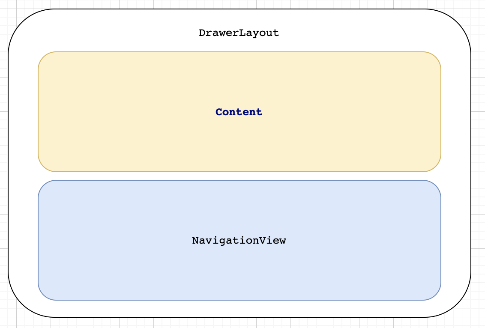
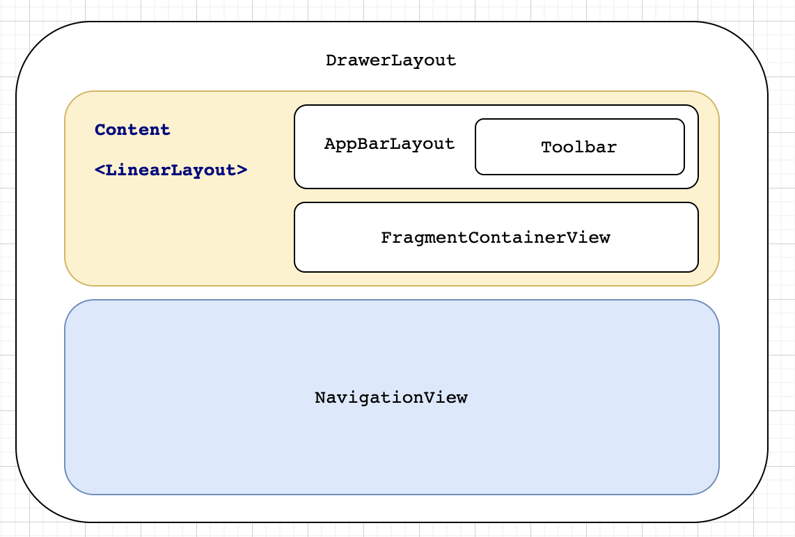

# 序言
歡迎來到「跟著官方學程式」 ( Learning From Android, **LFA** ) 的第一章。

我們將從 [architecture sample views branch](https://github.com/android/architecture-samples/tree/views) 學習如何用 View ( 不是 Compose 喔 ) 來做到官方推薦的架構。

當然，官方並沒有一步一步地教大家如何寫這個 App，但我會從無到有來建立出來。 至於教大家嘛？ 看看是否有需要吧！ 哈哈哈

不過我會盡量將需要或不需要的資訊都寫出來，哈哈哈。

另外，這個系列不太會有圖檔。 因為我的目標是從官方的程式中有效且快速地複習與更新我的 Android 知識。希望能早日回到職場上。

# 步驟 1 : 建立 TasksActivity

這是我們的 MainActivity，直接 Refactor 就好。

接下來我們要看 TasksActivity 的 layout xml。

<center>

</center>


## DrawerLayout

```groovy
<androidx.drawerlayout.widget.DrawerLayout
    xmlns:android="http://schemas.android.com/apk/res/android"
    xmlns:app="http://schemas.android.com/apk/res-auto"
    xmlns:tools="http://schemas.android.com/tools"
    android:id="@+id/drawer_layout"
    android:layout_width="match_parent"
    android:layout_height="match_parent"
    tools:context=".tasks.TasksActivity"
    tools:openDrawer="start">

    <!-- 其他元件 -->

<androidx.drawerlayout.widget.DrawerLayout/>
```


這裡使用了 **androidx.drawerlayout.widget.DrawerLayout**

```java
public class DrawerLayout extends ViewGroup implements Openable
```

根據官方的說法， **DrawerLayout** 是一個可以通過互動來開啟或關閉 「側選單」 的容器：

><br>
> DrawerLayout acts as a top-level container for window content that allows for interactive "drawer" views to be pulled out from one or both vertical edges of the window.
><br><br>


至於側選單的位置則可以用 `android:layout_gravity` 來操控。但要注意，每一側只能有一個選單，否則會拋出 Exception。

使用 **DrawerLayout** 時，我們只需要將我們主要內容放在首位，並設定以下，還有不要定義 `layout_gravity`：

```groovy
< android:layout_width = "match_parent"
  android:layout_height = "match_parent" />
```

之後就可以將 Drawer 放置成 subView。

然後通過 `layout_gravity` 來定義他的位置。一般而言， Drawer 的高會被設為 `match_parent` 並有固定值得寬。

在 **activity_tasks.xml** 中最後會寫成：

```groovy
<androidx.drawerlayout.widget.DrawerLayout
    xmlns:android="http://schemas.android.com/apk/res/android"
    xmlns:app="http://schemas.android.com/apk/res-auto"
    xmlns:tools="http://schemas.android.com/tools"
    android:id="@+id/drawer_layout"
    android:layout_width="match_parent"
    android:layout_height="match_parent"
    tools:context=".tasks.TasksActivity"
    tools:openDrawer="start">

    <LinearLayout
        android:layout_width="match_parent"
        android:layout_height="match_parent"
        android:orientation="vertical">

        <!-- 主要內容 -->

    </LinearLayout>

    <!-- Navigation Drawer -->
    <com.google.android.material.navigation.NavigationView
        android:id="@+id/nav_view"
        android:layout_width="wrap_content"
        android:layout_height="match_parent"
        android:layout_gravity="start" />

</androidx.drawerlayout.widget.DrawerLayout>
```

### 監聽 Drawer 的行為

我們可以通過 **DrawerLayout.DrawerListener** 來進行 Drawer 行為的監聽。 它有三種狀態： **STATE_IDLE**, **STATE_DRAGGING** 與 **STATE_SETTLING** 。

之所以有監聽的需要是因為我們也許想要在 Drawer 被完整顯示前做較為複雜的運算。而 **STATE_IDLE** 便是最好時機了。

><br>
> Android 還提供了 <b>DrawerLayout.SimpleDrawerListener </b> 一個已被實作的預設 Listener 共我們使用。
><br><br>

```java
public abstract static class SimpleDrawerListener implements DrawerListener {
    @Override
    public void onDrawerSlide(View drawerView, float slideOffset) {
    }

    @Override
    public void onDrawerOpened(View drawerView) {
    }

    @Override
    public void onDrawerClosed(View drawerView) {
    }

    @Override
    public void onDrawerStateChanged(int newState) {
    }
}
```

### NavigationView
剛剛說過，我們使用了 **NavigationView** 來充當 Drawer。 那 NavigationView 到底是什麼呢？

```java
public class NavigationView extends ScrimInsetsFrameLayout

public class ScrimInsetsFrameLayout extends FrameLayout
```

其實我也不清楚 **ScrimInsetsFrameLayout** 有什麼功能，但是在 **NavigationView** 中可以看到兩個跟 `scrim` 相關的屬性： `app:topInsetScrimEnabled` 與
`app:bottomInsetScrimEnabled`。

這兩個變數都預設為 `true`，而他的作用則是：

> <br>Whether or not the NavigationView will draw a scrim behind the window's top inset.
>
> 以及
>
> Set whether or not the NavigationView should draw a scrim behind the window's bottom inset (typically the navigation bar)
> <br>

#### NavigationMenuPresenter

**NavigationView** 中還有一個參數很重要，那就是負責記錄菜單 item UI 參數的 **NavigationMenuPresenter** ( `presenter` ) 了：

```java
private final NavigationMenuPresenter presenter = new NavigationMenuPresenter();
```

每次我們做出針對 item 外表的更改， **NavigationMenuPresenter** 會通過 **NavigationMenuAdapter** ，一個 **RecyclerView.Adapter<ViewHolder>**，進行更新。

更新時會將 Header 先加入 item 中，然後再將其他的 menu item 也加入，最後便會通過 `notifyDataSetChanged` 來展現新的菜單。

當然，這些只會在 **NavigationMenuPresenter** 中發生。 想要真正顯示在 **NavigationView** 中，他會經由 `getMenuView` 從 `presenter` 取得 **MenuView**。

另外， **NavigationView** 還有 **NavigationMenu**，一個負責建立 submenu 的 **MenuBuilder**。他會用 **WeakReference** 的方式與 `presenter` 做連結：

```java
mPresenters.add(new WeakReference<MenuPresenter>(presenter));
```

通過這個關係， **NavigationMenu** 可以通知 `presenter` 們的更新、存取 `presenter` 們的狀態 等等。

#### 設定 Menu
現在大致上知道 **NavigationView** 一些行為與參數後，我們要如何設定所需要的菜單呢？

我們只需要在 res 中建立一個 resource type 為 menu 的 resource file ( drawer_action.xml ) 即可。 然後我們可以在裡面定義 menu 的 item ：

```groovy
<?xml version="1.0" encoding="utf-8"?>
<menu xmlns:android="http://schemas.android.com/apk/res/android">
    <item
        android:id="@+id/item_title"
        android:icon="@drawable/ic_list"
        android:title="@string/list_title" />
    <item
        android:id="@+id/item_statistics"
        android:icon="@drawable/ic_statistics"
        android:title="@string/statistics_title" />
</menu>
```

最後我們只需要在 **NavigationView** 中將 `app:menu` 指向 `drawer_action.xml` 。 這樣一來 **NavigationView** 在創建的時候就會通過 ：

```java
if (a.hasValue(R.styleable.NavigationView_menu)) {
    inflateMenu(a.getResourceId(R.styleable.NavigationView_menu, 0));
}

// inflateMenu
public void inflateMenu(int resId) {
    presenter.setUpdateSuspended(true);
    getMenuInflater().inflate(resId, menu);
    presenter.setUpdateSuspended(false);
    presenter.updateMenuView(false);
}
```

來將其展開。

如果想要更換 item 樣貌，我們只需要在 **NavigationView** 中設定 `app:itemIconTint` 與 `app:itemTextColor`：

```groovy
app:itemIconTint="@drawable/drawer_item_color"
app:itemTextColor="@drawable/drawer_item_color"
```

#### 增加 Header
現在我們設定了 Items 了，我們就可以繼續新增 Header 了。

Header 其實就是另一個 Layout ：

```groovy
<FrameLayout
    xmlns:android="http://schemas.android.com/apk/res/android"
    android:layout_width="match_parent"
    android:layout_height="@dimen/header_height"
    android:background="?attr/colorPrimaryDark"
    android:gravity="bottom"
    android:orientation="vertical"
    android:padding="@dimen/header_padding"
    android:theme="@style/ThemeOverlay.AppCompat.Dark">

    <ImageView
        android:layout_width="@dimen/header_image_width"
        android:layout_height="wrap_content"
        android:layout_gravity="center"
        android:src="@drawable/logo_no_fill"
        android:contentDescription="@string/tasks_header_image_content_description" />

    <TextView
        android:layout_width="wrap_content"
        android:layout_height="wrap_content"
        android:layout_gravity="bottom|center_horizontal"
        android:text="@string/navigation_view_header_title"
        android:textAppearance="@style/TextAppearance.AppCompat.Body1" />

</FrameLayout>
```

通過 `android:layout_gravity` 我們可以設定物件在 **FrameLayout** 的位置。

最後再將 `app:headerLayout` 指向 `layout/nav_header` 就可以了。 剩下的就會由 **NavigationView** 處理：

```java
if (a.hasValue(R.styleable.NavigationView_headerLayout)) {
  inflateHeaderView(a.getResourceId(R.styleable.NavigationView_headerLayout, 0));
}

// inflateHeaderView
public View inflateHeaderView(@LayoutRes int res) {
  return presenter.inflateHeaderView(res);
}

// NavigationMenuPresenter
public View inflateHeaderView(@LayoutRes int res) {
  View view = layoutInflater.inflate(res, headerLayout, false);
  addHeaderView(view);
  return view;
}

public void addHeaderView(@NonNull View view) {
  headerLayout.addView(view);
  // The padding on top should be cleared.
  menuView.setPadding(0, 0, 0, menuView.getPaddingBottom());
}
```

Navigation Drawer 的設定就差不多這樣了。

如果想要監聽 menu item 是否被按，我們可以使用：

```kotlin
_binding.navView.setNavigationItemSelectedListener {
    // do whatever is needed when clicked
    true
}
```

## Content

我們繼續建立 TasksActivity 的 xml。
我們有了 Drawer 後，我們便需要設置 content 。

這 content 會由一個 AppBar 與 fragment 組成。 接下來都會一一講解。

```groovy
<LinearLayout
    android:layout_width="match_parent"
    android:layout_height="match_parent"
    android:orientation="vertical">

    <com.google.android.material.appbar.AppBarLayout
        android:layout_width="match_parent"
        android:layout_height="wrap_content">

        <androidx.appcompat.widget.Toolbar
            android:id="@+id/toolbar"
            android:layout_width="match_parent"
            android:layout_height="wrap_content"
            android:minHeight="?attr/actionBarSize"
            android:theme="@style/Toolbar"
            app:popupTheme="@style/ThemeOverlay.AppCompat.Light" />
    </com.google.android.material.appbar.AppBarLayout>

    <fragment
        android:id="@+id/nav_host_fragment"
        android:name="androidx.navigation.fragment.NavHostFragment"
        android:layout_width="match_parent"
        android:layout_height="match_parent"

        app:defaultNavHost="true"
        app:navGraph="@navigation/nav_graph" />

</LinearLayout>
```


### AppBarLayout

<center>

</center>


**AppBarLayout** 是一個實作 **CoordinatorLayout.AttachedBehavior** 的容器：

```java
public class AppBarLayout extends LinearLayout implements CoordinatorLayout.AttachedBehavior
```

如果我們 content 是由 CoordinatorLayout 為底，而且含有一個 ScrollView 的話，當 ScrollView 進行滑動時， **AppBarLayout** 便會做出對應的行為。

範例：
```groovy
<androidx.coordinatorlayout.widget.CoordinatorLayout
          xmlns:android="http://schemas.android.com/apk/res/android"
          xmlns:app="http://schemas.android.com/apk/res-auto"
          android:layout_width="match_parent"
          android:layout_height="match_parent">

      <androidx.core.widget.NestedScrollView
              android:layout_width="match_parent"
              android:layout_height="match_parent"
              app:layout_behavior="@string/appbar_scrolling_view_behavior">

          <!-- Your scrolling content -->

      </androidx.core.widget.NestedScrollView>

      <com.google.android.material.appbar.AppBarLayout
              android:layout_height="wrap_content"
              android:layout_width="match_parent">

          <androidx.appcompat.widget.Toolbar
                  ...
                  app:layout_scrollFlags="scroll|enterAlways"/>

          <com.google.android.material.tabs.TabLayout
                  ...
                  app:layout_scrollFlags="scroll|enterAlways"/>

      </com.google.android.material.appbar.AppBarLayout>

  </androidx.coordinatorlayout.widget.CoordinatorLayout>
```

一般，我們都會搭配 **Toolbar** 一起使用：


```groovy
<com.google.android.material.appbar.AppBarLayout
    android:layout_width="match_parent"
    android:layout_height="wrap_content">

    <androidx.appcompat.widget.Toolbar
        android:id="@+id/toolbar"
        android:layout_width="match_parent"
        android:layout_height="wrap_content"
        android:minHeight="?attr/actionBarSize"
        android:theme="@style/Toolbar"
        app:popupTheme="@style/ThemeOverlay.AppCompat.Light" />
</com.google.android.material.appbar.AppBarLayout>
```

**Toolbar** 是個 **MenuHost** ：
```java
public class Toolbar extends ViewGroup implements MenuHost
```

這表示我們可以通過 xml 來設定我們想要出現在 Toolbar 上的 menu。

### fragment / FragmentContainerView

首先，為了要進行 Fragment 間的導引，範例中是使用 `fragment`。 它只是一個 **FrameLayout**。 而他導引 Fragment 的行為是取決於 Fragment 本身。 所以如果 Fragment 資料庫出現任何問題，我們只能等新的 **Navigation** 或 修復好的 **Fragment** 來打救了。
[參考](https://stackoverflow.com/q/58320487/18597115)

為了避免這個未知的行為，官方便推出 **FragmentContainerView** 來取代它。

那我們接下來會從 `fragment` 開始著手。

雖說範例中，fragment 是搭配著 `nav_graph` 來進行。

但我們先看看不需要 `nav_graph` 要如何進行換頁的。

#### fragment (no nav_graph)

```groovy
<fragment
  android:id="@+id/nav_host_fragment"
  android:layout_width="match_parent"
  android:layout_height="match_parent"/>
```

當我們設定好 `fragment` 時，讓 app 跑起來時你會發現，整個 app 給你 crash 了。 原因出自無法進行 fragment 中的 inflation。

這是因為我們需要定義 `fragment` 的最一開始是由誰來展現畫面。 所以我們需要先新增 [dependencies](https://developer.android.com/guide/navigation/navigation-getting-started?hl=zh-tw#Set-up) ：

```kotlin
val nav_version = "2.5.3"
implementation ("androidx.navigation:navigation-fragment-ktx:$nav_version")
implementation ("androidx.navigation:navigation-ui-ktx:$nav_version")
```

並設定 `fragment` 的 `android:name`，將其指向 **NavHostFragment** ：

```groovy
android:name="androidx.navigation.fragment.NavHostFragment"
```

如此一來 `fragment` 就會以 **NavHostFragment** 呈現。

```java
public open class NavHostFragment : Fragment(), NavHost
```

接下來，為了要展現換頁效果我們要建立一個 **TaskFragment**，無須做任何修改。


然後回到 TasksActivity 加上以下代碼：

```kotlin

private fun doReplaceFragment() {
    supportFragmentManager.beginTransaction().also {
        it.replace(R.id.nav_host_fragment, TasksFragment())
    }.commit()
}
```

這是將當下 container 中的 Fragment 取代為指定 Fragment。 而我們會從 NavigationView 的 menuItem 開啟這行為：

```kotlin
_binding.navView.setNavigationItemSelectedListener {

    when(it.itemId) {
        R.id.item_title -> {
            doReplaceFragment()
        }

        else -> {

        }
    }

    true
}
```

如此一來，當我們點擊 item_title 時，就會看到 TaskFragment 的內容。

當然，我們除了 `replace` 還能進行 `add`、 `addToBackStack` 、`show`、`hide`、 `attach`、`detach` 以及換頁的動畫等設定。

為了測試，我們還想要將不同的字串傳入 **TaskFragment** 中。 因此，我設了一個 counter ：

```kotlin
private var counter = 0
```

每次 `replace` 或 `add` 時 counter 會加 1 並傳給 TaskFragment。 另外，為了能 pop 目前 fragment，我們還讓 FragmentTransaction 通過 `addToBackStack` 做個記錄。 所以最後源碼為：

```kotlin
private fun doReplaceFragment() {
    supportFragmentManager.beginTransaction().also {
        it.replace(R.id.nav_host_fragment, TasksFragment.newInstance("$counter"))
        it.addToBackStack(null)
        counter++
    }.commit()
}

private fun doAddFragment() {
    supportFragmentManager.beginTransaction().also {
        it.add(R.id.nav_host_fragment, TasksFragment.newInstance("$counter"), "COUNTER_$counter")
        it.addToBackStack(null)
        counter++
    }.commit()
}
```

[參考 add, replace 與 addToBackStack 間的差別](https://stackoverflow.com/questions/18634207/difference-between-add-replace-and-addtobackstack)


然後新贈的 `OnBackButtonPressedDispatcher`

```kotlin
onBackPressedDispatcher.addCallback(this, object : OnBackPressedCallback(true) {
    override fun handleOnBackPressed() {

        supportFragmentManager.fragments.forEach { fragment ->
            if (fragment != null && fragment.isVisible) {
                with(fragment.childFragmentManager) {

                    // 查看 backstack 是否清空
                    if (backStackEntryCount > 0) {
                        popBackStack()
                        return
                    }
                }
            }
        }

        remove()
        onBackPressedDispatcher.onBackPressed()

    }
})
```

[參考 OnBackButtonPressed 的歷史](https://medium.com/mobile-app-development-publication/migrate-to-android-13-predictive-back-soon-before-its-too-late-e1e1723f392)

如果我們還希望畫面的轉換帶有動畫，我們可以使用 `FragmentTransaction.setTransition` 並指定預設的幾種不同顯示或消失方法：

```kotlin
it.setTransition(FragmentTransaction.TRANSIT_FRAGMENT_MATCH_ACTIVITY_OPEN)
```

除此之外，我們甚至可以客製動畫來展現進入與離開不同的效果：

```java
@NonNull
public FragmentTransaction setCustomAnimations(@AnimatorRes @AnimRes int enter,
        @AnimatorRes @AnimRes int exit, @AnimatorRes @AnimRes int popEnter,
        @AnimatorRes @AnimRes int popExit) {
    mEnterAnim = enter;
    mExitAnim = exit;
    mPopEnterAnim = popEnter;
    mPopExitAnim = popExit;
    return this;
}
```

[參考 Fragment Transition Animation](https://developer.android.com/guide/fragments/animate)

這就大致上覆蓋了 FragmentManager 如何進行 Fragment 的顯示的行為了。

接下來，我們看看如何與 Navigation Graph 搭配吧。


#### fragment (nav_graph)
我們要先在 res 中創建 Navigation 檔案，我們稱它為 `nav_graph`。然後我們更新 `activity_tasks` 為：

```groovy
<fragment
    android:id="@+id/nav_host_fragment"
    android:name="androidx.navigation.fragment.NavHostFragment"
    android:layout_width="match_parent"
    android:layout_height="match_parent"
    app:defaultNavHost="true"
    app:navGraph="@navigation/nav_graph"/>
```

如此一來 `nav_graph` 就會知道 `fragment` 是最一開始的 host。

接下來，我們先把其他 TaskFragment 新增在 `nav_graph` 中。


再來就是要定義它為首頁 TasksFragment ( `tasks_fragment_dest` )：

```groovy
<navigation xmlns:android="http://schemas.android.com/apk/res/android"
    xmlns:app="http://schemas.android.com/apk/res-auto"
    xmlns:tools="http://schemas.android.com/tools"
    android:id="@+id/nav_graph"
    app:startDestination="@id/tasks_fragment_dest">
    <fragment
        android:id="@+id/tasks_fragment_dest"
        android:name="com.demo.mocktodoapplication.tasks.TasksFragment"
        android:label="fragment_tasks"
        tools:layout="@layout/fragment_tasks" />
</navigation>
```

這樣開啟 App 時就看到 TaskFragment 了。

### FragmentContainerView

接下來我們可以用 `FragmentContainerView` 來取代掉 `fragment`。

你會發現，運作上是完全沒有差別的。

```groovy
<androidx.fragment.app.FragmentContainerView
      android:id="@+id/nav_host_fragment"
      android:name="androidx.navigation.fragment.NavHostFragment"
      android:layout_width="match_parent"
      android:layout_height="match_parent"
      app:defaultNavHost="true"
      app:navGraph="@navigation/nav_graph"/>
```

# 步驟 2： 建立資料結構

## 建立 Models
```kotlin
data class Task (
    var title: String = "",
    var description: String = "",
    var isCompleted: Boolean = false,
    var id: String = UUID.randomUUID().toString()
) {

    val titleForList: String
        get() = if (title.isNotEmpty()) title else description

    val isActive
        get() = !isCompleted

    val isEmpty
        get() = title.isEmpty() || description.isEmpty()
}
```

## 建立資料庫 (Room)

首先我們必須要導入 [Room dependencies](https://developer.android.com/training/data-storage/room) ：

```groovy
val room_version = "2.5.0"

implementation("androidx.room:room-runtime:$room_version")
annotationProcessor("androidx.room:room-compiler:$room_version")
```

**annotationProcessor** 能為我們將 model 與 Room 做結合。

### 建立 Room 的 Table
想要定義 Table，我們只需要將 **Task** 設為 **Entity**，並指定 tableName ：

```kotlin
@Entity(tableName = "tasks")
data class Task
```

如此一來，我們就知道叫做 tasks 的 table 是用來存放 Task 的了。

當然，**Entity** 除了定義 table 名稱外，還有以下參數：

```kotlin
@Target(AnnotationTarget.CLASS)
@Retention(AnnotationRetention.BINARY)
public annotation class Entity(
    val tableName: String = "",
    val indices: Array<Index> = [],
    val inheritSuperIndices: Boolean = false,
    val primaryKeys: Array<String> = [],
    val foreignKeys: Array<ForeignKey> = [],
    val ignoredColumns: Array<String> = []
)
```

另外，table 中的 Column 名稱預設是參數名稱，但我們還可以使用 Annotation 來定義其名稱：

```kotlin
@Entity(tableName = "tasks")
data class Task constructor(
    var title: String = "",
    var description: String = "",
    @ColumnInfo(name = "completed") var isCompleted: Boolean = false,
    @PrimaryKey @ColumnInfo(name = "entryid") var id: String = UUID.randomUUID().toString()
)
```

**ColumnInfo** 還可以：
1. 定義預設值
   若預設為 `null`，我們可以寫 `@ColumnInfo(defaultValue = "'NULL'")`
2. 設定 Column 是否應該被 indexed
   index 能加快進行 **SELECT** 但卻會拖慢 **INSERT** 與 **UPDATE** 的行為。預設為 **false**。
3. 設定屬性存取類型 ( **SQLiteTypeAffinity** )
   我們一般都會讓 Room 按照屬性型別來自行安排

#### @JVMOverride
在 App 中，他們將 Task 的 constructor 加上 **@JVMOverride**，我們來看看這有什麼用吧。

在沒有添加此 Annotation 之前，我們會有以下建構子：

```java
Task()
public Task(@NotNull String title, @NotNull String description, boolean isCompleted, @NotNull String id)
public Task(String var1, String var2, boolean var3, String var4, int var5, DefaultConstructorMarker var6)
```

增加後， Java 建構子會出現幾個覆寫的，並帶有預設值：

```java
@JvmOverloads
public Task(@NotNull String title, @NotNull String description, boolean isCompleted, @NotNull String id)
@JvmOverloads
public Task(@NotNull String title, @NotNull String description, boolean isCompleted) {
  this(title, description, isCompleted, (String)null, 8, (DefaultConstructorMarker)null);
}
@JvmOverloads
public Task(@NotNull String title, @NotNull String description) {
  this(title, description, false, (String)null, 12, (DefaultConstructorMarker)null);
}
@JvmOverloads
public Task(@NotNull String title) {
  this(title, (String)null, false, (String)null, 14, (DefaultConstructorMarker)null);
}
@JvmOverloads
public Task() {
  this((String)null, (String)null, false, (String)null, 15, (DefaultConstructorMarker)null);
}
```

### 建立 DAO

有了 table ，我們需要建立一個 **DAO** 來定義我們可以如何與 Database 互動。
這裡我們需要以下行為：
1. 從 tasks 表格取出 List<Task>
2. 從 tasks 表格取出某 id 的 Task
3. 插入新的 Task 入 tasks 中
4. 更新表格資訊
5. 刪除指定 Task


```kotlin
@Dao
interface TasksDao {

    @Query("SELECT * FROM Tasks")
    suspend fun getTasks(): List<Task>

    @Query("SELECT * FROM Tasks")
    fun observeTasks(): LiveData<List<Task>>

    // added this personally
    @Query("SELECT * FROM Tasks")
    fun flowWithTasks(): Flow<List<Task>>

    @Query("SELECT * FROM Tasks WHERE entryid = :taskId")
    suspend fun getTaskById(taskId: String): Task?

    @Query("SELECT * FROM Tasks WHERE entryid = :taskId")
    fun observeTaskById(taskId: String): LiveData<Task>

    @Insert(onConflict = OnConflictStrategy.REPLACE)
    suspend fun insertTask(task: Task)

    @Update
    suspend fun updateTask(task: Task): Int

    @Query("UPDATE tasks SET completed = :completed WHERE entryid = :taskId")
    suspend fun updateCompleted(taskId: String, completed: Boolean)

    @Query("DELETE FROM Tasks")
    suspend fun deleteTasks()

    @Query("DELETE FROM Tasks WHERE entryid = :taskId")
    suspend fun deleteTaskById(taskId: String): Int

    @Query("DELETE FROM Tasks WHERE completed = 1")
    suspend fun deleteCompletedTasks(): Int
}
```

你可以看見 **Query** 中只是 SQL 語法。如果想要使用到傳入的參數值時，我們只需要在前面加上 `:` 即可。

如果我們的參數是 List 或 Array，我們則需要將它括弧起來：

```kotlin
@Query("delete from timestamp where id in (:idList)")
fun deleteDataInTimestamp(idList: List<Int>)
```

現在資料與行為都有了，就差將他們兩者連在一起了。 此時我們就需要 **Database**。

### 建立 Database

一個 Database 需要定義一個 **abstract class** 並使用 **@Database** 來讓 Room 去實作。

```kotlin
@Database(entities = arrayOf(Task::class), version = 1)
abstract class TodoDatabase {}
```

除了定義 entities 與 version 外， Database 還能設定以下：

```java
@Target(ElementType.TYPE)
@Retention(RetentionPolicy.CLASS)
public @interface Database {
    Class<?>[] entities();
    Class<?>[] views() default {};
    int version();
    boolean exportSchema() default true;
    AutoMigration[] autoMigrations() default {};
}
```

我們可以使用 **@Database** 定義以下：
1. entities = [modelA::class, modelB::class ... ]
   [Entity 參考](https://developer.android.com/training/data-storage/room/defining-data.html)
2. views = [viewA::class, viewB::class ... ]
   一個 view / DatabaseView 相當於是一個小型的 table 但我們使用時可以將其當作 Entity 來使用
   [參考 kodeco](https://www.kodeco.com/10194335-database-views-with-room-for-android?page=1#toc-anchor-001)
3. version = 1
   這是目前版本。 每次更換 Database 格式 ( **schema** )都需要往上加
4. exportSchema : Boolean
   若為 true， Room 會將舊版的 Database 存放在 room.schemaLocation 所指定的資料夾中
5. AutoMigration[] autoMigrations()
   這是用來定義在更新 Database 時，需要如何對應。 像是：資料的轉換。

當中，由於我們不需要將舊的版本，所以我們直接設 `exportSchema` 為 false ：

```kotlin
@Database(entities = arrayOf(Task::class), version = 1, exportSchema = false)
abstract class TodoDatabase {}
```

最後，Database 必須要提供一個取得 **DAO** 的方法：

```kotlin
@Database(entities = arrayOf(Task::class), version = 1, exportSchema = false)
abstract class TodoDatabase: RoomDatabase() {
    abstract fun taskDao(): TasksDao
}
```

# 步驟 3: 建立 Repository
有了 Database 了，我們總得想方法讓我們更能輕鬆地調用這些方法吧？

這時我們就需要建立 Repository。 雖然這次的 App 只有本地端的資料，但這與 Remote 端來比就只差 **Retrofit** 的使用了。
當然還有的會需要使用 Socket，但這會是另一個題目了。

建立 Repository 時會，我們會將行為與實作分開，這樣就可以減少耦合性，並增加可塑性。

另外，我們還會客製化一個 **Result** sealed class 來取得這些 API 最後所得到的結果：

```kotlin
/**
 * A generic class that holds a value with its loading status.
 * @param <T>
 */
sealed class Result<out R> {

    data class Success<out T>(val data: T) : Result<T>()
    data class Error(val exception: Exception) : Result<Nothing>()
    object Loading : Result<Nothing>()

    override fun toString(): String {
        return when (this) {
            is Success<*> -> "Success[data=$data]"
            is Error -> "Error[exception=$exception]"
            Loading -> "Loading"
        }
    }
}

/**
 * `true` if [Result] is of type [Success] & holds non-null [Success.data].
 */
val Result<*>.succeeded
    get() = this is Result.Success && data != null
```

## 介面行為

我們這裡有兩個定義資料來源的介面：
- TasksRepository - 這定義了最終我們會調用的 API
- TasksDataSouce - 這個介面定義取得資料的 API

><br>
> 之所以會取 Repository 與 DataSource 是因為 DataSource 很清楚地讓我們知道這是用來取資料的。
> 而 Repository 則有可能是讓我們可以進行網路的登入、存取 local storage (非 Database) 、 向伺服器拿資料等等的行為。
><br>


以下便是 **TasksRepository** 與 **TasksDataSouce**：

```kotlin
interface TasksRepository {

    fun observeTasks(): LiveData<Result<List<Task>>>

    suspend fun getTasks(forceUpdate: Boolean = false): Result<List<Task>>

    // added personally
    fun getTasks(): Flow<List<Task>>

    suspend fun refreshTasks()

    fun observeTask(taskId: String): LiveData<Result<Task>>

    suspend fun getTask(taskId: String, forceUpdate: Boolean = false): Result<Task>

    suspend fun refreshTask(taskId: String)

    suspend fun saveTask(task: Task)

    suspend fun completeTask(task: Task)

    suspend fun completeTask(taskId: String)

    suspend fun activateTask(task: Task)

    suspend fun activateTask(taskId: String)

    suspend fun clearCompletedTasks()

    suspend fun deleteAllTasks()

    suspend fun deleteTask(taskId: String)
}
```

```kotlin
interface TasksDataSource {

    fun observeTasks(): LiveData<Result<List<Task>>>

    suspend fun getTasks(): Result<List<Task>>

    // added personally
    fun getTasksViaFlow(): Flow<List<Task>>

    suspend fun refreshTasks()

    fun observeTask(taskId: String): LiveData<Result<Task>>

    suspend fun getTask(taskId: String): Result<Task>

    suspend fun refreshTask(taskId: String)

    suspend fun saveTask(task: Task)

    suspend fun completeTask(task: Task)

    suspend fun completeTask(taskId: String)

    suspend fun activateTask(task: Task)

    suspend fun activateTask(taskId: String)

    suspend fun clearCompletedTasks()

    suspend fun deleteAllTasks()

    suspend fun deleteTask(taskId: String)
}
```

## Repository 的實作

### TasksLocalDataSource
我們需要實作 TasksDataSouce。 當我們要從 Database 取得資料的時後，我們需要通過 DAO 來進行。
所以我們的 TasksLocalDataSource 會帶入 **TasksDao** ：

```kotlin
class TasksLocalDataSource internal constructor(
    private val tasksDao: TasksDao,
    private val ioDispatcher: CoroutineDispatcher = Dispatchers.IO
) : TasksDataSource
```

這裡其實帶不帶入 **CoroutineDispatcher** 也沒差，因為我們遇到 **suspend function** 時一般都會使用 **Dispatchers.IO**，而不會使用其他的。 當然也有可能有些特別指名必需要用固定的 Dispatchers，但目前沒遇見過。

以下便是使用 **Coroutine** 與 **Flow** 的最後實作：

```kotlin
class TasksLocalDataSource internal constructor(
    private val tasksDao: TasksDao,
    private val ioDispatcher: CoroutineDispatcher = Dispatchers.IO
) : TasksDataSource {
    override fun observeTasks(): LiveData<Result<List<Task>>> {
        return tasksDao.observeTasks().map {
            Result.Success(it)
        }
    }

    override suspend fun getTasks(): Result<List<Task>> {
        return withContext(ioDispatcher) {
            return@withContext try {
                Result.Success(tasksDao.getTasks())
            } catch (e: Exception) {
                Result.Error(e)
            }
        }
    }

    override suspend fun getTasksViaFlow(): Flow<Result<List<Task>>> = flow {
        emit(Result.Loading)
        try {
            val tasks = tasksDao.getTasks()
            emit(Result.Success(tasks))
        } catch (e: Exception) {
            emit(Result.Error(e))
        }
    }

    override suspend fun refreshTasks() {
        // NO-OP
    }

    override suspend fun refreshTask(taskId: String) {
        // NO-OP
    }

    override fun observeTask(taskId: String): LiveData<Result<Task>> {
        return tasksDao.observeTaskById(taskId).map {
            Result.Success(it)
        }
    }

    override suspend fun getTask(taskId: String): Result<Task> = withContext(ioDispatcher) {
        try {
            val task = tasksDao.getTaskById(taskId)
            if (task != null) return@withContext Result.Success(task)
            else Result.Error(Exception("Task not found!"))
        } catch (e: Exception) {
            return@withContext Result.Error(e)
        }
    }

    override suspend fun saveTask(task: Task) = withContext(ioDispatcher) {
        tasksDao.insertTask(task)
    }

    override suspend fun completeTask(task: Task) = withContext(ioDispatcher){
        tasksDao.updateCompleted(task.id, true)
    }

    override suspend fun completeTask(taskId: String) = withContext(ioDispatcher) {
        tasksDao.updateCompleted(taskId, true)
    }

    override suspend fun activateTask(task: Task) = withContext(ioDispatcher) {
        tasksDao.updateCompleted(task.id, false)
    }

    override suspend fun activateTask(taskId: String) = withContext(ioDispatcher) {
        tasksDao.updateCompleted(taskId, false)
    }

    override suspend fun clearCompletedTasks() = withContext<Unit>(ioDispatcher) {
        tasksDao.deleteCompletedTasks()
    }

    override suspend fun deleteAllTasks() = withContext<Unit>(ioDispatcher) {
        tasksDao.deleteTasks()
    }

    override suspend fun deleteTask(taskId: String) = withContext<Unit>(ioDispatcher) {
        tasksDao.deleteTaskById(taskId)
    }

}
```

其中可能比較有問題的部分是在 LiveData.map 這裡。 我一開始也在想，一個 LiveData 怎麼進行 map 並還能回傳 LiveData 呢？ 原來 LiveData.map 的實作是回傳 **MediatorLiveData** ：

```kotlin
@JvmName("map")
@MainThread
@CheckResult
fun <X, Y> LiveData<X>.map(
    transform: (@JvmSuppressWildcards X) -> (@JvmSuppressWildcards Y)
): LiveData<Y> {
    val result = MediatorLiveData<Y>()
    result.addSource(this) { x -> result.value = transform(x) }
    return result
}
```

另外，你會發現 `refreshTask` 與 `refreshTasks` 並沒有實作，這是因為之後我們要讓 remote repository 來負責這兩個 api。

### 建立 Build Variants

當我們在建立一個 app 時，它可能會有好幾個版本，像是免費版、付費版、測試版、公測版、等等。 一般來說，這些版本的差異不大，而我們不可能為了每個版本都重寫一個 app，這時我們就會設定多個 Build Variants 了。

每個 Build Variant 都有兩個重要指標：
1. build type (建構類型)： release, debug, staging ...
2. flavor (變種版本) : paid, free, mock ....

build type 是用來指定 apk 或 封裝時的設定，包括偵錯選項、簽署金鑰

flavor 可能是用來指定 API version、資源、或原始碼。 每個 flavor 都 **需要** 被歸類進某個 flavor dimension。

不同的 flavor dimension 之間也可以進行結合：

```groovy
android {
  ...
  buildTypes {
    debug {...}
    release {...}
  }

  // Specifies the flavor dimensions you want to use. The order in which you
  // list the dimensions determines their priority, from highest to lowest,
  // when Gradle merges variant sources and configurations. You must assign
  // each product flavor you configure to one of the flavor dimensions.
  flavorDimensions "api", "mode"

  productFlavors {
    demo {
      // Assigns this product flavor to the "mode" flavor dimension.
      dimension "mode"
      ...
    }

    full {
      dimension "mode"
      ...
    }

    // Configurations in the "api" product flavors override those in "mode"
    // flavors and the defaultConfig block. Gradle determines the priority
    // between flavor dimensions based on the order in which they appear next
    // to the flavorDimensions property, with the first dimension having a higher
    // priority than the second, and so on.
    minApi24 {
      dimension "api"
      minSdkVersion 24
      // To ensure the target device receives the version of the app with
      // the highest compatible API level, assign version codes in increasing
      // value with API level.

      versionCode 30000 + android.defaultConfig.versionCode
      versionNameSuffix "-minApi24"
      ...
    }

    minApi23 {
      dimension "api"
      minSdkVersion 23
      versionCode 20000  + android.defaultConfig.versionCode
      versionNameSuffix "-minApi23"
      ...
    }

    minApi21 {
      dimension "api"
      minSdkVersion 21
      versionCode 10000  + android.defaultConfig.versionCode
      versionNameSuffix "-minApi21"
      ...
    }
  }
}
...
```

最後可能得到的配對如下：
- [minApi24, minApi23, minApi21][Demo, Full][Debug, Release]
- 或 app-[minApi24, minApi23, minApi21]-[demo, full]-[debug, release].apk

我們這 app 並不需要那麼複雜，只需要在專案中為了建立一個 remote repository，他選擇建立了一個叫 **mock** 與 **prod** 的 **flavor**。

```groovy
// If you need to add more flavors, consider using flavor dimensions.
flavorDimensions += "default"
productFlavors {
    create("mock") {
        dimension = "default"
        applicationIdSuffix = ".mock"
        versionNameSuffix = "-mock"
    }
    create("prod") {
        dimension = "default"
    }
}
```

這樣一來只要跑 mock，我們就可以從 id 看出端倪了。

參考 [build variants](https://developer.android.com/build/build-variants)


### FakeFailingTasksRemoteDataSource

現在，我們可以在 app 檔案上點選右鍵，並建立 **Folder > Java Folder**。 這時 AS 會問你想要建立在哪，你就選 **Target Source Set** 為 **mock**。

然後在裡面建立一個 Package **{Your package name}.data**。 最後在 data 中建立 **FakeFailingTasksRemoteDataSource** ：

```kotlin
object FakeTasksRemoteDataSource : TasksDataSource
```

這個類別會使用 **LinkedHashMap** 來當作假資料，並使用 **MutableLiveData** 當作是假的監控者 LiveData：

```kotlin
object FakeTasksRemoteDataSource : TasksDataSource {

    // represents the dataSource
    private var TASKS_SERVICE_DATA: LinkedHashMap<String, Task> = LinkedHashMap()

    // represents the result data
    private val observableTasks = MutableLiveData<Result<List<Task>>>()

    override suspend fun refreshTasks() {
        getTasks().let {
            observableTasks.postValue(it)
        }
    }

    override suspend fun refreshTask(taskId: String) {
        refreshTasks()
    }

    override fun observeTasks(): LiveData<Result<List<Task>>> {
        return observableTasks
    }

    override fun observeTask(taskId: String): LiveData<Result<Task>> {
        return observableTasks.map { tasks ->
            when (tasks) {
                is Result.Loading -> Result.Loading
                is Result.Error -> Result.Error(tasks.exception)
                is Result.Success -> {
                    val task = tasks.data.firstOrNull() { it.id == taskId }
                        ?: return@map Result.Error(Exception("Not found"))
                    Result.Success(task)
                }
            }
        }
    }

    override suspend fun getTask(taskId: String): Result<Task> {
        TASKS_SERVICE_DATA[taskId]?.let {
            return Result.Success(it)
        }
        return Result.Error(Exception("Could not find task"))
    }

    override suspend fun getTasks(): Result<List<Task>> {
        return Result.Success(TASKS_SERVICE_DATA.values.toList())
    }

    override suspend fun getTasksViaFlow(): Flow<Result<List<Task>>> = flow {
        emit(Result.Loading)
        try {
            emit(Result.Success(TASKS_SERVICE_DATA.values.toList()))
        } catch (e: Exception) {
            emit(Result.Error(e))
        }
    }

    override suspend fun saveTask(task: Task) {
        TASKS_SERVICE_DATA[task.id] = task
    }

    override suspend fun completeTask(task: Task) {
        val completedTask = Task(task.title, task.description, true, task.id)
        TASKS_SERVICE_DATA[task.id] = completedTask
    }

    override suspend fun completeTask(taskId: String) {
        // Not required for the remote data source.
    }

    override suspend fun activateTask(task: Task) {
        val activeTask = Task(task.title, task.description, false, task.id)
        TASKS_SERVICE_DATA[task.id] = activeTask
    }

    override suspend fun activateTask(taskId: String) {
        // Not required for the remote data source.
    }

    override suspend fun clearCompletedTasks() {
        TASKS_SERVICE_DATA = TASKS_SERVICE_DATA.filterValues {
            !it.isCompleted
        } as LinkedHashMap<String, Task>
    }

    override suspend fun deleteTask(taskId: String) {
        TASKS_SERVICE_DATA.remove(taskId)
        refreshTasks()
    }

    override suspend fun deleteAllTasks() {
        TASKS_SERVICE_DATA.clear()
        refreshTasks()
    }
}
```


### DefaultTasksRepository
這會是整個 app 主要使用的 Respository。所以這裡的建構子會有 Local 與 Remote DataSource。 但這兩個 DataSource 的行為都是 **TasksDataSouce** ：

```kotlin
class DefaultTasksRepository(
    private val tasksRemoteDataSource: TasksDataSource,
    private val tasksLocalDataSource: TasksDataSource,
    private val ioDispatcher: CoroutineDispatcher = Dispatchers.IO
) : TasksRepository
```

而裡面的方法皆會是由 Remote 與 Local 配合而完成：

```kotlin
/**
 * Default implementation of [TasksRepository]. Single entry point for managing tasks' data.
 */
class DefaultTasksRepository(
    private val tasksRemoteDataSource: TasksDataSource,
    private val tasksLocalDataSource: TasksDataSource,
    private val ioDispatcher: CoroutineDispatcher = Dispatchers.IO
) : TasksRepository {

    override suspend fun getTasks(forceUpdate: Boolean): Result<List<Task>> {
        if (forceUpdate) {
            try {
                updateTasksFromRemoteDataSource()
            } catch (ex: Exception) {
                return Result.Error(ex)
            }
        }
        return tasksLocalDataSource.getTasks()
    }

    override suspend fun refreshTasks() {
        updateTasksFromRemoteDataSource()
    }

    override suspend fun getTasks(): Flow<Result<List<Task>>> = tasksLocalDataSource.getTasksViaFlow()

    override fun observeTasks(): LiveData<Result<List<Task>>> {
        return tasksLocalDataSource.observeTasks()
    }

    override suspend fun refreshTask(taskId: String) {
        updateTaskFromRemoteDataSource(taskId)
    }

    /*
    * update remotely, and if successfully, than update the whole database.
    * this usually happens the first time
    */
    private suspend fun updateTasksFromRemoteDataSource() {
        val remoteTasks = tasksRemoteDataSource.getTasks()

        if (remoteTasks is Success) {
            // Real apps might want to do a proper sync, deleting, modifying or adding each task.
            tasksLocalDataSource.deleteAllTasks()
            remoteTasks.data.forEach { task ->
                tasksLocalDataSource.saveTask(task)
            }
        } else if (remoteTasks is Result.Error) {
            throw remoteTasks.exception
        }
    }

    override fun observeTask(taskId: String): LiveData<Result<Task>> {
        return tasksLocalDataSource.observeTask(taskId)
    }

    private suspend fun updateTaskFromRemoteDataSource(taskId: String) {
        val remoteTask = tasksRemoteDataSource.getTask(taskId)

        if (remoteTask is Success) {
            tasksLocalDataSource.saveTask(remoteTask.data)
        }
    }

    /**
     * Relies on [getTasks] to fetch data and picks the task with the same ID.
     */
    override suspend fun getTask(taskId: String, forceUpdate: Boolean): Result<Task> {
      if (forceUpdate) {
          updateTaskFromRemoteDataSource(taskId)
      }
      return tasksLocalDataSource.getTask(taskId)
    }

    override suspend fun saveTask(task: Task) {
        coroutineScope {
            launch { tasksRemoteDataSource.saveTask(task) }
            launch { tasksLocalDataSource.saveTask(task) }
        }
    }

    override suspend fun completeTask(task: Task) {
        coroutineScope {
            launch { tasksRemoteDataSource.completeTask(task) }
            launch { tasksLocalDataSource.completeTask(task) }
        }
    }

    override suspend fun completeTask(taskId: String) {
        withContext(ioDispatcher) {
            (getTaskWithId(taskId) as? Success)?.let { it ->
                completeTask(it.data)
            }
        }
    }

    override suspend fun activateTask(task: Task) = withContext<Unit>(ioDispatcher) {
        coroutineScope {
            launch { tasksRemoteDataSource.activateTask(task) }
            launch { tasksLocalDataSource.activateTask(task) }
        }
    }

    override suspend fun activateTask(taskId: String) {
        withContext(ioDispatcher) {
            (getTaskWithId(taskId) as? Success)?.let { it ->
                activateTask(it.data)
            }
        }
    }

    override suspend fun clearCompletedTasks() {
        coroutineScope {
            launch { tasksRemoteDataSource.clearCompletedTasks() }
            launch { tasksLocalDataSource.clearCompletedTasks() }
        }
    }

    override suspend fun deleteAllTasks() {
        withContext(ioDispatcher) {
            coroutineScope {
                launch { tasksRemoteDataSource.deleteAllTasks() }
                launch { tasksLocalDataSource.deleteAllTasks() }
            }
        }
    }

    override suspend fun deleteTask(taskId: String) {
        coroutineScope {
            launch { tasksRemoteDataSource.deleteTask(taskId) }
            launch { tasksLocalDataSource.deleteTask(taskId) }
        }
    }

    private suspend fun getTaskWithId(id: String): Result<Task> {
        return tasksLocalDataSource.getTask(id)
    }
}
```

在 **DefaultTasksRepository** 中，最常見的就是 CoroutineScope.launch。 連續的 `launch` 使用並不表示他們會連續性地進行這些方法或這兩者方法有任何的關聯。 他們的執行時機取決於 Thread 啥時有空，以及何時方入 stack 中。

但有的時候我們會有兩個或多個 suspend 方法需要被等待來執行之後的方法。 像是取得使用者資料然後用它來得到更多的資訊。 此時，我們就需要使用 **Job.join** 或 **async await** 了。

## ServiceLocator

為了要讓整個 App 都能找到 Repository，這裡選擇了使用 **ServiceLocator**。 基本上就是全部服務的大合集。

但因為我們主要的服務是 Repository，所以也只會在裡面創建並提供 Repository 的服務：

```kotlin
object ServiceLocator {

    private val lock = Any()
    private var database: ToDoDatabase? = null
    @Volatile
    var tasksRepository: TasksRepository? = null
        @VisibleForTesting set

    // avoid race condition by using synchronized or a mutex
    fun provideTasksRepository(context: Context): TasksRepository {
        synchronized(this) {
            return tasksRepository ?: tasksRepository ?:
            // create tasksRepository if it is null
             createTasksRepository(context)
        }
    }

    private fun createTasksRepository(context: Context): TasksRepository {
        val newRepo = DefaultTasksRepository(FakeTasksRemoteDataSource, createTaskLocalDataSource(context))
        tasksRepository = newRepo
        return newRepo
    }

    private fun createTaskLocalDataSource(context: Context): TasksDataSource {
        val database = database ?: createDataBase(context)
        return TasksLocalDataSource(database.taskDao())
    }

    @VisibleForTesting
    fun createDataBase(
        context: Context,
        inMemory: Boolean = false
    ): ToDoDatabase {
        val result = if (inMemory) {
            // Use a faster in-memory database for tests
            Room.inMemoryDatabaseBuilder(context.applicationContext, ToDoDatabase::class.java)
                .allowMainThreadQueries()
                .build()
        } else {
            // Real database using SQLite
            Room.databaseBuilder(
                context.applicationContext,
                ToDoDatabase::class.java, "Tasks.db"
            ).build()
        }
        database = result
        return result
    }

    @VisibleForTesting
    fun resetRepository() {
        synchronized(lock) {
            runBlocking {
                FakeTasksRemoteDataSource.deleteAllTasks()
            }
            // Clear all data to avoid test pollution.
            database?.apply {
                clearAllTables()
                close()
            }
            database = null
            tasksRepository = null
        }
    }
}
```

## 建立 TodoApplication

為了要讓大家都能取得 **ServiceLocator**，我們需要建立 **TodoApplication**，並在這取得 **Repository** ：


```kotlin
class TodoApplication : Application() {

    // Depends on the flavor,
    val taskRepository: TasksRepository
        get() = ServiceLocator.provideTasksRepository(this)

    override fun onCreate() {
        super.onCreate()
        if (BuildConfig.DEBUG) Timber.plant(Timber.DebugTree())
    }
}
```

這裡我們還用了 **Timber** 來幫我們進行 logging。 想要調用 **BuildConfig**，要記得在 build.gradle (app) 中進行設定：

```groovy
// gradle.properties
android.defaults.buildfeatures.buildconfig=true

// or build.gradle
android {
  ...
  buildFeatures {
     ...
     buildConfig = true
  }
}
```

另外，也要記得在 Manifest 中設定 TodoApplication，讓 app 在啟動時也建立它：

```groovy
// Manifest
<application
    ...
    android:name="TodoApplication"
    ...>
```


# 步驟 4： 設定 TaskFragment

記住要開啟 **dataBinding = true** 喔：
```groovy
// module :app

android {
    // ...
    buildFeatures {
        dataBinding = true
    }
}
```

## fragment_task.xml
**TaskFragment** 相對 **TasksActivity** 複雜。

它是以 **CoordinatorLayout** 為底層，並含有一個 FAB：

```groovy
<layout xmlns:android="http://schemas.android.com/apk/res/android"
    xmlns:tools="http://schemas.android.com/tools">

    <data>

    </data>

    <androidx.coordinatorlayout.widget.CoordinatorLayout
        android:layout_width="match_parent"
        android:layout_height="match_parent"
        tools:context=".tasks.TasksFragment">


        <com.google.android.material.floatingactionbutton.FloatingActionButton
            android:id="@+id/add_task_fab"
            android:layout_width="wrap_content"
            android:layout_height="wrap_content"
            android:layout_margin="@dimen/fab_margin"
            android:src="@drawable/ic_add"
            app:fabSize="normal"
            app:layout_anchor="@id/refresh_layout"
            app:layout_anchorGravity="bottom|right|end" />
    </androidx.coordinatorlayout.widget.CoordinatorLayout>
</layout>
```


除了 FAB，TaskFragment 的內容還包含一個顯示資料的 RecyclerView 以及顯示錯誤訊息的 TextView。 但為了要讓 RecyclerView 可以進行更新，我們需要使用 **SwipeRefreshLayout**：

```groovy
implementation("androidx.swiperefreshlayout:swiperefreshlayout:1.2.0-alpha01")
```

目前的 xml 長這樣：
```groovy
<layout xmlns:android="http://schemas.android.com/apk/res/android"
    xmlns:tools="http://schemas.android.com/tools">

    <data>

    </data>

    <androidx.coordinatorlayout.widget.CoordinatorLayout xmlns:app="http://schemas.android.com/apk/res-auto"
        android:layout_width="match_parent"
        android:layout_height="match_parent"
        tools:context=".tasks.TasksFragment">


        <androidx.swiperefreshlayout.widget.SwipeRefreshLayout
            android:id="@+id/refresh_layout"
            android:layout_width="match_parent"
            android:layout_height="match_parent">

            <RelativeLayout
                android:id="@+id/tasks_container_layout"
                android:layout_width="match_parent"
                android:layout_height="match_parent"
                android:clickable="true"
                android:orientation="vertical">

                <LinearLayout
                    android:id="@+id/tasks_linear_layout"
                    android:layout_width="match_parent"
                    android:layout_height="match_parent"
                    android:orientation="vertical">

                    <TextView
                        android:id="@+id/filtering_text"
                        android:layout_width="match_parent"
                        android:layout_height="wrap_content"
                        android:layout_marginLeft="@dimen/list_item_padding"
                        android:layout_marginTop="@dimen/activity_vertical_margin"
                        android:layout_marginRight="@dimen/list_item_padding"
                        android:layout_marginBottom="@dimen/activity_vertical_margin"
                        android:gravity="center_vertical" />

                    <androidx.recyclerview.widget.RecyclerView
                        android:id="@+id/tasks_list"
                        android:layout_width="match_parent"
                        android:layout_height="wrap_content"
                        app:layoutManager="androidx.recyclerview.widget.LinearLayoutManager" />

                </LinearLayout>

                <LinearLayout
                    android:id="@+id/no_tasks_layout"
                    android:layout_width="wrap_content"
                    android:layout_height="wrap_content"
                    android:layout_centerInParent="true"
                    android:orientation="vertical">

                    <TextView
                        android:id="@+id/no_tasks_text"
                        android:layout_width="wrap_content"
                        android:layout_height="wrap_content"
                        android:layout_gravity="center"
                        android:layout_marginBottom="@dimen/list_item_padding" />

                </LinearLayout>
            </RelativeLayout>
        </androidx.swiperefreshlayout.widget.SwipeRefreshLayout>


        <com.google.android.material.floatingactionbutton.FloatingActionButton
            android:id="@+id/add_task_fab"
            android:layout_width="wrap_content"
            android:layout_height="wrap_content"
            android:layout_margin="@dimen/fab_margin"
            android:contentDescription="@string/fab_content_description"
            android:src="@drawable/ic_add"
            app:fabSize="normal"
            app:layout_anchor="@id/refresh_layout"
            app:layout_anchorGravity="bottom|right|end" />

    </androidx.coordinatorlayout.widget.CoordinatorLayout>
</layout>
```

這 UI 中還有包含了過濾功能，所以我們需要建立 **TasksFilterType** ：

```kotlin
enum class TasksFilterType {
    /**
     * Do not filter tasks.
     */
    ALL_TASKS,

    /**
     * Filters only the active (not completed yet) tasks.
     */
    ACTIVE_TASKS,

    /**
     * Filters only the completed tasks.
     */
    COMPLETED_TASKS
}

```

## TasksViewModel

雖然我更希望先建立 TasksFragment 中的行為，但為了可以將與使用者互動，我們需要先創建 **TasksViewModel**：

```kotlin
class TasksViewModel: ViewModel()
```

在 **TasksViewModel** 中，我們需要通過 **TasksRepository** 來進行資料的讀取，所以我們會將 **TasksRepository** 傳入 ViewModel 中：

```kotlin
class TasksViewModel(private val repository: TasksRepository): ViewModel()
```

另外，我們還需要考慮到如果系統突然將我們關掉，那資料就會消失了。 此時我們就需要使用到 **SavedStateHandle**。
所以最後 **TasksViewModel** 的建構子變成：

```kotlin
class TasksViewModel(
    private val tasksRepository: TasksRepository,
    private val savedStateHandle: SavedStateHandle
) : ViewModel()
```

### 定義參數
**TasksViewModel** 會有以下參數：
```kotlin
// 1. self explanatory
private val _forceUpdate = MutableLiveData<Boolean>(false)

// 2. the current items or tasks that are shown on fragment
//    when _forceUpdate is updated, it will fetch new data from tasksRepository
//    then the data will be filtered.
private val _items: LiveData<List<Task>> = _forceUpdate.switchMap { forceUpdate ->
    if (forceUpdate) {
        _dataLoading.value = true
        viewModelScope.launch {
            tasksRepository.refreshTasks()
            _dataLoading.value = false
        }
    }
    tasksRepository.observeTasks().distinctUntilChanged().switchMap { filterTasks(it) }
}

val items: LiveData<List<Task>> = _items

// 3. notify if data is being loaded
private val _dataLoading = MutableLiveData<Boolean>()
val dataLoading: LiveData<Boolean> = _dataLoading

// 4. current filter label
private val _currentFilteringLabel = MutableLiveData<Int>()
val currentFilteringLabel: LiveData<Int> = _currentFilteringLabel

// 5. icon and label when there is no tasks
private val _noTasksLabel = MutableLiveData<Int>()
val noTasksLabel: LiveData<Int> = _noTasksLabel

private val _noTaskIconRes = MutableLiveData<Int>()
val noTaskIconRes: LiveData<Int> = _noTaskIconRes

// 6.
private val _tasksAddViewVisible = MutableLiveData<Boolean>()
val tasksAddViewVisible: LiveData<Boolean> = _tasksAddViewVisible

// 7. texts to be shown by snackbar (only once, until new data is set)
private val _snackbarText = MutableLiveData<Event<Int>>()
val snackbarText: LiveData<Event<Int>> = _snackbarText

// 8. navigation to specific task or new task
private val _openTaskEvent = MutableLiveData<Event<String>>()
val openTaskEvent: LiveData<Event<String>> = _openTaskEvent

private val _newTaskEvent = MutableLiveData<Event<Unit>>()
val newTaskEvent: LiveData<Event<Unit>> = _newTaskEvent

// Not used at the moment
private val isDataLoadingError = MutableLiveData<Boolean>()

private var resultMessageShown: Boolean = false

// This LiveData depends on another so we can use a transformation.
val empty: LiveData<Boolean> = Transformations.map(_items) {
    it.isEmpty()
}
```
#### Event
上面有一個新的類別 **[Event](https://medium.com/androiddevelopers/livedata-with-snackbar-navigation-and-other-events-the-singleliveevent-case-ac2622673150)**：
```kotlin
open class Event<out T>(private val content: T) {

    @Suppress("MemberVisibilityCanBePrivate")
    var hasBeenHandled = false
        private set // Allow external read but not write

    /**
     * Returns the content and prevents its use again.
     */
    fun getContentIfNotHandled(): T? {
        return if (hasBeenHandled) {
            null
        } else {
            hasBeenHandled = true
            content
        }
    }

    /**
     * Returns the content, even if it's already been handled.
     */
    fun peekContent(): T = content
}
```

這是一個為了進行一次性通知的類別。

另外，為了進行 **Event** 的觀察，我們還需要建立 **EventObserver** ：

```kotlin
class EventObserver<T>(private val onEventUnhandledContent: (T) -> Unit) : Observer<Event<T>?> {
    override fun onChanged(value: Event<T>?) {
        value?.getContentIfNotHandled()?.let {
            onEventUnhandledContent(it)
        }
    }
}
```

所以，當我們更新 **Event** 時，會有兩種行為：

```kotlin
snackbarEvent.observe(
    lifecycleOwner,
    Observer { event ->
        event.getContentIfNotHandled()?.let {
            showSnackbar(context.getString(it), timeLength)
        }
    }
)

// or

viewModel.newTaskEvent.observe(
    viewLifecycleOwner,
    EventObserver {
        navigateToAddNewTask()
    }
)
```

兩者之間的差別只是 **EventObserver** 幫我們減少 boilerplate 而已。也就是說 `snackbarText` 以可以寫成：

```kotlin
snackbarEvent.observe(
    lifecycleOwner,
    EventObserver {
      showSnackbar(context.getString(it), timeLength)
    }
)
```


### 定義行為
**TasksViewModel** 會有以下行為：
- 取得與儲存 **TasksFilterType**
  ```kotlin
  private fun getSavedFilterType(): TasksFilterType {
      return savedStateHandle.get(TASKS_FILTER_SAVED_STATE_KEY) ?: ALL_TASKS
  }

  // loadTasks after update filter
  fun setFiltering(requestType: TasksFilterType) {
      savedStateHandle.set(TASKS_FILTER_SAVED_STATE_KEY, requestType)

      // Depending on the filter type, set the filtering label, icon drawables, etc.
      when (requestType) {
          ALL_TASKS -> {
              setFilter(
                  R.string.label_all, R.string.no_tasks_all,
                  R.drawable.logo_no_fill, true
              )
          }
          ACTIVE_TASKS -> {
              setFilter(
                  R.string.label_active, R.string.no_tasks_active,
                  R.drawable.ic_check_circle_96dp, false
              )
          }
          COMPLETED_TASKS -> {
              setFilter(
                  R.string.label_completed, R.string.no_tasks_completed,
                  R.drawable.ic_verified_user_96dp, false
              )
          }
      }
      // Refresh list
      loadTasks(false)
  }

  private fun setFilter(
      @StringRes filteringLabelString: Int,
      @StringRes noTasksLabelString: Int,
      @DrawableRes noTaskIconDrawable: Int,
      tasksAddVisible: Boolean
  ) {
      // 更新 filter label
      _currentFilteringLabel.value = filteringLabelString
      // 更新 tasks label 與 icon
      _noTasksLabel.value = noTasksLabelString
      _noTaskIconRes.value = noTaskIconDrawable
      _tasksAddViewVisible.value = tasksAddVisible
  }
  ```

- 更新畫面的 task
  ```kotlin
  // 通過 _forceUpdate 的更新， _items 也會通過 Repository 的更新來得到新的 items
  fun loadTasks(forceUpdate: Boolean) {
      _forceUpdate.value = forceUpdate
  }

  fun refresh() {
      _forceUpdate.value = true
  }

  ```
  這方法會通過 `_forceUpdate` 的更新，來進行 items 的更新。
  <br>
- 過濾 tasks
  ```kotlin
  private fun filterTasks(tasksResult: Result<List<Task>>): LiveData<List<Task>> {
      // TODO: This is a good case for liveData builder. Replace when stable.
      val result = MutableLiveData<List<Task>>()

      if (tasksResult is Success) {
          isDataLoadingError.value = false
          viewModelScope.launch {
              result.value = filterItems(tasksResult.data, getSavedFilterType())
          }
      } else {
          result.value = emptyList()
          showSnackbarMessage(R.string.loading_tasks_error)
          isDataLoadingError.value = true
      }

      return result
  }

  // filter the items or tasks based on filterType
  private fun filterItems(tasks: List<Task>, filteringType: TasksFilterType): List<Task> {
      val tasksToShow = ArrayList<Task>()
      // We filter the tasks based on the requestType
      for (task in tasks) {
          when (filteringType) {
              ALL_TASKS -> tasksToShow.add(task)
              ACTIVE_TASKS -> if (task.isActive) {
                  tasksToShow.add(task)
              }
              COMPLETED_TASKS -> if (task.isCompleted) {
                  tasksToShow.add(task)
              }
          }
      }
      return tasksToShow
  }
  ```

- 進行 `snackbar` 的顯示
  ```kotlin
  fun showEditResultMessage(result: Int) {
      if (resultMessageShown) return
      when (result) {
          EDIT_RESULT_OK -> showSnackbarMessage(R.string.successfully_saved_task_message)
          ADD_EDIT_RESULT_OK -> showSnackbarMessage(R.string.successfully_added_task_message)
          DELETE_RESULT_OK -> showSnackbarMessage(R.string.successfully_deleted_task_message)
      }
      resultMessageShown = true
  }

  private fun showSnackbarMessage(message: Int) {
      _snackbarText.value = Event(message)
  }
  ```
- 導向 (navigate)
  ```kotlin
  fun openTask(taskId: String) {
      _openTaskEvent.value = Event(taskId)
  }

  fun addNewTask() {
      _newTaskEvent.value = Event(Unit)
  }
  ```

- 針對 task 的行為
  ```kotlin
  fun completeTask(task: Task, completed: Boolean) = viewModelScope.launch {
      if (completed) {
          tasksRepository.completeTask(task)
          showSnackbarMessage(R.string.task_marked_complete)
      } else {
          tasksRepository.activateTask(task)
          showSnackbarMessage(R.string.task_marked_active)
      }
  }

  fun clearCompletedTasks() {
      viewModelScope.launch {
          tasksRepository.clearCompletedTasks()
          showSnackbarMessage(R.string.completed_tasks_cleared)
      }
  }
  ```

通過這些方法的設定，現在的 **TasksViewModel** 變成：

```kotlin
class TasksViewModel(
    private val tasksRepository: TasksRepository,
    private val savedStateHandle: SavedStateHandle
) : ViewModel() {

    private val _forceUpdate = MutableLiveData<Boolean>(false)

    private val _items: LiveData<List<Task>> = _forceUpdate.switchMap { forceUpdate ->
        if (forceUpdate) {
            _dataLoading.value = true
            viewModelScope.launch {
                tasksRepository.refreshTasks()
                _dataLoading.value = false
            }
        }
        tasksRepository.observeTasks().distinctUntilChanged().switchMap { filterTasks(it) }
    }

    val items: LiveData<List<Task>> = _items

    private val _dataLoading = MutableLiveData<Boolean>()
    val dataLoading: LiveData<Boolean> = _dataLoading

    private val _currentFilteringLabel = MutableLiveData<Int>()
    val currentFilteringLabel: LiveData<Int> = _currentFilteringLabel

    private val _noTasksLabel = MutableLiveData<Int>()
    val noTasksLabel: LiveData<Int> = _noTasksLabel

    private val _noTaskIconRes = MutableLiveData<Int>()
    val noTaskIconRes: LiveData<Int> = _noTaskIconRes

    private val _tasksAddViewVisible = MutableLiveData<Boolean>()
    val tasksAddViewVisible: LiveData<Boolean> = _tasksAddViewVisible

    private val _snackbarText = MutableLiveData<Event<Int>>()
    val snackbarText: LiveData<Event<Int>> = _snackbarText

    // Not used at the moment
    private val isDataLoadingError = MutableLiveData<Boolean>()

    private val _openTaskEvent = MutableLiveData<Event<String>>()
    val openTaskEvent: LiveData<Event<String>> = _openTaskEvent

    private val _newTaskEvent = MutableLiveData<Event<Unit>>()
    val newTaskEvent: LiveData<Event<Unit>> = _newTaskEvent

    private var resultMessageShown: Boolean = false

    // This LiveData depends on another so we can use a transformation.
    /*
    val empty: LiveData<Boolean> = Transformations.map(_items) {
        it.isEmpty()
    }*/

    val empty: LiveData<Boolean> = _items.map {
        it.isEmpty()
    }

    init {
        // Set initial state
        setFiltering(getSavedFilterType())
        loadTasks(true)
    }

    /**
     * Sets the current task filtering type.
     *
     * @param requestType Can be [TasksFilterType.ALL_TASKS],
     * [TasksFilterType.COMPLETED_TASKS], or
     * [TasksFilterType.ACTIVE_TASKS]
     */
    fun setFiltering(requestType: TasksFilterType) {
        savedStateHandle.set(TASKS_FILTER_SAVED_STATE_KEY, requestType)

        // Depending on the filter type, set the filtering label, icon drawables, etc.
        when (requestType) {
            ALL_TASKS -> {
                setFilter(
                    R.string.label_all, R.string.no_tasks_all,
                    R.drawable.logo_no_fill, true
                )
            }
            ACTIVE_TASKS -> {
                setFilter(
                    R.string.label_active, R.string.no_tasks_active,
                    R.drawable.ic_check_circle_96dp, false
                )
            }
            COMPLETED_TASKS -> {
                setFilter(
                    R.string.label_completed, R.string.no_tasks_completed,
                    R.drawable.ic_verified_user_96dp, false
                )
            }
        }
        // Refresh list
        loadTasks(false)
    }

    private fun setFilter(
        @StringRes filteringLabelString: Int,
        @StringRes noTasksLabelString: Int,
        @DrawableRes noTaskIconDrawable: Int,
        tasksAddVisible: Boolean
    ) {
        _currentFilteringLabel.value = filteringLabelString
        _noTasksLabel.value = noTasksLabelString
        _noTaskIconRes.value = noTaskIconDrawable
        _tasksAddViewVisible.value = tasksAddVisible
    }

    fun clearCompletedTasks() {
        viewModelScope.launch {
            tasksRepository.clearCompletedTasks()
            showSnackbarMessage(R.string.completed_tasks_cleared)
        }
    }

    fun completeTask(task: Task, completed: Boolean) = viewModelScope.launch {
        if (completed) {
            tasksRepository.completeTask(task)
            showSnackbarMessage(R.string.task_marked_complete)
        } else {
            tasksRepository.activateTask(task)
            showSnackbarMessage(R.string.task_marked_active)
        }
    }

    /**
     * Called by the Data Binding library and the FAB's click listener.
     */
    fun addNewTask() {
        _newTaskEvent.value = Event(Unit)
    }

    /**
     * Called by Data Binding.
     */
    fun openTask(taskId: String) {
        _openTaskEvent.value = Event(taskId)
    }

    fun showEditResultMessage(result: Int) {
        if (resultMessageShown) return
        when (result) {
            EDIT_RESULT_OK -> showSnackbarMessage(R.string.successfully_saved_task_message)
            ADD_EDIT_RESULT_OK -> showSnackbarMessage(R.string.successfully_added_task_message)
            DELETE_RESULT_OK -> showSnackbarMessage(R.string.successfully_deleted_task_message)
        }
        resultMessageShown = true
    }

    private fun showSnackbarMessage(message: Int) {
        _snackbarText.value = Event(message)
    }

    private fun filterTasks(tasksResult: Result<List<Task>>): LiveData<List<Task>> {
        // TODO: This is a good case for liveData builder. Replace when stable.
        val result = MutableLiveData<List<Task>>()

        if (tasksResult is Success) {
            isDataLoadingError.value = false
            viewModelScope.launch {
                result.value = filterItems(tasksResult.data, getSavedFilterType())
            }
        } else {
            result.value = emptyList()
            showSnackbarMessage(R.string.loading_tasks_error)
            isDataLoadingError.value = true
        }

        return result
    }

    /**
     * @param forceUpdate Pass in true to refresh the data in the [TasksDataSource]
     */
    fun loadTasks(forceUpdate: Boolean) {
        _forceUpdate.value = forceUpdate
    }

    private fun filterItems(tasks: List<Task>, filteringType: TasksFilterType): List<Task> {
        val tasksToShow = ArrayList<Task>()
        // We filter the tasks based on the requestType
        for (task in tasks) {
            when (filteringType) {
                ALL_TASKS -> tasksToShow.add(task)
                ACTIVE_TASKS -> if (task.isActive) {
                    tasksToShow.add(task)
                }
                COMPLETED_TASKS -> if (task.isCompleted) {
                    tasksToShow.add(task)
                }
            }
        }
        return tasksToShow
    }

    fun refresh() {
        _forceUpdate.value = true
    }

    private fun getSavedFilterType(): TasksFilterType {
        return savedStateHandle.get(TASKS_FILTER_SAVED_STATE_KEY) ?: ALL_TASKS
    }
}

// Used to save the current filtering in SavedStateHandle.
const val TASKS_FILTER_SAVED_STATE_KEY = "TASKS_FILTER_SAVED_STATE_KEY"

// TasksActivity.kt
// Keys for navigation
const val ADD_EDIT_RESULT_OK = Activity.RESULT_FIRST_USER + 1
const val DELETE_RESULT_OK = Activity.RESULT_FIRST_USER + 2
const val EDIT_RESULT_OK = Activity.RESULT_FIRST_USER + 3
```


#### LiveData 的 map 與 switchMap

在源碼中，`empty` 是通過 **Transformations** 來設定的：

```kotlin
val empty: LiveData<Boolean> = Transformations.map(_items) {
    it.isEmpty()
}
```

但在 `lifecycle version 2.6.0` 之後 [這方法就沒有](https://stackoverflow.com/a/75790645/18597115) 了，取而代之的是 `map` 或 `switchMap`。

```kotlin
@JvmName("map")
@MainThread
@CheckResult
fun <X, Y> LiveData<X>.map(
    transform: (@JvmSuppressWildcards X) -> (@JvmSuppressWildcards Y)
): LiveData<Y> {
    val result = MediatorLiveData<Y>()
    result.addSource(this) { x -> result.value = transform(x) }
    return result
}

@JvmName("switchMap")
@MainThread
@CheckResult
fun <X, Y> LiveData<X>.switchMap(
    transform: (@JvmSuppressWildcards X) -> (@JvmSuppressWildcards LiveData<Y>)?
): LiveData<Y> {
    val result = MediatorLiveData<Y>()
    result.addSource(this, object : Observer<X> {
        var liveData: LiveData<Y>? = null

        override fun onChanged(value: X) {
            val newLiveData = transform(value)
            if (liveData === newLiveData) {
                return
            }
            if (liveData != null) {
                result.removeSource(liveData!!)
            }
            liveData = newLiveData
            if (liveData != null) {
                result.addSource(liveData!!) { y -> result.setValue(y) }
            }
        }
    })
    return result
}

```

`map` 與 `switchMap` 的差別在於 **Observer** 的實作以及 `transform` 的功能。
- `transform` 的功能
  ```kotlin
  // map
  transform: (@JvmSuppressWildcards X) -> (@JvmSuppressWildcards Y)

  // switchMap
  transform: (@JvmSuppressWildcards X) -> (@JvmSuppressWildcards LiveData<Y>)?
  ```
- **Observer** 的實作
  ```kotlin
  // map
  { x -> result.value = transform(x) }

  // switchMap
  Observer<X> {
      var liveData: LiveData<Y>? = null

      override fun onChanged(value: X) {
          val newLiveData = transform(value)
          if (liveData === newLiveData) {
              return
          }
          if (liveData != null) {
              // 移除舊的 LiveData
              result.removeSource(liveData!!)
          }
          liveData = newLiveData
          if (liveData != null) {
              result.addSource(liveData!!) { y -> result.setValue(y) }
          }
      }
  }
  ```
- 功能
  `map` 會不斷地從相同的 **LiveData** 來進行更新
  `switchMap` 則可以更換 **LiveData** 並只會使用新的 **LiveData** 來進行更新


範例：

```kotlin
// map
val userLD : LiveData<User> = ...;
val userFullNameLD: LiveData<String> = userLD.map { user -> user.firstName + user.lastName }

// switchMap
class UserViewModel: AndroidViewModel {
    val nameQueryLiveData : MutableLiveData<String> = ...

    fun usersWithNameLiveData(): LiveData<List<String>> = nameQueryLiveData.switchMap {
        name ->
          // 創建新的 LiveData 來更新 usersWithNameLiveData
          myDataSource.usersWithNameLiveData(name)
    }

    fun setNameQuery(val name: String) {
        this.nameQueryLiveData.value = name;
    }
}
```

### 定義 TodoViewModelFactory

有了 **ViewModel**，我們需要建立一個 ViewModelProvider.Factory 來創建它：

```kotlin
@Suppress("UNCHECKED_CAST")
val TodoViewModelFactory = object : ViewModelProvider.Factory {
    override fun <T : ViewModel> create(modelClass: Class<T>, extras: CreationExtras): T =
        with(modelClass) {
            val application = checkNotNull(extras[APPLICATION_KEY]) as TodoApplication
            val tasksRepository = application.taskRepository
            when {
                isAssignableFrom(TasksViewModel::class.java) -> {
                    val handle = extras.createSavedStateHandle()
                    TasksViewModel(tasksRepository, handle)
                }
                else ->
                    throw IllegalArgumentException("Unknown ViewModel class: ${modelClass.name}")
            }
        } as T
}
```

因為 **TasksViewModel** 需要一個 **SavedStateHandle**，所以我們可以在 **TodoViewModelFactory** 中的 **CreationExtras** 取得：

```kotlin
extras.createSavedStateHandle()
```

`createSavedStateHandle` 的實作為：

```kotlin
@MainThread
public fun CreationExtras.createSavedStateHandle(): SavedStateHandle {
    val savedStateRegistryOwner = this[SAVED_STATE_REGISTRY_OWNER_KEY]
        ?: throw IllegalArgumentException(
            "CreationExtras must have a value by `SAVED_STATE_REGISTRY_OWNER_KEY`"
        )
    val viewModelStateRegistryOwner = this[VIEW_MODEL_STORE_OWNER_KEY]
        ?: throw IllegalArgumentException(
            "CreationExtras must have a value by `VIEW_MODEL_STORE_OWNER_KEY`"
        )

    val defaultArgs = this[DEFAULT_ARGS_KEY]
    val key = this[VIEW_MODEL_KEY] ?: throw IllegalArgumentException(
        "CreationExtras must have a value by `VIEW_MODEL_KEY`"
    )
    return createSavedStateHandle(
        savedStateRegistryOwner, viewModelStateRegistryOwner, key, defaultArgs
    )
}

private fun createSavedStateHandle(
    savedStateRegistryOwner: SavedStateRegistryOwner,
    viewModelStoreOwner: ViewModelStoreOwner,
    key: String,
    defaultArgs: Bundle?
): SavedStateHandle {
    val provider = savedStateRegistryOwner.savedStateHandlesProvider
    val viewModel = viewModelStoreOwner.savedStateHandlesVM
    // If we already have a reference to a previously created SavedStateHandle
    // for a given key stored in our ViewModel, use that. Otherwise, create
    // a new SavedStateHandle, providing it any restored state we might have saved
    return viewModel.handles[key] ?: SavedStateHandle.createHandle(
        provider.consumeRestoredStateForKey(key), defaultArgs
    ).also { viewModel.handles[key] = it }
}
```

## RecyclerView
竟然有了 RecyclerView，那我們也該有 item 與  **ListAdapter** 吧？

### Item
```groovy
<layout xmlns:android="http://schemas.android.com/apk/res/android"
    xmlns:app="http://schemas.android.com/apk/res-auto">

    <LinearLayout
        android:layout_width="match_parent"
        android:layout_height="?android:attr/listPreferredItemHeight"
        android:orientation="horizontal"
        android:paddingLeft="@dimen/activity_horizontal_margin"
        android:paddingRight="@dimen/activity_horizontal_margin"
        android:paddingBottom="@dimen/list_item_padding"
        android:paddingTop="@dimen/list_item_padding">

        <CheckBox
            android:id="@+id/complete_checkbox"
            android:layout_width="wrap_content"
            android:layout_height="wrap_content"
            android:layout_gravity="center_vertical" />

        <TextView
            android:id="@+id/title_text"
            android:layout_width="match_parent"
            android:layout_height="wrap_content"
            android:layout_gravity="center_vertical"
            android:layout_marginLeft="@dimen/activity_horizontal_margin"
            android:layout_marginStart="@dimen/activity_horizontal_margin"
            android:textAppearance="@style/TextAppearance.AppCompat.Title"/>
    </LinearLayout>
</layout>
```

這裡，我們還可以搭配 **TasksViewModel** 的值與行為：

```kotlin
<data>

    <import type="android.widget.CompoundButton" />

    <variable
        name="task"
        type="com.demo.mocktodoapplication.data.Task" />

    <variable
        name="viewmodel"
        type="com.demo.mocktodoapplication.tasks.TasksViewModel" />
</data>

<LinearLayout
    android:layout_width="match_parent"
    android:layout_height="?android:attr/listPreferredItemHeight"
    android:orientation="horizontal"
    android:paddingLeft="@dimen/activity_horizontal_margin"
    android:paddingRight="@dimen/activity_horizontal_margin"
    android:paddingBottom="@dimen/list_item_padding"
    android:paddingTop="@dimen/list_item_padding"
    android:onClick="@{() -> viewmodel.openTask(task.id)}">

    <CheckBox
        android:id="@+id/complete_checkbox"
        android:layout_width="wrap_content"
        android:layout_height="wrap_content"
        android:layout_gravity="center_vertical"
        android:onClick="@{(view) -> viewmodel.completeTask(task, ((CompoundButton)view).isChecked())}"
        android:checked="@{task.completed}" />

    <TextView
        android:id="@+id/title_text"
        android:layout_width="match_parent"
        android:layout_height="wrap_content"
        android:layout_gravity="center_vertical"
        android:layout_marginLeft="@dimen/activity_horizontal_margin"
        android:layout_marginStart="@dimen/activity_horizontal_margin"
        android:textAppearance="@style/TextAppearance.AppCompat.Title"
        android:text="@{task.titleForList}"
        app:completedTask="@{task.completed}" />
</LinearLayout>
```

### ListAdapter

```kotlin
/**
 * Adapter for the task list. Has a reference to the [TasksViewModel] to send actions back to it.
 */
class TasksAdapter(private val viewModel: TasksViewModel) :
    ListAdapter<Task, ViewHolder>(TaskDiffCallback()) {

    override fun onBindViewHolder(holder: ViewHolder, position: Int) {
        val item = getItem(position)

        holder.bind(viewModel, item)
    }

    override fun onCreateViewHolder(parent: ViewGroup, viewType: Int): ViewHolder {
        return ViewHolder.from(parent)
    }

    class ViewHolder private constructor(val binding: TaskItemBinding) :
        RecyclerView.ViewHolder(binding.root) {

        fun bind(viewModel: TasksViewModel, item: Task) {

            binding.viewmodel = viewModel
            binding.task = item

            // Evaluates the pending bindings, updating any Views that have expressions bound to modified variables.
            // This must be run on the UI thread.
            binding.executePendingBindings()
        }

        companion object {
            fun from(parent: ViewGroup): ViewHolder {
                val layoutInflater = LayoutInflater.from(parent.context)
                val binding = TaskItemBinding.inflate(layoutInflater, parent, false)

                return ViewHolder(binding)
            }
        }
    }
}
```

### TaskDiffCallback
```kotlin
/**
 * Callback for calculating the diff between two non-null items in a list.
 *
 * Used by ListAdapter to calculate the minimum number of changes between and old list and a new
 * list that's been passed to `submitList`.
 */
class TaskDiffCallback : DiffUtil.ItemCallback<Task>() {
    override fun areItemsTheSame(oldItem: Task, newItem: Task): Boolean {
        return oldItem.id == newItem.id
    }

    override fun areContentsTheSame(oldItem: Task, newItem: Task): Boolean {
        return oldItem == newItem
    }
}
```
## TasksFragment

我們先將 TasksFragment 的資料都顯示出來。我們會需要以下參數：
- ViewModel
- LayoutManager
- ListAdapter

### 建立 TasksViewModel
我們接下來看看 **TasksViewModel** 能如何被創建。
我們會從以下兩種方法著手：
- **ViewModelProvider**
- `by viewModels`

#### ViewModelProvider
使用 **ViewModelProvider** 需要以下參數：

```kotlin
@JvmOverloads
constructor(
    // 一個負責存放 ViewModel 的物件 (裡面就是一個 map 罷了)
    private val store: ViewModelStore,
    // 一個創建 ViewModel 的 Factory (這就是 TodoViewModelFactory)
    private val factory: Factory,
    // 一個裝有額外資料的 CreationExtras
    private val defaultCreationExtras: CreationExtras = CreationExtras.Empty,
)
```

要取得 **ViewModelStore** 並不難，只要是 **Fragment** 或 **ComponentActivty** 皆可取得。 以下是從 **Fragment** 取得 **ViewModelStore** 的流程：

> `Fragment.getViewModelStore` > `FragmentManager.getViewModelStore` > `FragmentManagerViewModel.getViewModelStore`

源碼如下：

```kotlin
// Fragment.kt
@NonNull
@Override
public ViewModelStore getViewModelStore() {
    if (mFragmentManager == null) {
        throw new IllegalStateException("Can't access ViewModels from detached fragment");
    }
    if (getMinimumMaxLifecycleState() == Lifecycle.State.INITIALIZED.ordinal()) {
        throw new IllegalStateException("Calling getViewModelStore() before a Fragment "
                + "reaches onCreate() when using setMaxLifecycle(INITIALIZED) is not "
                + "supported");
    }
    return mFragmentManager.getViewModelStore(this);
}

// FragmentManager.kt
@NonNull
ViewModelStore getViewModelStore(@NonNull Fragment f) {
    // mNonConfig 是 FragmentManagerViewModel
    return mNonConfig.getViewModelStore(f);
}

// FragmentManagerViewModel.kt
@NonNull
ViewModelStore getViewModelStore(@NonNull Fragment f) {
    // 會以 fragment 的名稱來當作 key
    ViewModelStore viewModelStore = mViewModelStores.get(f.mWho);
    // 若尚無 ViewModelStore，就會創建一個出來
    if (viewModelStore == null) {
        viewModelStore = new ViewModelStore();
        mViewModelStores.put(f.mWho, viewModelStore);
    }
    return viewModelStore;
}
```

所以我們可以寫：
```kotlin
_viewModel = ViewModelProvider(viewModelStore, TodoViewModelFactory)[TasksViewModel::class.java]
```

錯誤訊息就會出現了：

> java.lang.IllegalStateException: Required value was null. at com.demo.mocktodoapplication.TodoViewModelFactoryKt\$TodoViewModelFactory\$1.create

這裡所謂 `null` 的參數就是 **TodoViewModelFactory** 中 `create` 時所需要的 **CreationExtras**。 那還不簡單？ 我們加上：

```kotlin
_viewModel = ViewModelProvider(
              viewModelStore,
              TodoViewModelFactory,
              MutableCreationExtras() )[TasksViewModel::class.java]
```

但因為 **TodoViewModelFactory** 的 `create` 中，我們還會檢查：

```kotlin
val application = checkNotNull(extras[APPLICATION_KEY]) as TodoApplication
```

所以我們再加上：
```kotlin
_viewModel = ViewModelProvider(
              viewModelStore,
              TodoViewModelFactory,
              MutableCreationExtras().apply {
                this[ViewModelProvider.AndroidViewModelFactory.APPLICATION_KEY] = requireActivity().application
              } )[TasksViewModel::class.java]
```

這時又會出現：
> CreationExtras must have a value by `SAVED_STATE_REGISTRY_OWNER_KEY`

這是因為當我們想要從 **CreationExtras** 中取得 **SavedStateHandle** 時：
```kotlin
val handle = extras.createSavedStateHandle()
```

他會檢查這個 **CreationExtras** 是否有：
- savedStateRegistryOwner
  一個擁有 **SavedStateRegistry** 的 **LifecycleOwner**。 也就是能存取 savedInstanceState 的 Fragment 與 ComponentActivty。
- viewModelStateRegistryOwner
  這就是 **ViewModelStoreOwner**，也就是 Fragment 或 ComponentActivty 了。
- key
  一個用來存取 ViewModel 的字串鑰匙

```kotlin
@MainThread
public fun CreationExtras.createSavedStateHandle(): SavedStateHandle {
    val savedStateRegistryOwner = this[SAVED_STATE_REGISTRY_OWNER_KEY]
        ?: throw IllegalArgumentException(
            "CreationExtras must have a value by `SAVED_STATE_REGISTRY_OWNER_KEY`"
        )
    val viewModelStateRegistryOwner = this[VIEW_MODEL_STORE_OWNER_KEY]
        ?: throw IllegalArgumentException(
            "CreationExtras must have a value by `VIEW_MODEL_STORE_OWNER_KEY`"
        )

    val defaultArgs = this[DEFAULT_ARGS_KEY]
    val key = this[VIEW_MODEL_KEY] ?: throw IllegalArgumentException(
        "CreationExtras must have a value by `VIEW_MODEL_KEY`"
    )
    return createSavedStateHandle(
        savedStateRegistryOwner, viewModelStateRegistryOwner, key, defaultArgs
    )
}
```

那我們就一一填上吧：

```kotlin
_viewModel = ViewModelProvider(viewModelStore, TodoViewModelFactory, MutableCreationExtras().apply {
      this[ViewModelProvider.AndroidViewModelFactory.APPLICATION_KEY] = requireActivity().application
      this[SAVED_STATE_REGISTRY_OWNER_KEY] = this@TasksFragment
      this[VIEW_MODEL_STORE_OWNER_KEY] = this@TasksFragment
      this[VIEW_MODEL_KEY] = "somekey"
  } )[TasksViewModel::class.java]
```

這樣就成功了 ... 也太麻煩了吧。

#### by viewModels
如果想要更簡單，我們就使用 **FragmentViewModelLazy**

```kotlin
private val viewModel by viewModels<TasksViewModel> { TodoViewModelFactory }
```

這個方法的實作如下：

```kotlin
// FragmentViewModelLazy.kt
@MainThread
public inline fun <reified VM : ViewModel> Fragment.viewModels(
    noinline ownerProducer: () -> ViewModelStoreOwner = { this },
    noinline extrasProducer: (() -> CreationExtras)? = null,
    noinline factoryProducer: (() -> Factory)? = null
): Lazy<VM> {
    val owner by lazy(LazyThreadSafetyMode.NONE) { ownerProducer() }
    return createViewModelLazy(
        VM::class,
        { owner.viewModelStore },
        {
            extrasProducer?.invoke()
            ?: (owner as? HasDefaultViewModelProviderFactory)?.defaultViewModelCreationExtras
            ?: CreationExtras.Empty
        },
        factoryProducer ?: {
            (owner as? HasDefaultViewModelProviderFactory)?.defaultViewModelProviderFactory
                ?: defaultViewModelProviderFactory
        })
}
```

- `reified` 是用來實體化 VM 的。 如此一來，我們可以在這個方法中知道 VM 到底是什麼類型 (`VM::class`)。

我們來細看看這段源碼是如何創建 **TasksViewModel** 的吧。

首現，還記得我們使用 **ViewModelProvider** 來創建 **ViewModel** 時所需要的東西嗎？
- Application
- ViewModelStore
- Factory
- SavedStateRegistryOwner
- VIEW_MODEL_STORE_OWNER_KEY
- VIEW_MODEL_KEY

那 `by viewModels` 又是如何實現這些的呢？

當然， **Factory** 很直覺是由我們給的。 但 **CreationExtras** 呢？ 原來 **Fragment** 的 `defaultCreationExtras` 已經幫我們完成了：

```kotlin
@NonNull
@Override
@CallSuper
public CreationExtras getDefaultViewModelCreationExtras() {
    Application application = null;
    Context appContext = requireContext().getApplicationContext();
    while (appContext instanceof ContextWrapper) {
        if (appContext instanceof Application) {
            application = (Application) appContext;
            break;
        }
        appContext = ((ContextWrapper) appContext).getBaseContext();
    }
    if (application == null && FragmentManager.isLoggingEnabled(Log.DEBUG)) {
        Log.d(FragmentManager.TAG, "Could not find Application instance from "
                + "Context " + requireContext().getApplicationContext() + ", you will "
                + "not be able to use AndroidViewModel with the default "
                + "ViewModelProvider.Factory");
    }
    // 1. 放入 Application
    MutableCreationExtras extras = new MutableCreationExtras();
    if (application != null) {
        extras.set(ViewModelProvider.AndroidViewModelFactory.APPLICATION_KEY, application);
    }
    // 2. 放入 SavedStateRegistryOwner
    extras.set(SavedStateHandleSupport.SAVED_STATE_REGISTRY_OWNER_KEY, this);
    // 3. 放入 VIEW_MODEL_KEY
    extras.set(SavedStateHandleSupport.VIEW_MODEL_STORE_OWNER_KEY, this);
    if (getArguments() != null) {
        extras.set(SavedStateHandleSupport.DEFAULT_ARGS_KEY, getArguments());
    }
    return extras;
}
```

現在記住了吧，下次就使用 `by viewModels` 來創建即可。

### 與連結 ViewModel

創建 **TasksViewModel** 後，我們需要將 `_binding` 中設定一個 `TasksViewModel` 的變數：

```groovy
<data>
    <import type="android.view.View"/>
    <import type="androidx.core.content.ContextCompat" />
    <variable
        name="vm"
        type="com.demo.mocktodoapplication.tasks.TasksViewModel" />
</data>
```

接下來就是跟 UI 元件進行連結：

```groovy
// 錯誤訊息
<LinearLayout
    android:id="@+id/no_tasks_layout"
    android:layout_width="wrap_content"
    android:layout_height="wrap_content"
    android:layout_centerInParent="true"
    android:orientation="vertical"
    android:visibility="@{vm.empty ? View.VISIBLE : View.GONE}">

    <ImageView
        android:id="@+id/no_tasks_icon"
        android:layout_width="96dp"
        android:layout_height="96dp"
        android:layout_gravity="center"
        android:src="@{ContextCompat.getDrawable(context, vm.noTaskIconRes)}"
        android:contentDescription="@string/no_tasks_image_content_description" />

    <TextView
        android:id="@+id/no_tasks_text"
        android:layout_width="wrap_content"
        android:layout_height="wrap_content"
        android:layout_gravity="center"
        android:layout_marginBottom="@dimen/list_item_padding"
        android:text="@{context.getString(vm.noTasksLabel)}" />
</LinearLayout>
```

接下來便是 RecyclerView 部分了：

```groovy
<LinearLayout
    android:id="@+id/tasks_linear_layout"
    android:layout_width="match_parent"
    android:layout_height="match_parent"
    android:orientation="vertical"
    android:visibility="@{vm.empty ? View.GONE : View.VISIBLE}">

    <TextView
        android:id="@+id/filtering_text"
        android:layout_width="match_parent"
        android:layout_height="wrap_content"
        android:layout_marginLeft="@dimen/list_item_padding"
        android:layout_marginTop="@dimen/activity_vertical_margin"
        android:layout_marginRight="@dimen/list_item_padding"
        android:layout_marginBottom="@dimen/activity_vertical_margin"
        android:gravity="center_vertical"
        android:text="@{context.getString(vm.currentFilteringLabel)}"
        android:textAppearance="@style/TextAppearance.AppCompat.Title"/>

    <androidx.recyclerview.widget.RecyclerView
        android:id="@+id/tasks_list"
        android:layout_width="match_parent"
        android:layout_height="wrap_content"
        app:layoutManager="androidx.recyclerview.widget.LinearLayoutManager"
        app:items="@{vm.items}"/>

</LinearLayout>
```

這裡要注意，我們其實無法用一般的 **DataBinding** 設定 RecyclerView 的 items 的。 我們需要使用 **BindingAdapter** 才行。

**BindingAdapter** 其實就是讓我們設定一個 XML 可使用的 attr 來進行連結。 通過這個連結，我們可以將值與調用者進行所需要的更新或運算。

這裡我們將 `viewModel` 的 `items` 與 RecyclerView 進行連結：

```kotlin
/**
 * [BindingAdapter]s for the [Task]s list.
 */
@BindingAdapter("app:items")
fun setItems(listView: RecyclerView, items: List<Task>?) {
    items?.let {
        (listView.adapter as TasksAdapter).submitList(items)
    }
}
```

## 設定 Menu

這裡有兩個 Menu：
- 顯示在 TabBar 的 menu。 主要功能在於 過濾、清除、更新 資料庫的 tasks
```groovy
<menu xmlns:android="http://schemas.android.com/apk/res/android"
    xmlns:app="http://schemas.android.com/apk/res-auto">
    <item
        android:id="@+id/menu_filter"
        android:title="@string/menu_filter"
        android:icon="@drawable/ic_filter_list"
        app:showAsAction="always" />
    <item
        android:id="@+id/menu_clear"
        android:title="@string/menu_clear"
        app:showAsAction="never" />
    <item
        android:id="@+id/menu_refresh"
        android:title="@string/refresh"
        app:showAsAction="never" />
</menu>
```
- 用於過濾顯示的 tasks ，包括 all, completed , active

```groovy
<menu xmlns:android="http://schemas.android.com/apk/res/android">
    <item
        android:id="@+id/all"
        android:title="@string/nav_all" />
    <item
        android:id="@+id/active"
        android:title="@string/nav_active" />
    <item
        android:id="@+id/completed"
        android:title="@string/nav_completed" />
</menu>
```

我們定義了 menu 後，我們可以使用 **MenuHost** 與 **MenuProvider** 將他們 inflate 出來：

```kotlin
private fun setupMenuProvider() {
val menuHost: MenuHost = requireActivity()
menuHost.addMenuProvider(
    object : MenuProvider {
        override fun onCreateMenu(menu: Menu, menuInflater: MenuInflater) {
            menuInflater.inflate(R.menu.tasks_fragment_menu, menu)
        }

        override fun onMenuItemSelected(menuItem: MenuItem): Boolean {
            return when (menuItem.itemId) {
                R.id.menu_clear -> {
                    _viewModel.clearCompletedTasks()
                    true
                }
                R.id.menu_filter -> {
                    showFilteringPopUpMenu()
                    true
                }
                R.id.menu_refresh -> {
                    _viewModel.loadTasks(true)
                    true
                }
                else -> false
            }
        }
    },
    viewLifecycleOwner, Lifecycle.State.RESUMED
)
```

**MenuProvider** 是一個可以顯示、創造、關閉與 menu 互動 的介面：

```kotlin
public interface MenuProvider {

    default void onPrepareMenu(@NonNull Menu menu) {}

    void onCreateMenu(@NonNull Menu menu, @NonNull MenuInflater menuInflater);

    boolean onMenuItemSelected(@NonNull MenuItem menuItem);

    default void onMenuClosed(@NonNull Menu menu) {}
}
```

通過 `onCreateMenu`， **MenuProvider** 會建立 **MenuItem**。

當我們點選 `R.id.menu_filter` 時，我們需要顯示過濾條件的 menu。 所以此時，我們需要找尋 `R.id.menu_filter` 所對應的 **View** 並建立 **PopupMenu** ：


```kotlin
private fun showFilteringPopUpMenu() {
    val view = activity?.findViewById<View>(R.id.menu_filter) ?: return
    PopupMenu(requireContext(), view).run {
        menuInflater.inflate(R.menu.filter_tasks, menu)

        setOnMenuItemClickListener {
            _viewModel.setFiltering(
                when (it.itemId) {
                    R.id.active -> TasksFilterType.ACTIVE_TASKS
                    R.id.completed -> TasksFilterType.COMPLETED_TASKS
                    else -> TasksFilterType.ALL_TASKS
                }
            )
            true
        }
        show()
    }
}

```

現在你應該可以看在更換 FilterType 的時候看到畫面的更新。 但卻沒有如此。 這是因為我們忘記設 `_binding` 的 `lifecycleOwner`：

```kotlin
// onViewCreated
_binding.lifecycleOwner = viewLifecycleOwner
```

有了 `lifecycleOwner` ， ViewModel 才會執行更新的通知，畫面才會更新。

# 步驟 5：AddEditTaskFragment

我們已經大致設定好 **TasksFragment** 了，現在我們要創建新的 Task。 基本上就是從 **TasksFragment** 導入 **AddEditTaskFragment**。

## 引導入 AddEditTaskFragment
我們要進入 **AddEditTaskFragment**，其實是為了建立新的 **Task**。

而進入 **AddEditTaskFragment** 的方法就是從 **TasksFragment** 的 FAB 進入：

```kotlin
// Navigations
private fun setupFab() {
    _binding.addTaskFab.setOnClickListener {
        navigateToAddNewTask()
    }
}
```

`navigateToAddNewTask` 有兩種做法：
- 使用 **FragmentManager** 手動帶入
```kotlin
parentFragmentManager.beginTransaction().also {
it.replace(R.id.nav_host_fragment, AddEditTaskFragment().apply { /*創建 Bundle 並通過 Fragment.setArguments 來傳入資料*/ })
    it.addToBackStack(null)
}.commit()
```
- 使用 navGraph 搭配著自動產生的 Direction 帶入

我們此時需要在 `nav_graph` 中在 **TasksFragment** 的 `<fragment>` 中定義 `<action>` 來進行導向：

```groovy
<fragment
    android:id="@+id/tasks_fragment_dest"
    android:name="com.demo.mocktodoapplication.tasks.TasksFragment"
    android:label="fragment_tasks"
    tools:layout="@layout/fragment_task" >

    <action
        android:id="@+id/action_tasksFragment_to_addEditTaskFragment"
        app:destination="@id/add_edit_task_fragment_dest" />

</fragment>

<fragment
    android:id="@+id/add_edit_task_fragment_dest"
    android:name="com.demo.mocktodoapplication.edittasks.AddEditTaskFragment"
    android:label="fragment_add_edit_task"
    tools:layout="@layout/fragment_add_edit_task" >

    <action
        android:id="@+id/action_addEditTaskFragment_to_tasksFragment"
        app:destination="@id/tasks_fragment_dest" />

    <!-- 設定我們所需要傳入的值 -->
    <argument
        android:name="taskId"
        app:argType="string"
        app:nullable="true" />
    <argument
        android:name="title"
        app:argType="string"
        app:nullable="false" />
</fragment>
```

另外，還需要新增 `androidx.navigation.safeargs` dependencies：

```groovy
// top level build.gradle (project)
buildscript {
    dependencies {
        val nav_version = "2.7.3"
        classpath("androidx.navigation:navigation-safe-args-gradle-plugin:$nav_version")
    }
}

// app level build.gradle (module)
plugins {
    // ...
    id("androidx.navigation.safeargs.kotlin")
    // 或 如果只需要 Java
    id("androidx.navigation.safeargs")
}
```

這樣 `navigateToAddNewTask` 就可以寫成：

```kotlin
private fun navigateToAddNewTask() {
    val action = TasksFragmentDirections
        .actionTasksFragmentToAddEditTaskFragment(
            null, // taskId
            resources.getString(R.string.add_task) // title
        )
    findNavController().navigate(action)
}
```

而我們想要取得這些 `args` 就可以通過：

```kotlin
// AddEditTaskFragment.kt
private val args: AddEditTaskFragmentArgs by navArgs()

// FragmentNavArgsLazy
@MainThread
public inline fun <reified Args : NavArgs> Fragment.navArgs(): NavArgsLazy<Args> =
    NavArgsLazy(Args::class) {
        arguments ?: throw IllegalStateException("Fragment $this has null arguments")
    }
```

這方法其實會從 `navArgsClass.java` 通過 **reflection** 調用 `fromBundle` 來取得傳入的 Bundle。

現在連結已經弄好，我們接下來需要設定 **AddEditTaskFragment** 的 UI。

## AddEditTaskViewModel
```kotlin
class AddEditTaskViewModel(
    private val tasksRepository: TasksRepository
) : ViewModel()
```

這個 **ViewModel** 中會有以下參數：
```kotlin
// Two-Way Binding
val title = MutableLiveData<String>()
val description = MutableLiveData<String>()

// notify data is loading
private val _dataLoading = MutableLiveData<Boolean>()
val dataLoading: LiveData<Boolean> = _dataLoading

// one time notification for snackbar
private val _snackbarText = MutableLiveData<Event<Int>>()
val snackbarText: LiveData<Event<Int>> = _snackbarText

// one time notification
private val _taskUpdatedEvent = MutableLiveData<Event<Unit>>()
val taskUpdatedEvent: LiveData<Event<Unit>> = _taskUpdatedEvent

private var taskId: String? = null

private var isNewTask: Boolean = false

private var isDataLoaded = false

private var taskCompleted = false
```

當 `taskId` 傳進來時，我們需要對他進行分析：

```kotlin
fun start(taskId: String?) {
    if (_dataLoading.value == true) {
        return
    }

    this.taskId = taskId
    if (taskId == null) {
        // No need to populate, it's a new task
        isNewTask = true
        return
    }
    if (isDataLoaded) {
        // No need to populate, already have data.
        return
    }

    isNewTask = false
    _dataLoading.value = true

    viewModelScope.launch {
        tasksRepository.getTask(taskId).let { result ->
            if (result is Result.Success) {
                onTaskLoaded(result.data)
            } else {
                onDataNotAvailable()
            }
        }
    }
}

private fun onTaskLoaded(task: Task) {
    title.value = task.title
    description.value = task.description
    taskCompleted = task.isCompleted
    _dataLoading.value = false
    isDataLoaded = true
}

private fun onDataNotAvailable() {
    _dataLoading.value = false
}
```

## fragment_add_edit_task.xml
有了 **AddEditTaskViewModel** 後，我們可以設定一下 xml 並與 ViewModel 進行連結：

```groovy
<layout xmlns:android="http://schemas.android.com/apk/res/android"
    xmlns:tools="http://schemas.android.com/tools">

    <data>
        <import type="android.view.View" />

        <variable
            name="viewmodel"
            type="com.demo.mocktodoapplication.edittasks.AddEditTaskViewModel" />
    </data>

    <androidx.coordinatorlayout.widget.CoordinatorLayout
        android:id="@+id/coordinator_layout"
        android:layout_width="match_parent"
        android:layout_height="match_parent"
        tools:context=".edittasks.AddEditTaskFragment"
        xmlns:app="http://schemas.android.com/apk/res-auto">

        <androidx.swiperefreshlayout.widget.SwipeRefreshLayout
            android:id="@+id/refresh_layout"
            android:layout_width="match_parent"
            android:layout_height="match_parent"
            app:enabled="@{viewmodel.dataLoading}"
            app:refreshing="@{viewmodel.dataLoading}">

            <ScrollView
                android:layout_width="match_parent"
                android:layout_height="match_parent">

                <LinearLayout
                    android:layout_width="match_parent"
                    android:layout_height="wrap_content"
                    android:orientation="vertical"
                    android:paddingLeft="@dimen/activity_horizontal_margin"
                    android:paddingTop="@dimen/activity_vertical_margin"
                    android:paddingRight="@dimen/activity_horizontal_margin"
                    android:paddingBottom="@dimen/activity_vertical_margin"
                    android:visibility="@{viewmodel.dataLoading ? View.GONE : View.VISIBLE}">

                    <EditText
                        android:id="@+id/add_task_title_edit_text"
                        android:background="@null"
                        android:layout_width="match_parent"
                        android:layout_height="wrap_content"
                        android:hint="@string/title_hint"
                        android:imeOptions="flagNoExtractUi"
                        android:maxLines="1"
                        android:text="@={viewmodel.title}"
                        android:textStyle="bold"
                        android:textAppearance="@style/TextAppearance.AppCompat.Title" />

                    <EditText
                        android:id="@+id/add_task_description_edit_text"
                        android:background="@null"
                        android:layout_width="match_parent"
                        android:layout_height="350dp"
                        android:gravity="top"
                        android:hint="@string/description_hint"
                        android:imeOptions="flagNoExtractUi"
                        android:text="@={viewmodel.description}" />

                </LinearLayout>
            </ScrollView>

        </androidx.swiperefreshlayout.widget.SwipeRefreshLayout>

        <com.google.android.material.floatingactionbutton.FloatingActionButton
            android:id="@+id/save_task_fab"
            android:layout_width="wrap_content"
            android:layout_height="wrap_content"
            android:layout_margin="@dimen/fab_margin"
            android:src="@drawable/ic_done"
            android:onClick="@{() -> viewmodel.saveTask()}"
            app:fabSize="normal"
            app:layout_anchor="@id/refresh_layout"
            app:layout_anchorGravity="bottom|right|end" />

    </androidx.coordinatorlayout.widget.CoordinatorLayout>
</layout>
```

## AddEditTaskFragment.kt
現在我們只需要簡單地設定好 **AddEditTaskFragment**。 包括創建他的 **ViewModel**、**Binding** 與從 `nav_graph` 取得 args ：

```kotlin
class AddEditTaskFragment : Fragment() {

    private val args: AddEditTaskFragmentArgs by navArgs()
    private val _viewModel by viewModels<AddEditTaskViewModel> { TodoViewModelFactory }
    private lateinit var _binding: FragmentAddEditTaskBinding

    override fun onCreateView(
        inflater: LayoutInflater, container: ViewGroup?,
        savedInstanceState: Bundle?
    ): View {
        // Inflate the layout for this fragment
        _binding = FragmentAddEditTaskBinding.inflate(layoutInflater).apply {
            this.viewmodel = _viewModel
        }
        _binding.lifecycleOwner = viewLifecycleOwner
        return _binding.root
    }

    override fun onViewCreated(view: View, savedInstanceState: Bundle?) {
        super.onViewCreated(view, savedInstanceState)
        _viewModel.start(args.taskId)
    }
}
```

如此一來，我們就可以從 **TasksFragment** 進入 **AddEditTaskFragment** 了。

## 設定 snackbar
我們希望當 Task 被創建時，我們會用 SnackBar 通知使用者。

```kotlin
/**
 * Transforms static java function Snackbar.make() to an extension function on View.
 */
fun View.showSnackbar(snackbarText: String, timeLength: Int) {
    Snackbar.make(this, snackbarText, timeLength).run {
        addCallback(object : Snackbar.Callback() {
            override fun onShown(sb: Snackbar?) {
                // EspressoIdlingResource.increment()
            }

            override fun onDismissed(transientBottomBar: Snackbar?, event: Int) {
                // EspressoIdlingResource.decrement()
            }
        })
        show()
    }
}

/**
 * Triggers a snackbar message when the value contained by snackbarTaskMessageLiveEvent is modified.
 */
fun View.setupSnackbar(
    lifecycleOwner: LifecycleOwner,
    snackbarEvent: LiveData<Event<Int>>,
    timeLength: Int
) {

    snackbarEvent.observe(
        lifecycleOwner,
        Observer { event ->
            event.getContentIfNotHandled()?.let {
                showSnackbar(context.getString(it), timeLength)
            }
        }
    )
}

```

以上的源碼有些被 comment 掉了，這些之後會再講。 目前只是做出最簡單版本。

### AddEditTaskFragment

```kotlin
override fun onViewCreated(view: View, savedInstanceState: Bundle?) {
    super.onViewCreated(view, savedInstanceState)
    setupSnackbar()
    _viewModel.start(args.taskId)
}

private fun setupSnackbar() {
    view?.setupSnackbar(this, _viewModel.snackbarText, Snackbar.LENGTH_SHORT)
}
```

如此一來，只要 `_viewModel.snackbarText` 有更新，就會顯示 snackbar 了。

但如果我們突然回到上一頁，我也希望使用者知道他的 Task 已經被儲存了。 這要怎麼做呢？

我們將資料傳回去給 **TaskFragment** 即可。為此，我們需要在 NavGraph 中定義傳回去的值：

```groovy
<fragment
    android:id="@+id/tasks_fragment_dest"
    android:name="com.demo.mocktodoapplication.tasks.TasksFragment"
    android:label="fragment_tasks"
    tools:layout="@layout/fragment_task" >

    <action
        android:id="@+id/action_tasksFragment_to_addEditTaskFragment"
        app:destination="@id/add_edit_task_fragment_dest" />

    <argument
        android:name="userMessage"
        app:argType="integer"
        android:defaultValue="0" />

</fragment>
```

並在 **AddEditTaskFragment** 與 **TasksFragment** 中進行設定：

```kotlin
// AddEditTaskFragment
private fun setupNavigation() {
    viewModel.taskUpdatedEvent.observe(
        viewLifecycleOwner,
        EventObserver {
            val action = AddEditTaskFragmentDirections
                .actionAddEditTaskFragmentToTasksFragment()
            // since we gave a default value for userMessage, we cannot input it an argument when creating action, thus :
            action.userMessage = ADD_EDIT_RESULT_OK
            findNavController().navigate(action)
        }
    )
}

// TasksFragment
private val args: TasksFragmentArgs by navArgs()

// called this during onViewCreated, so it will check for args everytime we come back
private fun setupSnackbar() {
    view?.setupSnackbar(viewLifecycleOwner, _viewModel.snackbarText, Snackbar.LENGTH_SHORT)
    arguments?.let {
        _viewModel.showEditResultMessage(args.userMessage)
    }
}
```

現在你可以創建 Task 了。 接下來，我們需要在點擊 Task 時帶我們去修改 Task。

但請切記，我們目前這個 App 會在每次開啟時重置所有資料。
這是因為這段源碼：

```kotlin
private suspend fun updateTasksFromRemoteDataSource() {
    val remoteTasks = tasksRemoteDataSource.getTasks()

    if (remoteTasks is Result.Success) {
        // Real apps might want to do a proper sync, deleting, modifying or adding each task.
        tasksLocalDataSource.deleteAllTasks()
        remoteTasks.data.forEach { task ->
            tasksLocalDataSource.saveTask(task)
        }
    } else if (remoteTasks is Result.Error) {
        throw remoteTasks.exception
    }
}
```

# 步驟 6：設定 TaskDetailFragment

## Navigation
**TaskDetailFragment** 可以進入兩個地方，包括 **TasksFragment** 與 **AddEditTaskFragment** ：

```groovy
<fragment
    android:id="@+id/task_detail_fragment_dest"
    android:name="com.demo.mocktodoapplication.details.TaskDetailFragment"
    android:label="fragment_task_details"
    tools:layout="@layout/fragment_task_details" >
    <action
        android:id="@+id/action_taskDetailFragment_to_addEditTaskFragment"
        app:destination="@id/add_edit_task_fragment_dest" />
    <action
        android:id="@+id/action_taskDetailFragment_to_tasksFragment"
        app:destination="@id/tasks_fragment_dest" />
    <argument
        android:name="taskId"
        app:argType="string" />
</fragment>
```

另外， **TasksFragment** 也可以進入 **TaskDetailFragment**，所以我們需要更新 `tasks_fragment_dest` 的 `action`：

```groovy
<fragment
    android:id="@+id/tasks_fragment_dest"
    android:name="com.demo.mocktodoapplication.tasks.TasksFragment"
    android:label="@string/app_name"
    tools:layout="@layout/fragment_task" >

    <action
        android:id="@+id/action_tasksFragment_to_addEditTaskFragment"
        app:destination="@id/add_edit_task_fragment_dest" />
    <action
        android:id="@+id/action_tasksFragment_to_taskDetailFragment"
        app:destination="@id/task_detail_fragment_dest" />
    <argument
        android:name="userMessage"
        app:argType="integer"
        android:defaultValue="0" />
</fragment>
```

最後我們在 **TasksFragment** 中進行設定。

我們需要在 **TasksFragment** 中監控 `openTaskEvent` 與 `newTaskEvent`：
```kotlin
private fun setupNavigation() {
    viewModel.openTaskEvent.observe(
        viewLifecycleOwner,
        EventObserver {
            openTaskDetails(it)
        }
    )
}

private fun openTaskDetails(taskId: String) {
    val action = TasksFragmentDirections.actionTasksFragmentToTaskDetailFragment(taskId)
    findNavController().navigate(action)
}
```

## TaskDetailViewModel
ViewModel 會有以下行為：
- 載入 Task
- 修改 Task
- 刪除 Task
- 更新 Task

我們來看看這些行為是如何做到的吧。

**<u>載入 Task</u>**
```kotlin
// 1. 通過 start 更新 _taskId
fun start(taskId: String?)

// 2. 更新 _taskId
private val _taskId = MutableLiveData<String>()

// 3. 通過 switchMap, _task 會在 _taskId 更新的時候通過 Repository 進行觀察
//    所謂的觀察其實就是 "SELECT * FROM Tasks WHERE entryid = :taskId"
private val _task = _taskId.switchMap { taskId ->
    // 這裡有時候會 crash，因為 id 為 null。 但我想不到理由會在這發生。
    tasksRepository.observeTask(taskId).map { computeResult(it) }
}

// 4. 通過 DataBinding 更新畫面
```

**<u>修改 Task</u>**
```kotlin
// 1. 通過 FAB 更新 editTaskEvent
private fun setupFab() {
    activity?.findViewById<View>(R.id.edit_task_fab)?.setOnClickListener {
        viewModel.editTask()
    }
}

// 2. editTaskEvent 的更新畫面就會導向 AddEditTaskFragment
viewModel.editTaskEvent.observe(
    viewLifecycleOwner,
    EventObserver {
        val action = TaskDetailFragmentDirections
            .actionTaskDetailFragmentToAddEditTaskFragment(
                args.taskId,
                resources.getString(R.string.edit_task)
            )
        findNavController().navigate(action)
    }
)
```

另外兩個都差不多。

## fragment_task_details.xml
有了 ViewModel，我們可以進行 DataBinding 了。
所以， `fragment_task_details` 的 UI 長這樣：

```groovy
<layout xmlns:android="http://schemas.android.com/apk/res/android"
    xmlns:tools="http://schemas.android.com/tools">

    <data>

        <import type="android.view.View" />

        <import type="android.widget.CompoundButton" />

        <variable
            name="viewmodel"
            type="com.demo.mocktodoapplication.details.TaskDetailViewModel" />
    </data>

    <androidx.coordinatorlayout.widget.CoordinatorLayout
        android:id="@+id/coordinator_layout"
        android:layout_width="match_parent"
        android:layout_height="match_parent"
        xmlns:app="http://schemas.android.com/apk/res-auto">


        <androidx.swiperefreshlayout.widget.SwipeRefreshLayout
            android:id="@+id/refresh_layout"
            android:layout_width="match_parent"
            android:layout_height="match_parent"
            app:onRefreshListener="@{viewmodel::refresh}"
            app:refreshing="@{viewmodel.dataLoading}">

            <LinearLayout
                android:layout_width="match_parent"
                android:layout_height="match_parent"
                android:orientation="vertical"
                android:paddingLeft="@dimen/activity_horizontal_margin"
                android:paddingTop="@dimen/activity_vertical_margin"
                android:paddingRight="@dimen/activity_horizontal_margin"
                android:paddingBottom="@dimen/activity_vertical_margin">

                <LinearLayout
                    android:layout_width="match_parent"
                    android:layout_height="match_parent"
                    android:orientation="vertical"
                    android:paddingLeft="@dimen/activity_horizontal_margin"
                    android:paddingTop="@dimen/activity_vertical_margin"
                    android:paddingRight="@dimen/activity_horizontal_margin"
                    android:paddingBottom="@dimen/activity_vertical_margin"
                    android:visibility="@{viewmodel.isDataAvailable ? View.GONE : View.VISIBLE}">

                    <TextView
                        android:layout_width="wrap_content"
                        android:layout_height="wrap_content"
                        android:text="@string/no_data"
                        android:textAppearance="?android:attr/textAppearanceLarge"
                        android:visibility="@{viewmodel.dataLoading ? View.GONE : View.VISIBLE}" />
                </LinearLayout>

                <RelativeLayout
                    android:layout_width="match_parent"
                    android:layout_height="match_parent"
                    android:orientation="vertical"
                    android:paddingLeft="@dimen/activity_horizontal_margin"
                    android:paddingTop="@dimen/activity_vertical_margin"
                    android:paddingRight="@dimen/activity_horizontal_margin"
                    android:paddingBottom="@dimen/activity_vertical_margin"
                    android:visibility="@{viewmodel.isDataAvailable ? View.VISIBLE : View.GONE}">

                    <!-- android:paddingTop specified to temporarily work around -->
                    <!-- https://github.com/robolectric/robolectric/issues/4588 -->
                    <CheckBox
                        android:id="@+id/task_detail_complete_checkbox"
                        android:layout_width="wrap_content"
                        android:layout_height="wrap_content"
                        android:layout_gravity="center_vertical"
                        android:layout_marginRight="@dimen/activity_horizontal_margin"
                        android:checked="@{viewmodel.completed}"
                        android:onClick="@{(view) -> viewmodel.setCompleted(((CompoundButton)view).isChecked())}"
                        android:paddingTop="1dp" />

                    <TextView
                        android:id="@+id/task_detail_title_text"
                        android:layout_width="match_parent"
                        android:layout_height="wrap_content"
                        android:layout_toRightOf="@id/task_detail_complete_checkbox"
                        android:paddingTop="1dp"
                        android:text="@{viewmodel.task.title}"
                        android:textAppearance="?android:attr/textAppearanceLarge" />

                    <TextView
                        android:id="@+id/task_detail_description_text"
                        android:layout_width="match_parent"
                        android:layout_height="wrap_content"
                        android:layout_below="@id/task_detail_title_text"
                        android:layout_toRightOf="@id/task_detail_complete_checkbox"
                        android:paddingTop="1dp"
                        android:text="@{viewmodel.task.description}"
                        android:textAppearance="?android:attr/textAppearanceMedium" />

                </RelativeLayout>
            </LinearLayout>
        </androidx.swiperefreshlayout.widget.SwipeRefreshLayout>

        <com.google.android.material.floatingactionbutton.FloatingActionButton
            android:id="@+id/edit_task_fab"
            android:layout_width="wrap_content"
            android:layout_height="wrap_content"
            android:layout_margin="@dimen/fab_margin"
            android:src="@drawable/ic_edit"
            app:fabSize="normal"
            app:layout_anchor="@id/refresh_layout"
            app:layout_anchorGravity="bottom|right|end" />

    </androidx.coordinatorlayout.widget.CoordinatorLayout>
</layout>
```

另外，我們也可以將 FAB 的行為寫在 xml 中：

```groovy
<com.google.android.material.floatingactionbutton.FloatingActionButton
        android:id="@+id/edit_task_fab"
        android:layout_width="wrap_content"
        android:layout_height="wrap_content"
        android:layout_margin="@dimen/fab_margin"
        android:src="@drawable/ic_edit"
        app:fabSize="normal"
        app:layout_anchor="@id/refresh_layout"
        android:onClick="@{(view) -> viewmodel.editTask()}"
        app:layout_anchorGravity="bottom|right|end" />
```

這樣我們就不需要 `setupFab`方法了。

接下來，我們來看看 **StatisticsFragment** 吧，這也是最後一個 **Fragment** 了。


# 步驟 7： StatisticsFragment

StatisticsFragment 主要功能是展現全部 **Task** 的完成程度。為了做到這個功能，我們需要一個能幫我們把相關資料整理出來的方法與存取物件。

## StatisticsUtils

```kotlin
data class StatsResult(val activeTasksPercent: Float, val completedTasksPercent: Float)
```

首先，我們建立了一個 data class 來存放 `activeTasksPercent` 與 `completedTasksPercent`。

再來，我們需要一個能通過 **Task** 的列舉來算出 **StatsResult** ：

```kotlin
/**
 * Function that does some trivial computation. Used to showcase unit tests.
 */
internal fun getActiveAndCompletedStats(tasks: List<Task>?): StatsResult {

    return if (tasks == null || tasks.isEmpty()) {
        StatsResult(0f, 0f)
    } else {
        val totalTasks = tasks.size
        val numberOfActiveTasks = tasks.count { it.isActive }
        StatsResult(
            activeTasksPercent = 100f * numberOfActiveTasks / tasks.size,
            completedTasksPercent = 100f * (totalTasks - numberOfActiveTasks) / tasks.size
        )
    }
}
```

## 建立 StatisticsViewModel
**StatisticsViewModel** 主要的功能是提供 **StatsResult** 以及更新資料。

```kotlin
class StatisticsViewModel(
    private val tasksRepository: TasksRepository
) : ViewModel() {

    private val tasks: LiveData<Result<List<Task>>> = tasksRepository.observeTasks()
    private val _dataLoading = MutableLiveData<Boolean>(false)
    private val stats: LiveData<StatsResult?> = tasks.map {
        if (it is Result.Success) {
            getActiveAndCompletedStats(it.data)
        } else {
            null
        }
    }

    val activeTasksPercent = stats.map {
        it?.activeTasksPercent ?: 0f
    }
    val completedTasksPercent: LiveData<Float> = stats.map { it?.completedTasksPercent ?: 0f }
    val dataLoading: LiveData<Boolean> = _dataLoading
    val error: LiveData<Boolean> = tasks.map { it is Result.Error }
    val empty: LiveData<Boolean> = tasks.map { (it as? Result.Success)?.data.isNullOrEmpty() }

    fun refresh() {
        _dataLoading.value = true
        viewModelScope.launch {
            tasksRepository.refreshTasks()
            _dataLoading.value = false
        }
    }
}
```

## fragment_statistics.xml

這次的 UI 很簡單，你可以看看：

```groovy
<layout xmlns:android="http://schemas.android.com/apk/res/android"
    xmlns:app="http://schemas.android.com/apk/res-auto">

    <data>

        <import type="android.view.View" />

        <variable
            name="viewmodel"
            type="com.demo.mocktodoapplication.statistics.StatisticsViewModel" />
    </data>

    <com.demo.mocktodoapplication.ScrollChildSwipeRefreshLayout
        android:id="@+id/refresh_layout"
        app:refreshing="@{viewmodel.dataLoading}"
        app:onRefreshListener="@{viewmodel::refresh}"
        android:layout_width="match_parent"
        android:layout_height="match_parent">

        <LinearLayout
            android:layout_width="match_parent"
            android:layout_height="match_parent"
            android:orientation="vertical"
            android:paddingLeft="@dimen/activity_horizontal_margin"
            android:paddingTop="@dimen/activity_vertical_margin"
            android:paddingRight="@dimen/activity_horizontal_margin"
            android:paddingBottom="@dimen/activity_vertical_margin">

            <LinearLayout
                android:id="@+id/statistics_layout"
                android:layout_width="match_parent"
                android:layout_height="match_parent"
                android:orientation="vertical"
                android:visibility="@{viewmodel.dataLoading ? View.GONE : View.VISIBLE}">

                <TextView
                    android:layout_width="match_parent"
                    android:layout_height="wrap_content"
                    android:text="@string/statistics_no_tasks"
                    android:textAppearance="?android:attr/textAppearanceMedium"
                    android:visibility="@{viewmodel.empty ? View.VISIBLE : View.GONE}" />

                <TextView
                    android:id="@+id/stats_active_text"
                    android:layout_width="match_parent"
                    android:layout_height="wrap_content"
                    android:paddingTop="1dp"
                    android:text="@{@string/statistics_active_tasks(viewmodel.activeTasksPercent)}"
                    android:textAppearance="?android:attr/textAppearanceMedium"
                    android:visibility="@{viewmodel.empty ? View.GONE : View.VISIBLE}" />

                <!-- android:paddingTop specified to temporarily work around -->
                <!-- https://github.com/robolectric/robolectric/issues/4588 -->
                <TextView
                    android:id="@+id/stats_completed_text"
                    android:layout_width="match_parent"
                    android:layout_height="wrap_content"
                    android:paddingTop="1dp"
                    android:text="@{@string/statistics_completed_tasks(viewmodel.completedTasksPercent)}"
                    android:textAppearance="?android:attr/textAppearanceMedium"
                    android:visibility="@{viewmodel.empty ? View.GONE : View.VISIBLE}" />

            </LinearLayout>
        </LinearLayout>

    </com.demo.mocktodoapplication.ScrollChildSwipeRefreshLayout>
</layout>
```

那我的問題來了，為什麼第一個 **LinearLayout** 不使用 **FrameLayout** 呢？


## StatisticsFragment
```kotlin
class StatisticsFragment : Fragment() {

    private lateinit var _binding: FragmentStatisticsBinding

    private val _viewModel by viewModels<StatisticsViewModel> { TodoViewModelFactory }

    override fun onCreateView(
        inflater: LayoutInflater,
        container: ViewGroup?,
        savedInstanceState: Bundle?
    ): View {
        _binding = DataBindingUtil.inflate(
            inflater, R.layout.fragment_statistics, container,
            false
        )
        return _binding.root
    }

    override fun onViewCreated(view: View, savedInstanceState: Bundle?) {
        super.onViewCreated(view, savedInstanceState)
        _binding.viewmodel = _viewModel
        _binding.lifecycleOwner = this.viewLifecycleOwner
        this.setupRefreshLayout(_binding.refreshLayout)
    }
}
```

## drawer_action
好，我想大家都在想 **StatisticsFragment** 到底從哪裡出現吧？

還記得我們的 **DrawerLayout** 嗎？ 恩，就是那兩個 menu ：
```groovy
<menu xmlns:android="http://schemas.android.com/apk/res/android">
    <item
        android:id="@+id/item_title"
        android:icon="@drawable/ic_list"
        android:title="@string/list_title" />
    <item
        android:id="@+id/item_statistics"
        android:icon="@drawable/ic_statistics"
        android:title="@string/statistics_title" />
</menu>
```

這是目前的設定，我們的 `id` 都是創建一個新的 id。 但我們要更改成 `nav_graph` 中的 id：

```groovy
<menu xmlns:android="http://schemas.android.com/apk/res/android">
    <item
        android:id="@id/tasks_fragment_dest"
        android:icon="@drawable/ic_list"
        android:title="@string/list_title" />
    <item
        android:id="@id/statistics_fragment_dest"
        android:icon="@drawable/ic_statistics"
        android:title="@string/statistics_title" />
</menu>
```

## nav_graph
接下來，別忘記在 `nav_graph` 也要進行連結：

```groovy
<fragment
    android:id="@+id/tasks_fragment_dest"
    android:name="com.demo.mocktodoapplication.tasks.TasksFragment"
    android:label="@string/app_name"
    tools:layout="@layout/fragment_task" >

    <!-- ... -->
    <action android:id="@+id/action_tasksFragment_to_statisticsFragment"
        app:destination="@id/statistics_fragment_dest"/>
    <argument
        android:name="userMessage"
        app:argType="integer"
        android:defaultValue="0" />
</fragment>

<fragment
    android:id="@+id/statistics_fragment_dest"
    android:name="com.demo.mocktodoapplication.statistics.StatisticsFragment"
    android:label="fragment_statistics"
    tools:layout="@layout/fragment_statistics">
    <action android:id="@+id/action_statisticsFragment_to_tasksFragment"
        app:destination="@id/tasks_fragment_dest"/>
</fragment>
```

當然，這還不夠，我們需要在 **TasksActivity** 中讓 Drawer 與 Navigation 進行連結。

## TasksActivity

想要設定與 `nav_graph` 的連結，我們需要以下物件：
- **AppBarConfiguration**
- **NavController**

### AppBarConfiguration
**AppBarConfiguration** 是用來連結 app bar pattern 與 NavigationUI 的。 如此一來，我們的 app bar 就能通過使用者的互動進行 navigation 的功能。

**AppBarConfiguration** 的建構子只有三個參數：

```java
public class AppBarConfiguration private constructor(
    // 定義最高層的 destinations。在這些頁面中，不會顯示 Up 按紐。
    public val topLevelDestinations: Set<Int>,

    // 這是我們的 DrawerLayout。 AppBarConfiguration 會控制它是否該顯示 menu 或 up 按鈕
    public val openableLayout: Openable?,

    // 當 navigateUp 回傳 false 時就會通過這物件來知道該如何應對
    public val fallbackOnNavigateUpListener: OnNavigateUpListener?
)
```

由於此建構子是 `private`，所以想要建立 **AppBarConfiguration** 就需要用到 **AppBarConfiguration.Builder**。

或者可以使用以下與建構子相同行為的 `inline` 方法：

```java
@Suppress("FunctionName", "NOTHING_TO_INLINE") /* Acts like a constructor */
public inline fun AppBarConfiguration(
    navGraph: NavGraph,
    drawerLayout: Openable? = null,
    noinline fallbackOnNavigateUpListener: () -> Boolean = { false }
): AppBarConfiguration = AppBarConfiguration.Builder(navGraph)
    .setOpenableLayout(drawerLayout)
    .setFallbackOnNavigateUpListener(fallbackOnNavigateUpListener)
    .build()

@Suppress("FunctionName", "NOTHING_TO_INLINE") /* Acts like a constructor */
public inline fun AppBarConfiguration(
    topLevelMenu: Menu,
    drawerLayout: Openable? = null,
    noinline fallbackOnNavigateUpListener: () -> Boolean = { false }
): AppBarConfiguration = AppBarConfiguration.Builder(topLevelMenu)
    .setOpenableLayout(drawerLayout)
    .setFallbackOnNavigateUpListener(fallbackOnNavigateUpListener)
    .build()

@Suppress("FunctionName", "NOTHING_TO_INLINE") /* Acts like a constructor */
public inline fun AppBarConfiguration(
    topLevelDestinationIds: Set<Int>,
    drawerLayout: Openable? = null,
    noinline fallbackOnNavigateUpListener: () -> Boolean = { false }
): AppBarConfiguration = AppBarConfiguration.Builder(topLevelDestinationIds)
    .setOpenableLayout(drawerLayout)
    .setFallbackOnNavigateUpListener(fallbackOnNavigateUpListener)
    .build()
```

### AppBarConfiguration.Builder
**Builder** 有以下建構方法：

```java
// 會以 startDestination (ie tasks_fragment_dest) 為唯一 topLevelDestinations
public constructor(navGraph: NavGraph) {
  topLevelDestinations.add(navGraph.findStartDestination().id)
}

// 這個建構子適合於有 NavigationBarView 的 UI ，但不適用於我們這次的 UI
public constructor(topLevelMenu: Menu) {
    val size = topLevelMenu.size()
    for (index in 0 until size) {
        val item = topLevelMenu.getItem(index)
        topLevelDestinations.add(item.itemId)
    }
}

public constructor(vararg topLevelDestinationIds: Int) {
    for (destinationId in topLevelDestinationIds) {
        topLevelDestinations.add(destinationId)
    }
}

public constructor(topLevelDestinationIds: Set<Int>) {
    topLevelDestinations.addAll(topLevelDestinationIds)
}
```

所以我們這次使用的方法為：

```kotlin
_appBarConfiguration =
    AppBarConfiguration.Builder(R.id.tasks_fragment_dest, R.id.statistics_fragment_dest)
        .setOpenableLayout(_binding.drawerLayout)
        .build()
```

創建了 **AppBarConfiguration** 後，我們需要將 **NavController** 找出來好讓我們之後可以進行連結。

### NavController

#### FATAL EXCEPTION
官方提供的方法為：
```kotlin
val navController = findNavController(R.id.nav_host_fragment)
```

但我使用時卻會出現：

```
FATAL EXCEPTION: main
Process: com.demo.mocktodoapplication.mock, PID: 29526
java.lang.RuntimeException: Unable to start activity ComponentInfo{com.demo.mocktodoapplication.mock/com.demo.mocktodoapplication.tasks.TasksActivity}: java.lang.IllegalStateException: Activity com.demo.mocktodoapplication.tasks.TasksActivity@c4e78e does not have a NavController set on 2131362113
```

但如果我們改為：
```kotlin
supportFragmentManager.findFragmentById(R.id.nav_host_fragment)
```

就可以解決這問題了。

#### 暸解錯誤訊息

我們來看看為什麼會如此吧。

`findNavController` 其實會通過 **Activity** 的 xml 找到對應的 View：

```kotlin
public fun Activity.findNavController(
    @IdRes viewId: Int
): NavController = Navigation.findNavController(this, viewId)

@JvmStatic
public fun findNavController(activity: Activity, @IdRes viewId: Int): NavController {
    val view = ActivityCompat.requireViewById<View>(activity, viewId)
    return findViewNavController(view)
        ?: throw IllegalStateException(
            "Activity $activity does not have a NavController set on $viewId"
        )
}

private fun findViewNavController(view: View): NavController? =
    generateSequence(view) {
        it.parent as? View?
    }.mapNotNull {
        getViewNavController(it)
    }.firstOrNull()

@Suppress("UNCHECKED_CAST")
private fun getViewNavController(view: View): NavController? {
    val tag = view.getTag(R.id.nav_controller_view_tag)
    var controller: NavController? = null
    if (tag is WeakReference<*>) {
        controller = (tag as WeakReference<NavController>).get()
    } else if (tag is NavController) {
        controller = tag
    }
    return controller
}
```

原來錯誤出在 `view.getTag(R.id.nav_controller_view_tag)`。 此時的 view 其實是 **FragmentContainerView**。

而其中原因可以在官方的 [Bug Issue](https://issuetracker.google.com/issues/142847973) 找到：
```
When the NavHostFragment is inflated using FragmentContainerView, if you attempt to use findNavController in the onCreate() of the Activity, the nav controller cannot be found.

This is because when the fragment is inflated in the constructor of FragmentContainerView, the fragmentManager is in the INITIALIZING state, and therefore the added fragment only goes up to initializing.

For the nav controller to be properly set, the fragment view needs to be created and onViewCreated() needs to be dispatched, which does not happen until the ACTIVITY_CREATED state.
```

所以是因為生命週期的關係 ... 誰會想到呢？

#### 解決方法

所以與其從 **FragmentContainerView** 中取得 **NavController**，我們需要直接從 **NavHostFragment** 中取得。

```kotlin
// 這會 failed
// val navHostFragment = supportFragmentManager.findFragmentById(R.id.my_nav_host_fragment) as NavHostFragment

// 正確寫法
val navHostFragment = supportFragmentManager.findFragmentById(R.id.my_nav_host_fragment)
val navController = navHostFragment?.navController
```

### 進行連結

現在知道如何取得 **NavController** 也得到 **AppBarConfiguration**，我們可以調用 `setupActionBarWithNavController` 來進行最後連結：

```kotlin
setupActionBarWithNavController(navController, _appBarConfiguration)
```

這方法的實作如下：

```kotlin
public fun AppCompatActivity.setupActionBarWithNavController(
    navController: NavController,
    configuration: AppBarConfiguration = AppBarConfiguration(navController.graph)
) {
    NavigationUI.setupActionBarWithNavController(this, navController, configuration)
}

@JvmStatic
@JvmOverloads
public fun setupActionBarWithNavController(
    activity: AppCompatActivity,
    navController: NavController,
    configuration: AppBarConfiguration =
        AppBarConfiguration.Builder(navController.graph).build()
): Unit =
    navController.addOnDestinationChangedListener(
        ActionBarOnDestinationChangedListener(activity, configuration)
    )
```

**ActionBarOnDestinationChangedListener** 主要的功能是動態設定 **title** 與 **NavigationIcon**：

```kotlin
internal class ActionBarOnDestinationChangedListener(
    private val activity: AppCompatActivity,
    configuration: AppBarConfiguration
) : AbstractAppBarOnDestinationChangedListener(
    checkNotNull(activity.drawerToggleDelegate) {
        "Activity $activity does not have an DrawerToggleDelegate set"
    }.actionBarThemedContext,
    configuration
) {
    override fun setTitle(title: CharSequence?) {
        val actionBar = checkNotNull(activity.supportActionBar) {
            "Activity $activity does not have an ActionBar set via setSupportActionBar()"
        }
        actionBar.title = title
    }

    override fun setNavigationIcon(icon: Drawable?, @StringRes contentDescription: Int) {
        val actionBar = checkNotNull(activity.supportActionBar) {
            "Activity $activity does not have an ActionBar set via setSupportActionBar()"
        }
        actionBar.setDisplayHomeAsUpEnabled(icon != null)
        val delegate = checkNotNull(activity.drawerToggleDelegate) {
            "Activity $activity does not have an DrawerToggleDelegate set"
        }
        delegate.setActionBarUpIndicator(icon, contentDescription)
    }
}
```

設定好之後，我們還需要跟 `navView` 說一聲才行，否則它不知道原來可以通過 `navController` 進行更新：

```kotlin
_binding.navView.setupWithNavController(navController)
```

####最終設定

```kotlin
private fun setupNavigation() {
    supportFragmentManager.findFragmentById(R.id.nav_host_fragment)?.let {
        val navController = it.findNavController()
        _appBarConfiguration =
            AppBarConfiguration.Builder(R.id.tasks_fragment_dest, R.id.statistics_fragment_dest)
                .setOpenableLayout(_binding.drawerLayout)
                .build()
        setupActionBarWithNavController(navController, _appBarConfiguration)
        _binding.navView.setupWithNavController(navController)
    }
}
```

#### onSupportNavigateUp
除了設定 **NavController** 外，我們還需要設定 `onSupportNavigateUp` 方法：

```kotlin
override fun onSupportNavigateUp(): Boolean {

    return supportFragmentManager.findFragmentById(R.id.nav_host_fragment)?.let {
        it.findNavController().navigateUp(_appBarConfiguration)

    }?: super.onSupportNavigateUp()
}
```

這樣當我們按 back button 時，它就知道該如何反應了。

# 為何使用 FragmentContainerView 取代 fragment ？

[官方的解釋](https://issuetracker.google.com/issues/142847973#comment15) 如下：

```
Re #10 - yes, you should always use FragmentContainerView. There are absolutely other fixes around window insets and layout issues that occur when a fragment's root layout is directly within other layouts such as ConstraintLayout, besides the underlying issues with the <fragment> tag where fragments added via that tag go through lifecycle states entirely differently from the other Fragments added to the FragmentManager. The Lint check is there exactly because you absolutely should switch over to FragmentContainerView in all cases. It is not a no-op or negative even for a single static fragment.

FragmentContainerView uses a FragmentTransaction to add the initial fragment. If you were to use that approach manually, you'd note that findNavController() would not work in that case either. The whole point of FragmentContainerView is to provide a consistent path and lifecycle transition points for all fragments - as mentioned in comment #2 - the Activity's onCreate() is not where you should be accessing the Fragment's views, which is why getting the NavController from the NavHostFragment itself is the recommended solution in comment #4.

// comment #2
It is not possible for the view of the NavHostFragment to be available in the onCreate() of the Activity. In this case, the NavHostFragment lifecycle method follows the Activity lifecycle methods directly therefore, when the activity is on onCreate() so is the NavHostFragment. However, if the Fragment Lifecycle was driven with a LifecycleObserver (https://issuetracker.google.com/issues/127528777), onCreate() could be dispatched for a Fragment separately from the onCreate() for an Activity (or a parent Fragment if using a child Fragment). This means that if you were using a LifecycleObserver, it would be possible for the views to be available when onCreate() is dispatched and findNavController() would work in the LifecycleObserver's onCreate().

This is being tracked by https://issuetracker.google.com/issues/143145612.
```


# 客製化 SwipeRefreshLayout

官方的源碼中，他們製作了以下 **SwipeRefreshLayout** ：

```kotlin
/**
 * Extends [SwipeRefreshLayout] to support non-direct descendant scrolling views.
 *
 *
 * [SwipeRefreshLayout] works as expected when a scroll view is a direct child: it triggers
 * the refresh only when the view is on top. This class adds a way (@link #setScrollUpChild} to
 * define which view controls this behavior.
 */
class ScrollChildSwipeRefreshLayout @JvmOverloads constructor(
    context: Context,
    attrs: AttributeSet? = null
) : SwipeRefreshLayout(context, attrs) {

    var scrollUpChild: View? = null

    override fun canChildScrollUp() =
        scrollUpChild?.canScrollVertically(-1) ?: super.canChildScrollUp()
}
```

## SwipeRefreshLayout 的設計

**SwipeRefreshLayout** 是一個 **NestedScrollingParent** 也是一個 **NestedScrollingChild** 的 **ViewGroup**：

```java
public class SwipeRefreshLayout extends ViewGroup implements NestedScrollingParent,
        NestedScrollingChild
```

其中負責顯示 progress 的是 **CircleImageView**。

### CircleImageView
在 **SwipeRefreshLayout** 建立的時候會創建 **CircleImageView** ：
```java
private void createProgressView() {
    mCircleView = new CircleImageView(getContext(), CIRCLE_BG_LIGHT);
    mProgress = new CircularProgressDrawable(getContext());
    mProgress.setStyle(CircularProgressDrawable.DEFAULT);
    mCircleView.setImageDrawable(mProgress);
    mCircleView.setVisibility(View.GONE);
    addView(mCircleView);
}
```

**CircleImageView** 就只是一個 ImageView ：

```java
class CircleImageView extends ImageView
```

他的特色在於，當被創建的時候，他會將自己的 Background 設為一個圓形的 **ShapeDrawable**：

```java
ShapeDrawable circle;
if (elevationSupported()) {
    circle = new ShapeDrawable(new OvalShape());
    ViewCompat.setElevation(this, SHADOW_ELEVATION * density);
} else {
    OvalShape oval = new OvalShadow(mShadowRadius);
    circle = new ShapeDrawable(oval);
    setLayerType(View.LAYER_TYPE_SOFTWARE, circle.getPaint());
    circle.getPaint().setShadowLayer(mShadowRadius, shadowXOffset, shadowYOffset,
            KEY_SHADOW_COLOR);
    final int padding = mShadowRadius;
    // set padding so the inner image sits correctly within the shadow.
    setPadding(padding, padding, padding, padding);
}
circle.getPaint().setColor(color);
ViewCompat.setBackground(this, circle);
```

在 `onMeasure` 的時候還會搭配著 Elevation Shadow ：

```java
if (!elevationSupported()) {
    setMeasuredDimension(getMeasuredWidth() + mShadowRadius * 2, getMeasuredHeight()
            + mShadowRadius * 2);
}
```

而 OvalShadow 也只是一個 **OvalShape**，重點在於 `onDraw` 的行為：
```java
@Override
public void draw(Canvas canvas, Paint paint) {
    final int viewWidth = CircleImageView.this.getWidth();
    final int viewHeight = CircleImageView.this.getHeight();
    canvas.drawCircle(viewWidth / 2, viewHeight / 2, viewWidth / 2, mShadowPaint);
    canvas.drawCircle(viewWidth / 2, viewHeight / 2, viewWidth / 2 - mShadowRadius, paint);
}
```

### 初始化 CircleImageView 的位置

另外，在被創建時，他會先設定好 **CircleImageView** 出現的位置：

```java
// make mOriginalOffsetTop and mCurrentTargetOffsetTop equals to -mCircleDiameter
mOriginalOffsetTop = mCurrentTargetOffsetTop = -mCircleDiameter;
```

並通過 `moveToStart` 將 `mCircleView` 往上移 `(mOriginalOffsetTop - mFrom) * interpolatedTime`：

```java
void moveToStart(float interpolatedTime) {
    int targetTop = 0;
    targetTop = (mFrom + (int) ((mOriginalOffsetTop - mFrom) * interpolatedTime));
    int offset = targetTop - mCircleView.getTop();
    setTargetOffsetTopAndBottom(offset);
}

void setTargetOffsetTopAndBottom(int offset) {
    mCircleView.bringToFront();
    ViewCompat.offsetTopAndBottom(mCircleView, offset);
    mCurrentTargetOffsetTop = mCircleView.getTop();
}
```

## TouchEvent

現在知道 **CircleImageView** 的創建，我們接下來看看 **SwipeRefreshLayout** 是如何顯示整個被下拉的動畫與行爲吧。

我們只需要看兩個方法：
- onInterceptTouchEvent
- onTouchEvent

### onInterceptTouchEvent

當我們在下拉 RecyclerView / ScrollView 時， **SwipeRefreshLayout** 會先通過 `onInterceptTouchEvent` 接收到下拉的行為。

此時，他會確保 `mTarget: View` 的存在。 他會通過階層來尋找，第一個非 `mCircleView` 的 View 就是 `mTarget`：

```java
private void ensureTarget() {
    // Don't bother getting the parent height if the parent hasn't been laid
    // out yet.
    if (mTarget == null) {
        for (int i = 0; i < getChildCount(); i++) {
            View child = getChildAt(i);
            if (!child.equals(mCircleView)) {
                mTarget = child;
                break;
            }
        }
    }
}
```

找到 `mTarget` 後，他會先確認以下：

```java
if (mReturningToStart && action == MotionEvent.ACTION_DOWN) {
    mReturningToStart = false;
}

if (!isEnabled() || mReturningToStart || canChildScrollUp()
        || mRefreshing || mNestedScrollInProgress) {
    // Fail fast if we're not in a state where a swipe is possible
    return false;
}
```

1. 此 **SwipeRefreshLayout** 是否 Disabled ？
2. 動畫是否正在回到起始點？
3. 是否有可滑動的子視窗？
4. 是否正在更新？
5. NestedScrolling 是否還在滑動中？

若以上有 **true** 的，那就不會進行攔截。

當進行攔截，那就會看以下行為：
- ACTION_DOWN
  此時主要是抓住 `mActivePointerId` 並進行初始化
  ```java
  setTargetOffsetTopAndBottom(mOriginalOffsetTop - mCircleView.getTop());
  mActivePointerId = ev.getPointerId(0);
  mIsBeingDragged = false;

  pointerIndex = ev.findPointerIndex(mActivePointerId);
  if (pointerIndex < 0) {
      return false;
  }
  mInitialDownY = ev.getY(pointerIndex);
  ```
- ACTION_MOVE
  這時會確認手指沒有拿開，並進行 `startDragging`
  ```java
  if (mActivePointerId == INVALID_POINTER) {
      Log.e(LOG_TAG, "Got ACTION_MOVE event but don't have an active pointer id.");
      return false;
  }

  pointerIndex = ev.findPointerIndex(mActivePointerId);
  if (pointerIndex < 0) {
      return false;
  }
  final float y = ev.getY(pointerIndex);
  startDragging(y);
  break;
  ```
  其中的 `startDragging` 會確認目前偏移是否超過 `mTouchSlop`。 若是，那就會初始 `mInitialMotionY` 並開始顯示 `mProgress` ( 此時還沒執行動畫 ) ：

  ```java
  private void startDragging(float y) {
      final float yDiff = y - mInitialDownY;
      if (yDiff > mTouchSlop && !mIsBeingDragged) {
          mInitialMotionY = mInitialDownY + mTouchSlop;
          mIsBeingDragged = true;
          mProgress.setAlpha(STARTING_PROGRESS_ALPHA);
      }
  }
  ```

- ACTION_POINTER_UP
- ACTION_UP / ACTION_CANCEL

以下是 `onInterceptTouchEvent` 的源碼：

```java
@Override
public boolean onInterceptTouchEvent(MotionEvent ev) {
   ensureTarget();

   final int action = ev.getActionMasked();
   int pointerIndex;

   if (mReturningToStart && action == MotionEvent.ACTION_DOWN) {
       mReturningToStart = false;
   }

   if (!isEnabled() || mReturningToStart || canChildScrollUp()
           || mRefreshing || mNestedScrollInProgress) {
       // Fail fast if we're not in a state where a swipe is possible
       return false;
   }

   switch (action) {
       case MotionEvent.ACTION_DOWN:
           setTargetOffsetTopAndBottom(mOriginalOffsetTop - mCircleView.getTop());
           mActivePointerId = ev.getPointerId(0);
           mIsBeingDragged = false;

           pointerIndex = ev.findPointerIndex(mActivePointerId);
           if (pointerIndex < 0) {
               return false;
           }
           mInitialDownY = ev.getY(pointerIndex);
           break;

       case MotionEvent.ACTION_MOVE:
           if (mActivePointerId == INVALID_POINTER) {
               Log.e(LOG_TAG, "Got ACTION_MOVE event but don't have an active pointer id.");
               return false;
           }

           pointerIndex = ev.findPointerIndex(mActivePointerId);
           if (pointerIndex < 0) {
               return false;
           }
           final float y = ev.getY(pointerIndex);
           startDragging(y);
           break;

       case MotionEvent.ACTION_POINTER_UP:
           onSecondaryPointerUp(ev);
           break;

       case MotionEvent.ACTION_UP:
       case MotionEvent.ACTION_CANCEL:
           mIsBeingDragged = false;
           mActivePointerId = INVALID_POINTER;
           break;
   }

   return mIsBeingDragged;
}
```

### onTouchEvent

`onTouchEvent` 與 `onInterceptTouchEvent` 其實還蠻像的，除了 ACTION_MOVE 和 ACTION_UP 的行為。
當我們從 `onInterceptTouchEvent` 轉移到 `onTouchEvent` 時，一般就是當我們到頂的時候。

```java
@Override
public boolean onTouchEvent(MotionEvent ev) {
    final int action = ev.getActionMasked();
    int pointerIndex = -1;

    if (mReturningToStart && action == MotionEvent.ACTION_DOWN) {
        mReturningToStart = false;
    }

    if (!isEnabled() || mReturningToStart || canChildScrollUp()
            || mRefreshing || mNestedScrollInProgress) {
        // Fail fast if we're not in a state where a swipe is possible
        return false;
    }

    switch (action) {
        case MotionEvent.ACTION_DOWN:
            mActivePointerId = ev.getPointerId(0);
            mIsBeingDragged = false;
            break;

        case MotionEvent.ACTION_MOVE: {
            pointerIndex = ev.findPointerIndex(mActivePointerId);
            if (pointerIndex < 0) {
                Log.e(LOG_TAG, "Got ACTION_MOVE event but have an invalid active pointer id.");
                return false;
            }

            final float y = ev.getY(pointerIndex);
            startDragging(y);

            if (mIsBeingDragged) {
                final float overscrollTop = (y - mInitialMotionY) * DRAG_RATE;
                if (overscrollTop > 0) {
                    moveSpinner(overscrollTop);
                } else {
                    return false;
                }
            }
            break;
        }
        case MotionEvent.ACTION_POINTER_DOWN: {
            pointerIndex = ev.getActionIndex();
            if (pointerIndex < 0) {
                Log.e(LOG_TAG,
                        "Got ACTION_POINTER_DOWN event but have an invalid action index.");
                return false;
            }
            mActivePointerId = ev.getPointerId(pointerIndex);
            break;
        }

        case MotionEvent.ACTION_POINTER_UP:
            onSecondaryPointerUp(ev);
            break;

        case MotionEvent.ACTION_UP: {
            pointerIndex = ev.findPointerIndex(mActivePointerId);
            if (pointerIndex < 0) {
                Log.e(LOG_TAG, "Got ACTION_UP event but don't have an active pointer id.");
                return false;
            }

            if (mIsBeingDragged) {
                final float y = ev.getY(pointerIndex);
                final float overscrollTop = (y - mInitialMotionY) * DRAG_RATE;
                mIsBeingDragged = false;
                finishSpinner(overscrollTop);
            }
            mActivePointerId = INVALID_POINTER;
            return false;
        }
        case MotionEvent.ACTION_CANCEL:
            return false;
    }

    return true;
}
```


#### ACTION_MOVE
此時若我們繼續 `ACTION_MOVE`，它除了會調用 `startDragging` 還會開始調用 `moveSpinner`：

```java
pointerIndex = ev.findPointerIndex(mActivePointerId);
if (pointerIndex < 0) {
    Log.e(LOG_TAG, "Got ACTION_MOVE event but have an invalid active pointer id.");
    return false;
}

final float y = ev.getY(pointerIndex);
startDragging(y);

if (mIsBeingDragged) {
    final float overscrollTop = (y - mInitialMotionY) * DRAG_RATE;
    if (overscrollTop > 0) {
        moveSpinner(overscrollTop);
    } else {
        return false;
    }
}
break;
```
`overscrollTop` 的算法其實就是當我們當下的 `y` 位置超過我們最一開始 ACTION_DOWN 的位置即可。

而 `moveSpinner` 則會按我們目前拖拉的長度而計算出 `mProgress` 中的 **CircularProgressDrawable.Ring** 所需要畫出來的總角度。另外，他還會按照這個公式來算出 **Ring** 的選轉角度：

```java
float rotation = (-0.25f + .4f * adjustedPercent + tensionPercent * 2) * .5
```
最後，當我們的 `overscrollTop` 超過設定的 `mTotalDragDistance` 時，就會啟動動畫：

```java
if (mScale) {
    setAnimationProgress(Math.min(1f, overscrollTop / mTotalDragDistance));
}
if (overscrollTop < mTotalDragDistance) {
    if (mProgress.getAlpha() > STARTING_PROGRESS_ALPHA
            && !isAnimationRunning(mAlphaStartAnimation)) {
        // Animate the alpha
        startProgressAlphaStartAnimation();
    }
} else {
    if (mProgress.getAlpha() < MAX_ALPHA && !isAnimationRunning(mAlphaMaxAnimation)) {
        // Animate the alpha
        startProgressAlphaMaxAnimation();
    }
}
```

`startProgressAlphaMaxAnimation` 與 `startProgressAlphaStartAnimation` 的實作如下：

```java
private Animation startAlphaAnimation(final int startingAlpha, final int endingAlpha) {
    Animation alpha = new Animation() {
        @Override
        public void applyTransformation(float interpolatedTime, Transformation t) {
            mProgress.setAlpha(
                    (int) (startingAlpha + ((endingAlpha - startingAlpha) * interpolatedTime)));
        }
    };
    alpha.setDuration(ALPHA_ANIMATION_DURATION);
    // Clear out the previous animation listeners.
    mCircleView.setAnimationListener(null);
    mCircleView.clearAnimation();
    mCircleView.startAnimation(alpha);
    return alpha;
}
```

以下就是 `moveSpinner` 的源碼：

```java
private void moveSpinner(float overscrollTop) {
    mProgress.setArrowEnabled(true);
    float originalDragPercent = overscrollTop / mTotalDragDistance;

    float dragPercent = Math.min(1f, Math.abs(originalDragPercent));
    float adjustedPercent = (float) Math.max(dragPercent - .4, 0) * 5 / 3;
    float extraOS = Math.abs(overscrollTop) - mTotalDragDistance;
    float slingshotDist = mCustomSlingshotDistance > 0
            ? mCustomSlingshotDistance
            : (mUsingCustomStart
                    ? mSpinnerOffsetEnd - mOriginalOffsetTop
                    : mSpinnerOffsetEnd);
    float tensionSlingshotPercent = Math.max(0, Math.min(extraOS, slingshotDist * 2)
            / slingshotDist);
    float tensionPercent = (float) ((tensionSlingshotPercent / 4) - Math.pow(
            (tensionSlingshotPercent / 4), 2)) * 2f;
    float extraMove = (slingshotDist) * tensionPercent * 2;

    int targetY = mOriginalOffsetTop + (int) ((slingshotDist * dragPercent) + extraMove);
    // where 1.0f is a full circle
    if (mCircleView.getVisibility() != View.VISIBLE) {
        mCircleView.setVisibility(View.VISIBLE);
    }
    if (!mScale) {
        mCircleView.setScaleX(1f);
        mCircleView.setScaleY(1f);
    }

    if (mScale) {
        setAnimationProgress(Math.min(1f, overscrollTop / mTotalDragDistance));
    }
    if (overscrollTop < mTotalDragDistance) {
        if (mProgress.getAlpha() > STARTING_PROGRESS_ALPHA
                && !isAnimationRunning(mAlphaStartAnimation)) {
            // Animate the alpha
            startProgressAlphaStartAnimation();
        }
    } else {
        if (mProgress.getAlpha() < MAX_ALPHA && !isAnimationRunning(mAlphaMaxAnimation)) {
            // Animate the alpha
            startProgressAlphaMaxAnimation();
        }
    }
    float strokeStart = adjustedPercent * .8f;
    mProgress.setStartEndTrim(0f, Math.min(MAX_PROGRESS_ANGLE, strokeStart));
    mProgress.setArrowScale(Math.min(1f, adjustedPercent));

    float rotation = (-0.25f + .4f * adjustedPercent + tensionPercent * 2) * .5f;
    mProgress.setProgressRotation(rotation);
    setTargetOffsetTopAndBottom(targetY - mCurrentTargetOffsetTop);
}
```


#### ACTION_UP

```java
pointerIndex = ev.findPointerIndex(mActivePointerId);
if (pointerIndex < 0) {
    Log.e(LOG_TAG, "Got ACTION_UP event but don't have an active pointer id.");
    return false;
}

if (mIsBeingDragged) {
    final float y = ev.getY(pointerIndex);
    final float overscrollTop = (y - mInitialMotionY) * DRAG_RATE;
    mIsBeingDragged = false;
    finishSpinner(overscrollTop);
}
mActivePointerId = INVALID_POINTER;
return false;
```

當手指移開後，它就會直接調用 `finishSpinner` ：

```java
private void finishSpinner(float overscrollTop) {
    if (overscrollTop > mTotalDragDistance) {
        setRefreshing(true, true /* notify */);
    } else {
        // cancel refresh
        mRefreshing = false;
        mProgress.setStartEndTrim(0f, 0f);
        Animation.AnimationListener listener = null;
        if (!mScale) {
            listener = new Animation.AnimationListener() {

                @Override
                public void onAnimationStart(Animation animation) {
                }

                @Override
                public void onAnimationEnd(Animation animation) {
                    if (!mScale) {
                        startScaleDownAnimation(null);
                    }
                }

                @Override
                public void onAnimationRepeat(Animation animation) {
                }

            };
        }
        animateOffsetToStartPosition(mCurrentTargetOffsetTop, listener);
        mProgress.setArrowEnabled(false);
    }
}
```


### 通知 OnRefreshListener
目前我們知道拉下 **SwipeRefreshLayout** 時的行為，但似乎沒有通知 **OnRefreshListener**。 所以到底什麼時候被通知呢？

原來這是設在 `mRefreshListener` 中：

```java
private Animation.AnimationListener mRefreshListener = new Animation.AnimationListener() {
  @Override
  public void onAnimationStart(Animation animation) {
  }

  @Override
  public void onAnimationRepeat(Animation animation) {
  }

  @Override
  public void onAnimationEnd(Animation animation) {
      if (mRefreshing) {
          // Make sure the progress view is fully visible
          mProgress.setAlpha(MAX_ALPHA);
          mProgress.start();
          if (mNotify) {
              if (mListener != null) {
                  mListener.onRefresh();
              }
          }
          mCurrentTargetOffsetTop = mCircleView.getTop();
      } else {
          reset();
      }
  }
};
```

當 `mRefreshListener` 所監控的 Animation 完成後，就會進行初始化並通知 `mListener`。

而 `mRefreshListener` 會被使用到的地方在 `setRefreshing` 也就是 `finishSpinner` 時。

```java
private void setRefreshing(boolean refreshing, final boolean notify) {
    if (mRefreshing != refreshing) {
        mNotify = notify;
        ensureTarget();
        mRefreshing = refreshing;
        if (mRefreshing) {
            animateOffsetToCorrectPosition(mCurrentTargetOffsetTop, mRefreshListener);
        } else {
            startScaleDownAnimation(mRefreshListener);
        }
    }
}
```

### 額外知識
由於 **SwipeRefreshLayout** 並不負責執行 `draw` 的部分，所以它會在創建時調用：

```java
setWillNotDraw(false);
```

那主要負責畫畫的又是誰呢？
沒錯，就是 **CircleImageView** 了。

那 **SwipeRefreshLayout** 又是負責什麼的呢？
其實也就是 `onLayout` 、 `onMeasure` 、 `onTouchEvent` 等等了。


## canChildScrollUp 的覆寫

看了這麼多，那我們回頭看看客製化的 **SwipeRefreshLayout** 為什麼要覆寫 `canChildScrollUp` 呢？

`canChildScrollUp` 原本的實作會按 `mTarget` 來訂：
```java
public boolean canChildScrollUp() {
    if (mChildScrollUpCallback != null) {
        return mChildScrollUpCallback.canChildScrollUp(this, mTarget);
    }
    if (mTarget instanceof ListView) {
        return ListViewCompat.canScrollList((ListView) mTarget, -1);
    }
    return mTarget.canScrollVertically(-1);
}
```

但是如果我們想要更直接地控制 `mTarget` 是誰，那該怎麼辦呢？
其實這時我們進行覆寫即可：

```kotlin
/**
 * Extends [SwipeRefreshLayout] to support non-direct descendant scrolling views.
 *
 *
 * [SwipeRefreshLayout] works as expected when a scroll view is a direct child: it triggers
 * the refresh only when the view is on top. This class adds a way (@link #setScrollUpChild} to
 * define which view controls this behavior.
 */
class ScrollChildSwipeRefreshLayout @JvmOverloads constructor(
    context: Context,
    attrs: AttributeSet? = null
) : SwipeRefreshLayout(context, attrs) {

    var scrollUpChild: View? = null

    override fun canChildScrollUp() =
        scrollUpChild?.canScrollVertically(-1) ?: super.canChildScrollUp()
}


// extension
fun Fragment.setupRefreshLayout(
    refreshLayout: ScrollChildSwipeRefreshLayout,
    scrollUpChild: View? = null
) {
    refreshLayout.setColorSchemeColors(
        ContextCompat.getColor(requireActivity(), R.color.colorPrimary),
        ContextCompat.getColor(requireActivity(), R.color.colorAccent),
        ContextCompat.getColor(requireActivity(), R.color.colorPrimaryDark)
    )
    // Set the scrolling view in the custom SwipeRefreshLayout.
    scrollUpChild?.let {
        refreshLayout.scrollUpChild = it
    }
}
```

但其實我們這個 App 並不是真的需要這種做法就是了。

最後我們可以將 xml 中的 `androidx.swiperefreshlayout.widget.SwipeRefreshLayout` 改為 `com.demo.mocktodoapplication.ScrollChildSwipeRefreshLayout` 並在對應的 Fragment 中的 `onViewCreated` 裡調用：

```kotlin
setupRefreshLayout(_binding.refreshLayout)
```

當然，目前我們指定的 `scrollUpChild` 依舊是 `null`。 唯一改變的只有 `refreshLayout` 的配色而已。

# 總結
這個 App 教會我們以下：
- 如何使用 **LiveData** 與 **ViewModel** 創建 **MVVM** 架構
  有趣的是，要記住 MVVM 中的 VM 並不是指 Android 中的 **ViewModel**，而是 **LiveData**。 這是因為 **ViewModel** 只是用來存放資料，並根據 LifecycleState 讓 **LiveData** 吐給 Observers。
- MVVM 中的 **M** 指的是 Model，也就是 Repository。
  Repository 可以分成以下： RemoteRepository, LocalRepository, LocalDataSource, 與 RemoteDataSource。
  DataSource 是用來提供資料的，而 Repository 則是用來進行 Data 的 Fetching、以及與伺服器的溝通。
  之後我會寫一個 App 會使用 **Retrofit** 進行網路溝通，敬請期待。
- 我們可以使用  **ServiceLocator** 來將共用的類別在其中進行初始化的設定。
- 在創建 Repository 的時候我們可以將 Mocking Repository 傳入來做測試。
  ```kotlin
  object ServiceLocator {

      private val lock = Any()
      private var database: TodoDatabase? = null
      @Volatile
      var tasksRepository: TasksRepository? = null
          @VisibleForTesting set

      fun provideTasksRepository(context: Context): TasksRepository {
          synchronized(this) {
              return tasksRepository ?: tasksRepository ?: createTasksRepository(context)
          }
      }

      private fun createTasksRepository(context: Context): TasksRepository {
          val newRepo = DefaultTasksRepository(FakeTasksRemoteDataSource, createTaskLocalDataSource(context))
          tasksRepository = newRepo
          return newRepo
      }

      private fun createTaskLocalDataSource(context: Context): TasksDataSource {
          val database = database ?: createDataBase(context)
          return TasksLocalDataSource(database.taskDao())
      }

      @VisibleForTesting
      fun createDataBase(
          context: Context,
          inMemory: Boolean = false
      ): TodoDatabase {
          val result = if (inMemory) {
              // Use a faster in-memory database for tests
              Room.inMemoryDatabaseBuilder(context.applicationContext, TodoDatabase::class.java)
                  .allowMainThreadQueries()
                  .build()
          } else {
              // Real database using SQLite
              Room.databaseBuilder(
                  context.applicationContext,
                  TodoDatabase::class.java, "Tasks.db"
              ).build()
          }
          database = result
          return result
      }

      @VisibleForTesting
      fun resetRepository() {
          synchronized(lock) {
              runBlocking {
                  FakeTasksRemoteDataSource.deleteAllTasks()
              }
              // Clear all data to avoid test pollution.
              database?.apply {
                  clearAllTables()
                  close()
              }
              database = null
              tasksRepository = null
          }
      }
  }
  ```
- 這 app 也教會我們如何建立 **flavor**

# 下篇

現在我們寫完一個 App 了，接下來我們看看如何進行測試吧。

# 錯誤訊息
## Room
### AppDatabase_Impl cannot be found
如果你都有將 `@Database` 、 `@Entity` 等等都設定無誤，那可能就是跟我一樣的錯誤。 那就是 Gradle 中設定有誤了。

```groovy
implementation("androidx.room:room-runtime:$room_version")
annotationProcessor("androidx.room:room-compiler:$room_version")
```

這是我們原本的，但這無法讓 Room 自動創建 AppDatabase_Impl。 我們還需要：

```groovy
ksp("androidx.room:room-compiler:$room_version")
```

使用 `ksp` 別忘記還需要設定好 plugin ：
```groovy
// build.gradle (project)
plugins {
  id("com.google.devtools.ksp") version "1.9.10-1.0.13" apply false
}

// build.gradle (module)
plugins {
  id("com.google.devtools.ksp")
}
```

### Coroutine
若我們想要在 Database 的 DAO 中使用 Coroutine 相關的功能，我們還需要設定 `room-ktx`：

```groovy
implementation("androidx.room:room-ktx:$room_version")
```

如此一來，我們才可以讓 DAO 回傳 Flow。

## Navigation

### NavGraph 搭配 onBackPressedDispatcher
當我們從 **TasksFragment** 通過以下進入 **AddEditTaskFragment** 時：

```kotlin
private fun navigateToAddNewTask() {
    val action = TasksFragmentDirections
        .actionTasksFragmentToAddEditTaskFragment(
            null,
            resources.getString(R.string.add_task)
        )
    findNavController().navigate(action)
}
```

由於我之前寫了一個 `onBackPressedDispatcher` ：

```kotlin
onBackPressedDispatcher.addCallback(this, object : OnBackPressedCallback(true) {
    override fun handleOnBackPressed() {

        supportFragmentManager.fragments.forEach { fragment ->
            if (fragment != null && fragment.isVisible) {
                with(fragment.childFragmentManager) {
                    if (backStackEntryCount > 0) {
                        popBackStack()
                        return
                    }
                }
            }
        }

        remove()
        onBackPressedDispatcher.onBackPressed()

    }
})
```

所以導致我從 **AddEditTaskFragment** 回到 **TasksFragment** 時出現以下錯誤訊息：

```
id/action_tasksFragment_to_addEditTaskFragment
cannot be found from the current destination
Destination(com.demo.mocktodoapplication.mock:id/
add_edit_task_fragment_dest)
```

所以要小心。


<br><br><br><br><br><br><br><br><br>
